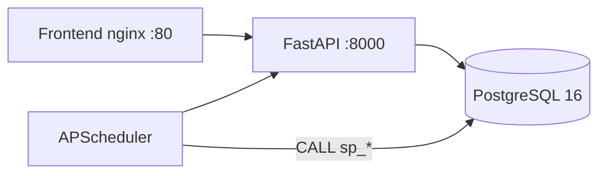

# Инициализация БД ПТТ и взаимодействие backend с PostgreSQL

Документ описывает **нулевые (init) SQL-скрипты** каталога `db/init/` и то, **как FastAPI-backend** обращается к базе. Для курсовой работы это справочник к приложению В (`docs/appendix/PTT_database_init.sql`) и к главам про реализацию БД и API.

См. также: [DB_SYNC.md](./DB_SYNC.md) (таблица «кто что вызывает»), [OLAP.md](./OLAP.md), [DEPLOY.md](./DEPLOY.md).

---

## 1. Как запускаются init-скрипты

При **первом** старте контейнера PostgreSQL (`postgres:16-alpine`) Docker монтирует каталог проекта в стандартную точку входа образа:

```yaml
# docker-compose.yml (фрагмент)
volumes:
  - ./db/init:/docker-entrypoint-initdb.d:ro
```

**Порядок выполнения** — по **алфавиту имён файлов**. Поэтому файлы пронумерованы `01`…`09`: сначала расширения и типы, затем таблицы, индексы, функции, представления, процедуры, триггеры, seed.

| Условие | Поведение |
|---------|-----------|
| Том `pgdata` **пустой** | Все `*.sql` из `db/init/` выполняются один раз при создании кластера |
| Том **уже существует** | Init-скрипты **не повторяются**; изменения схемы — через `db/migrations/001`…`015` |
| Ручной запуск | `docker compose exec db psql -U ptt -d ptt -f /docker-entrypoint-initdb.d/03-tables.sql` |

Файл `00-readme.sql` — только **комментарии и NOTICE**; на схему не влияет.

**Сводный скрипт для приложения к курсовой:** `docs/appendix/PTT_database_init.sql` — конкатенация `01`…`09` (UTF-8), собирается командой:

```bash
python scripts/build_ptt_database_init_sql.py
```

---

## 2. Архитектурный принцип: «тонкий backend, тяжёлая БД»



- **Backend:** маршрутизация HTTP, валидация Pydantic, сессии SQLAlchemy, простой CRUD по таблицам.
- **БД:** бизнес-правила в **функциях** (`fn_*`), **процедурах** (`sp_*`), **представлениях** (`v_*`), **триггерах**; фоновые задачи — через планировщик, вызывающий `CALL sp_*`.

Одно-пользовательский режим: `default_user_id = 1` из `.env` / `Settings`; зависимость `current_user_id()` подставляет этот ID во все запросы.

---

## 3. Пофайловое описание `db/init/`

### 3.1. `01-extensions.sql` — расширения PostgreSQL

| Расширение | Назначение в проекте |
|------------|----------------------|
| `pg_trgm` | Триграммный поиск (теги, темы; вспомогательно к LIKE) |
| `btree_gist` | Поддержка **EXCLUDE USING gist** (исторически — запрет пересечения интервалов в `task_time_logs`; в актуальной схеме после миграции 012 overlap допускается) |
| `unaccent` | Нормализация текста для полнотекстового поиска |

Без расширений не создадутся некоторые индексы и FTS в дневнике.

---

### 3.2. `02-types.sql` — ENUM и DOMAIN

**Перечисления (ENUM)** задают допустимые значения на уровне СУБД (строже, чем строки в приложении):

| Тип | Значения (смысл) |
|-----|------------------|
| `task_status_enum` | `pending`, `in_progress`, `done`, `overdue`, `cancelled` |
| `task_priority_enum` | `low`, `medium`, `high`, `urgent` |
| `pattern_type_enum` | `positive` (привычка), `negative` (отказ) |
| `pattern_log_status_enum` | `pending`, `answered`, `missed` |
| `pattern_mode_enum` | `habit`, `scenario`, `markers` |
| `pattern_step_kind_enum` | `check`, `single_choice`, `note` |
| `pattern_step_role_enum` | роли шага сценария для аналитики |
| `pattern_session_status_enum` | `in_progress`, `completed`, `abandoned` |
| `recurrence_freq_enum` | `daily`, `weekly`, `monthly`, `custom` |
| `audit_action_enum` | `INSERT`, `UPDATE`, `DELETE` |

**Домены (DOMAIN):** например `hex_color` (`#RRGGBB`), `positive_int`, `mood_score` — переиспользуемые ограничения для колонок.

ORM-дубликаты enum лежат в `backend/app/models/enums.py` и должны совпадать с БД.

---

### 3.3. `03-tables.sql` — 23 таблицы и декларативные ограничения

Создаётся **реляционная схема** с `PRIMARY KEY`, `FOREIGN KEY`, `UNIQUE`, `CHECK`. Краткая карта сущностей:

| № | Таблица | Роль |
|---|---------|------|
| 1 | `users` | Пользователи (в seed — одна запись `id=1`) |
| 2 | `topics` | Темы задач/паттернов (`user_id`, уникальное имя) |
| 3 | `tags` | Универсальные теги |
| 4 | `recurring_rules` | Правила повторения (`frequency`, `params` JSONB, `next_run_at`) |
| 5 | `tasks` | Задачи: иерархия `parent_task_id`, дедлайн, статус, связь с повторением |
| 6 | `task_tags` | M:N задача ↔ тег |
| 7 | `task_time_logs` | Учёт времени (Pomodoro): интервалы `started_at` / `ended_at` |
| 8 | `diary_entries` | Дневник: дата, текст, настроение, энергия, `tsv` для FTS |
| 9 | `diary_tags` | M:N дневник ↔ тег |
| 10 | `behavior_patterns` | Паттерны поведения (режим `pattern_mode`) |
| 11 | `pattern_response_options` | Варианты ответа (да/нет, шкала и т.д.) |
| 12 | `pattern_schedules` | Расписание (дни недели, время) |
| 13 | `pattern_logs` | Журнал откликов по дням |
| 14–17 | `pattern_steps`, `pattern_day_sessions`, `pattern_step_answers`, `pattern_markers`, `pattern_marker_day_closures` | Режимы **scenario** и **markers** |
| 18 | `goals` | Цели с дедлайном и прогрессом |
| 19 | `goal_links` | Связь цели с задачей или паттерном |
| 20 | `holidays` | Праздники (глобальный справочник, влияет на календарь) |
| 21 | `audit_log` | Журнал изменений (заполняется триггерами, **без ORM**) |
| 22 | `app_settings` | Ключ–значение настроек приложения |

**Примеры важных CHECK-ограничений** (backend ловит их как `IntegrityError` → HTTP 400/409):

- `tasks_deadline_after_created` — дедлайн позже `created_at`;
- `tasks_start_before_deadline` — `start_at` раньше дедлайна;
- `topics_user_name_uniq` / `tags_user_name_uniq` — уникальность имён в рамках пользователя;
- `diary_entries_user_date_uniq` — одна запись дневника на дату.

**Связи:** каскадное удаление от `users` к «дочерним» сущностям; `topics` при удалении блокирует задачи (`ON DELETE RESTRICT`).

---

### 3.4. `04-indexes.sql` — производительность запросов

Типы индексов по ТЗ:

- **B-tree** — фильтры по `deadline`, `start_at`, `(topic_id, status)`, родитель подзадач;
- **Partial** — только строки с `deadline IS NOT NULL`, только `status = 'overdue'`;
- **GIN** — полнотекстовый поиск по `diary_entries.tsv` (`to_tsvector('russian', …)`);
- **BRIN** — журналы с временными метками (`audit_log`, `task_time_logs`) при росте объёма.

Индексы не меняют логику, но ускоряют API: списки задач, календарь, поиск дневника, OLAP-срезы.

---

### 3.5. `05-functions.sql` — функции PL/pgSQL

Функции возвращают скаляры, наборы строк или JSON; вызываются из **VIEW**, **процедур**, **триггеров** и напрямую из backend через `SELECT fn_*(...)`.

| Группа | Функции | Назначение |
|--------|---------|------------|
| Календарь | `fn_day_color`, `fn_get_calendar_stats` | Цвет дня и агрегаты задач/дневника/праздников на месяц |
| Паттерны | `fn_pattern_is_scheduled`, `fn_pattern_day_has_answer`, `fn_pattern_day_success`, `fn_pattern_day_is_failure` | Расписание и успех дня по режиму |
| Серии | `fn_calculate_streak`, `fn_calculate_max_streak`, `fn_calculate_anti_streak`, `fn_pattern_clean_days_30d` | Streak / anti-streak для привычек |
| Статистика | `fn_completion_rate`, `fn_goal_progress` | KPI задач и целей |
| Поиск | `fn_search_diary` | FTS по дневнику (`russian`) |
| Повторение | `fn_next_recurring_date` | Следующая дата по `daily` / `weekly` / `monthly` / `custom` |

---

### 3.6. `06-views.sql` — представления и материализованное представление

| Объект | Тип | Содержание |
|--------|-----|------------|
| `v_task_topic_breakdown` | VIEW | Агрегаты задач по темам (% done, overdue) |
| `v_pattern_streaks` | VIEW | Текущая/макс. серия, clean days 30d (через `fn_*`) |
| `v_overdue_tasks` | **MATERIALIZED VIEW** | Снимок просроченных задач; обновляется `sp_recalc_calendar_cache` |
| `v_mood_productivity_correlation` | VIEW | Корреляция настроения и продуктивности |
| `v_olap_daily_facts` | VIEW | Зерно «день × пользователь» для OLAP API |
| `v_mood_holistic_correlation` | VIEW | Расширенная корреляция (дневник + паттерны) |
| `v_stats_task_priority` | VIEW | Распределение по приоритетам |
| `v_weekly_summary` | VIEW | Недельная сводка |
| `v_year_heatmap` | VIEW | Тепловая карта года |
| `v_task_subtree_progress` | VIEW | Прогресс подзадач (рекурсивный CTE) |
| `v_topic_time_distribution` | VIEW | Время по темам из `task_time_logs` |

Представления **не дублируют** данные в приложении: backend читает их SQL-запросом с фильтром `user_id` и дат.

---

### 3.7. `07-procedures.sql` — хранимые процедуры

Процедуры вызываются как `CALL sp_*(...)` (PostgreSQL 11+). Используются для **атомарных операций** и фоновой обработки.

| Процедура | Что делает |
|-----------|------------|
| `sp_complete_task` | Статус `done`, `completed_at`; триггер может выставить `overdue` |
| `sp_reopen_task` | Возврат из `done`/`overdue` в `in_progress` |
| `sp_log_pattern_response` | Запись отклика на паттерн (habit/markers) |
| `sp_spawn_recurring_tasks` | Создание экземпляров повторяющихся задач на дату |
| `sp_ensure_habit_logs_for_day` | Создание `pattern_logs` на день для habit-паттернов |
| `sp_close_overdue_pattern_logs` | Закрытие пропущенных откликов (`missed`) |
| `sp_recalc_calendar_cache` | `REFRESH MATERIALIZED VIEW v_overdue_tasks` |
| `sp_archive_old_audit` | Удаление старых записей `audit_log` |
| `sp_export_user_data` | JSON всех сущностей пользователя (`schema_version: 2`) |
| `sp_import_user_data` | Merge только тем и тегов (идемпотентно) |

---

### 3.8. `08-triggers.sql` — автоматика на уровне строк

Каждый триггер — пара **функция-обработчик** + `CREATE TRIGGER`.

| Триггер | Событие | Эффект |
|---------|---------|--------|
| `trg_*_updated_at` | BEFORE UPDATE | Поле `updated_at := now()` |
| `trg_task_set_completed_at` | BEFORE UPDATE tasks | При переходе в `done` — `completed_at` |
| `trg_task_overdue_check` | BEFORE UPDATE tasks | Завершение после дедлайна → статус `overdue` |
| `trg_diary_tsv_update` | BEFORE INSERT/UPDATE diary | Пересчёт `tsv` для FTS |
| `trg_audit_*` | AFTER INSERT/UPDATE/DELETE | Запись в `audit_log` (с подстановкой `user_id` для паттернов) |
| `trg_recurring_spawn_on_complete` | AFTER UPDATE tasks | При завершении — планирование следующего повторения |
| `trg_tag_user_match_*` | BEFORE INSERT task_tags/diary_tags | Тег принадлежит тому же `user_id` |
| `trg_goal_completed` | BEFORE UPDATE goals | Авто-завершение цели при 100% |
| `trg_pattern_to_task_on_response` | AFTER UPDATE pattern_logs | Опциональное создание задачи из паттерна |

Триггеры выполняются **всегда**, независимо от того, пишет в таблицу ORM или `psql`.

---

### 3.9. `09-seed.sql` — начальные данные

1. Пользователь `users(id=1, username='me')` и сдвиг sequence.
2. Темы по умолчанию: Работа, Учёба, Здоровье, Личное, Привычки, Прочее.
3. Демо-теги: важное, срочное, идея, …
4. Праздники РФ (календарь на 2026).
5. Записи `app_settings` (часовой пояс, версия схемы и т.д.).

`ON CONFLICT DO NOTHING` позволяет безопасно перезапускать seed вручную.

Дополнительные демо-данные — отдельно: `db/demo/seed_demo.sql` (не входит в init-каталог).

---

## 4. Цепочка зависимостей init-скриптов

```
01-extensions
    ↓
02-types ──→ 03-tables ──→ 04-indexes
                    ↓
              05-functions
                    ↓
              06-views (используют fn_*)
                    ↓
              07-procedures (CALL fn_*, REFRESH MV)
                    ↓
              08-triggers (ссылаются на fn_*)
                    ↓
              09-seed (INSERT в готовые таблицы)
```

Нарушение порядка (например, запуск `06` до `03`) приведёт к ошибкам «relation does not exist».

---

## 5. Как backend подключается к PostgreSQL

### 5.1. Конфигурация и движок

- DSN: `DATABASE_URL` → `postgresql+asyncpg://user:pass@db:5432/ptt` (`backend/app/config.py`).
- Движок: `create_async_engine` с пулом (10 + overflow 20); в pytest — `NullPool` (`backend/app/db.py`).
- Сессия на запрос: dependency `get_session()` — `yield session`, при ошибке `rollback`.

### 5.2. Три способа обращения к БД

| Способ | Когда используется | Пример в коде |
|--------|-------------------|---------------|
| **ORM** (`select`, `session.add`) | CRUD сущностей: задачи, темы, теги, дневник, паттерны, цели | `backend/app/api/v1/tasks.py` — `select(Task).where(...)` |
| **Raw SQL** (`text("SELECT …")`) | Функции, VIEW, сложные выборки | `calendar.py` — `fn_get_calendar_stats` |
| **CALL процедуры** | Атомарные действия и планировщик | `tasks.py` — `CALL sp_complete_task` |

Модели ORM: `backend/app/models/` — 22 таблицы; **`audit_log` без модели** (только триггеры).

### 5.3. Типичный HTTP-запрос

```
Клиент → FastAPI router → SessionDep + UserIdDep
       → SQLAlchemy AsyncSession
       → PostgreSQL
       → commit (автоматически при успешном завершении dependency)
       → Pydantic response_model
```

Ошибки целостности: `IntegrityError` → `integrity_error_to_http()` (`backend/app/services/db_errors.py`) — человекочитаемые 400/409 по имени constraint.

### 5.4. Планировщик (вне HTTP)

`backend/app/scheduler.py` (APScheduler) при старте приложения:

| Расписание | Процедура |
|------------|-----------|
| 00:05 ежедневно | `sp_spawn_recurring_tasks(current_date)` |
| 00:10 ежедневно | `sp_ensure_habit_logs_for_day(current_date)` |
| каждый час | `sp_close_overdue_pattern_logs(now())` |
| каждые 10 мин | `sp_recalc_calendar_cache()` |
| вс 03:00 | `sp_archive_old_audit(365)` |

Сессия: `session_scope()` с явным `commit` после `CALL`.

---

## 6. Соответствие API ↔ объекты БД

Полная таблица — в [DB_SYNC.md](./DB_SYNC.md). Ключевые примеры:

### 6.1. Задачи — смесь ORM и процедур

- **Список/создание/обновление** — ORM `Task`, фильтры, полнотекстовый поиск по `tasks` (GIN/tsvector в SQL).
- **Завершить / открыть снова** — только процедуры (гарантия триггеров):

```python
await session.execute(text("CALL sp_complete_task(:id)").bindparams(id=task.id))
await session.execute(text("CALL sp_reopen_task(:id)").bindparams(id=task_id))
```

- **Просроченные** — чтение `v_overdue_tasks` (материализованное представление).
- **Прогресс подзадач** — `SELECT … FROM v_task_subtree_progress`.

### 6.2. Календарь — только функции БД

```python
text("SELECT day, total, done, ratio, color, … FROM fn_get_calendar_stats(:uid, :y, :m)")
```

Heatmap: `SELECT … FROM v_year_heatmap WHERE user_id = :uid`.

### 6.3. Дневник — ORM + FTS-функция

CRUD через `DiaryEntry`; поиск:

```python
text("SELECT id, entry_date, … FROM fn_search_diary(:uid, :q, :lim)")
```

Триггер `trg_diary_tsv_update` поддерживает колонку `tsv` при каждой записи.

### 6.4. Паттерны — ORM + `sp_log_pattern_response`

Отметка привычки: `CALL sp_log_pattern_response(...)`. Для habit на «сегодня» API может вызвать `sp_ensure_habit_logs_for_day` до чтения логов. Streaks — `v_pattern_streaks` или прямые `fn_calculate_streak`.

### 6.5. Статистика и OLAP — VIEW и функции

`backend/app/api/v1/stats.py` — преимущественно `text()` к `v_*` и `fn_completion_rate`. OLAP-агрегации в Python: `backend/app/services/olap.py` читает `v_olap_daily_facts`.

### 6.6. Импорт/экспорт

| Режим | Реализация |
|-------|------------|
| Export JSON | `CALL sp_export_user_data` → один JSONB |
| Import merge | `CALL sp_import_user_data` (только темы/теги) |
| Import restore | Python `import_user_data()` — wipe + вставка + sequences |

### 6.7. Цели

Прогресс: `SELECT fn_goal_progress(:gid)`; завершение цели может сработать триггером `trg_goal_completed` при обновлении через ORM.

---

## 7. Миграции vs init (важно для защиты)

| Сценарий | Действие |
|----------|----------|
| Новый `docker compose up` с пустым volume | Достаточно `db/init/` — актуальная схема «из коробки» |
| Уже развёрнутая БД после `git pull` | По порядку `db/migrations/00N_*.sql` (см. DEPLOY.md) |
| Изменение init-файла | На существующий volume **не применится** автоматически — нужна миграция или пересоздание volume |

Init и миграции должны **сходиться по логике**; иначе dev (новый volume) и prod (старый volume) разойдутся.

---

## 8. Что включить в пояснительную записку (кратко)

1. **Нулевой скрипт** — это не один файл, а **упорядоченный набор** `01`…`09`, выполняемый Docker при первом старте; приложение В — их объединение.
2. **Нормализация** — 3НФ, внешние ключи, CHECK; бизнес-инварианты дублируются в БД (триггеры) и частично в API (Pydantic).
3. **Backend** — транспорт и CRUD; **сложная аналитика и транзакции** — в PostgreSQL.
4. **Надёжность** — процедуры `sp_complete_task` / `sp_reopen_task`, audit-триггеры, материализованный кэш просрочки, планировщик для повторений и паттернов.

---

## 9. Файлы проекта для углубления

| Тема | Путь |
|------|------|
| Init SQL (пофайлово) | `db/init/01-extensions.sql` … `09-seed.sql` |
| Сводный SQL | `docs/appendix/PTT_database_init.sql` |
| Миграции | `db/migrations/` |
| ORM | `backend/app/models/` |
| API v1 | `backend/app/api/v1/*.py` |
| Синхронизация API↔БД | `docs/DB_SYNC.md` |
| Техническое задание (раздел 4.3) | `ТЗ.md` |
