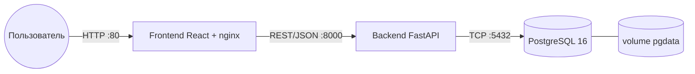
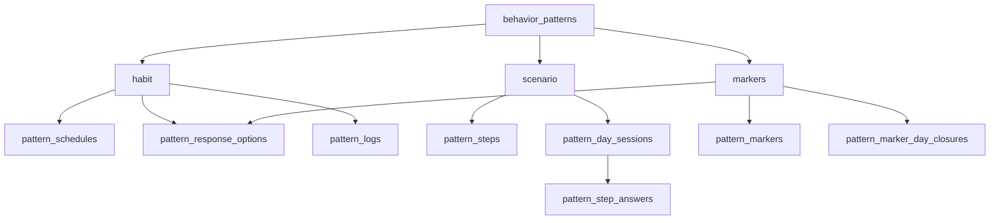
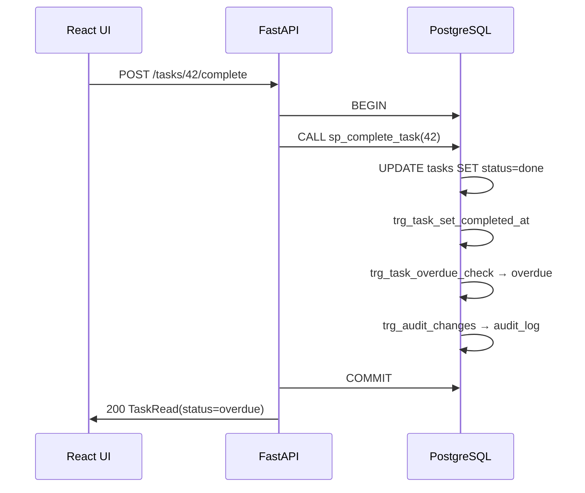

# ПОЯСНИТЕЛЬНАЯ ЗАПИСКА

## к курсовой работе по дисциплине «Базы данных»

**Тема:** Проектирование и реализация реляционной базы данных персонального таск-трекера с дневником, паттернами поведения и аналитикой прогресса

**Условное обозначение системы:** ПТТ (Персональный таск-трекер)

**Шифр:** КР-БД-2026-ПТТ

---

| Реквизит | Значение |
|---|---|
| Выполнил | студент группы `<номер>`, `<ФИО>` |
| Руководитель | `<ФИО, должность>` |
| Город | Нижний Новгород |
| Год | 2026 |

---

> **Примечание по оформлению.** Текст подготовлен в Markdown для удобства редактирования. При переносе в DOCX/PDF по ГОСТ 7.32–2017: поля 20/10/20/20 мм, шрифт Times New Roman 14 пт, межстрочный интервал 1,5, нумерация страниц внизу по центру, заголовки разделов — с новой страницы (кроме подразделов первого уровня по указанию кафедры).

---

## СОДЕРЖАНИЕ

**Реферат** — [в конце введения](#реферат)

1. [Введение](#1-введение)
2. [Назначение, цели и функциональность системы](#2-назначение-цели-и-функциональность-системы)
3. [Бизнес-процессы, нотации моделирования и связь с БД](#3-бизнес-процессы-нотации-моделирования-и-связь-с-бд)
4. [Архитектура и роль базы данных](#4-архитектура-и-роль-базы-данных)
5. [Концептуальная модель данных (ER-диаграмма)](#5-концептуальная-модель-данных-er-диаграмма)
6. [Функциональные подсистемы](#6-функциональные-подсистемы-от-интерфейса-к-backend-и-субд)
7. [Логическая и физическая схема PostgreSQL](#7-логическая-и-физическая-схема-postgresql)
8. [Нормализация, логика в СУБД, миграции](#8-нормализация-размещение-логики-и-эволюция-схемы)
9. [OLAP-подсистема](#9-olap-подсистема-аналитики)
10. [Экспериментальная оценка производительности](#10-экспериментальная-оценка-производительности)
11. [Каталог целостности](#11-каталог-целостности-данных)
12. [Глоссарий](#12-глоссарий)
13. [Заключение](#13-заключение)
14. [Список источников](#14-список-использованных-источников)
15. [Приложения](#15-приложения) — [KURSOVAYA_APPENDIX.md](./KURSOVAYA_APPENDIX.md), [рисунки](./KURSOVAYA_FIGURES.md)

**Нумерация иллюстраций:** рисунки 1–10 — в тексте глав 3–10; рисунки 11–14 — приложения (планы EXPLAIN, развёртывание). Таблицы 1–11 — по ходу текста.

**Объём:** основной текст (главы 1–12, без приложений) рассчитан на **~30 страниц** А4 (шрифт 14 пт, интервал 1,5, поля по ГОСТ 7.32–2017).

---

## 1. Введение

### 1.1. Актуальность темы

Личное планирование, ведение дневника и формирование привычек — повседневная деятельность, которую пользователи нередко распределяют между разрозненными инструментами (бумажный планер, заметки, календарь, сторонние сервисы). Это затрудняет **сводный анализ** накопленных данных и повышает риск их потери при смене платформы.

Курсовая работа по дисциплине «Базы данных» требует не просто прикладного приложения, а демонстрации **проектирования нетривиальной реляционной модели** и активного использования средств СУБД: декларативных ограничений целостности, представлений, функций, хранимых процедур, триггеров, индексов различных типов, полнотекстового поиска, оконных и рекурсивных запросов.

Разрабатываемая система **ПТТ** решает прикладную задачу единого учёта задач, дневника и паттернов поведения, при этом **ядром** выступает PostgreSQL 16: вычисления агрегации, серий, корреляций и отчётности выполняются на стороне сервера баз данных.

### 1.2. Объект и предмет исследования

- **Объект исследования** — процесс индивидуального планирования, самонаблюдения и анализа продуктивности одного пользователя.
- **Предмет исследования** — реляционная база данных и SQL-объекты, обеспечивающие хранение, целостность и вычисление показателей в системе ПТТ.

### 1.3. Цель и задачи работы

**Цель** — спроектировать и реализовать реляционную базу данных и программный комплекс ПТТ, в котором бизнес-логика расчётов сосредоточена в СУБД, а прикладной backend выступает тонким HTTP-слоем.

**Задачи:**

1. Проанализировать предметную область и сформировать требования (см. [ТЗ.md](../ТЗ.md)).
2. Построить концептуальную ER-модель и логическую схему PostgreSQL.
3. Реализовать DDL, индексы, представления, функции, процедуры и триггеры.
4. Разработать REST API (FastAPI), делегирующий расчёты в БД.
5. Реализовать клиентское SPA (React) для демонстрации сценариев.
6. Провести тестирование SQL-объектов и API.

### 1.4. Методы и средства

- Моделирование данных: ER-диаграмма в нотации Crow's Foot.
- СУБД: PostgreSQL 16, расширения `pg_trgm`, `btree_gist`.
- Сервер приложений: Python 3.12, FastAPI, SQLAlchemy 2, asyncpg.
- Клиент: React 18, TypeScript, TanStack Query.
- Развёртывание: Docker Compose (контейнеры `db`, `backend`, `frontend`).

### Реферат

**Объём основного текста:** ~30 с. **Таблиц:** 12. **Рисунков:** 8 (исходники — `docs/diagrams/`). **Приложений:** 4 (диаграммы, развёртывание, API, **код БД**).

**Ключевые слова:** PostgreSQL, реляционная база данных, триггер, хранимая процедура, ER-диаграмма, BPMN, таск-трекер, паттерн поведения.

**Результат:** спроектирована БД из 23 таблиц, 10+ представлений, 11+ функций, 8+ процедур, 10+ триггеров; бизнес-процессы формализованы в BPMN и диаграммах состояний с привязкой к SQL-объектам.

---

## 2. Назначение, цели и функциональность системы

### 2.1. Назначение

**Таблица 1** — Подсистемы системы ПТТ и объекты БД

**ПТТ** (полное наименование: «Персональный таск-трекер с дневником, паттернами поведения и календарём прогресса») предназначен для **одного пользователя** и обеспечивает:

| № | Направление | Краткое описание | Ключевые таблицы БД |
|---|---|---|---|
| 1 | Задачи | Темы, теги, приоритеты, дедлайны, подзадачи, повторения, учёт времени | `tasks`, `topics`, `tags`, `task_tags`, `task_time_logs`, `recurring_rules` |
| 2 | Дневник | Запись дня, настроение и энергия, FTS-поиск | `diary_entries`, `diary_tags` |
| 3 | Паттерны | Привычки, сценарии, точечные маркеры; серии и расписания | `behavior_patterns`, `pattern_*` (см. раздел 4) |
| 4 | Календарь | Заливка дней по % выполнения, праздники, heatmap года | `fn_get_calendar_stats`, `holidays`, `v_year_heatmap` |
| 5 | Статистика | KPI, темы, корреляция mood ↔ продуктивность, OLAP-срезы | представления `v_*`, `fn_mood_productivity_corr` |
| 6 | Цели | Долгосрочные цели, привязка задач и паттернов | `goals`, `goal_links`, `fn_goal_progress` |
| 7 | Данные | Импорт/экспорт JSON, резервное копирование | `sp_export_user_data`, `sp_import_user_data` |
| 8 | Служебное | Аудит изменений, настройки | `audit_log`, `app_settings` |

### 2.2. Цели создания (измеримые ориентиры)

- **Ц1.** Сократить ежедневное планирование за счёт быстрого ввода задач и повторяющихся правил (`recurring_rules`, `sp_spawn_recurring_tasks`).
- **Ц2.** Повысить долю своевременно выполненных задач — фиксируется статусом `done` и триггером просрочки `trg_task_overdue_check`.
- **Ц3.** Поддерживать серии положительных паттернов — функции `fn_calculate_streak`, представление `v_pattern_streaks`.
- **Ц4.** Снижать повторения негативных паттернов — `fn_calculate_anti_streak`, режим `markers`.
- **Ц5.** Давать объективную картину времени по темам — `task_time_logs`, `v_topic_time_distribution`.
- **Ц6.** Обеспечить сохранность данных — ACID PostgreSQL, том `pgdata`, `pg_dump`.
- **Ц7.** Выполнить учебные требования курса по БД — не менее 15 таблиц, 8+ представлений, функции, процедуры, триггеры, разнотипные индексы (фактически превышены, см. раздел 6).

### 2.3. Пользовательские сценарии (выборка)

Полный перечень user stories — в [ТЗ.md](../ТЗ.md), раздел 3.3. Ниже — сценарии, наиболее показательные с точки зрения БД.

**US-02. Завершение задачи.** Пользователь отмечает чек-бокс → backend вызывает `CALL sp_complete_task(:id)` → в одной транзакции обновляется `tasks`, срабатывают `trg_task_set_completed_at` и при нарушении дедлайна — `trg_task_overdue_check` → запись в `audit_log`.

**US-04. Дневник.** Одна запись на дату (`UNIQUE (user_id, entry_date)`). При сохранении текста триггер `trg_diary_tsv_update` заполняет `content_tsv` для FTS.

**US-05. Паттерн «привычка».** Расписание в `pattern_schedules`, отклик — `pattern_logs` через `sp_log_pattern_response`. Пропуск закрывается планировщиком: `sp_close_overdue_pattern_logs`.

**US-06. Календарь.** Запрос `GET /calendar/{year}/{month}` → `fn_get_calendar_stats` возвращает готовые поля для UI, включая цвет `fn_day_color(ratio)`.

**US-11. Корреляция.** `GET /stats/correlation` → `fn_mood_productivity_corr` использует встроенный агрегат PostgreSQL `corr()`.

### 2.4. Классификация бизнес-процессов системы

Для курсовой по БД процессы разделены на три класса по **месту исполнения логики**:

| Класс | Примеры | Где реализовано |
|---|---|---|
| **П1 — Пользовательские** | создать задачу, записать дневник, ответить на паттерн | UI + API + INSERT/UPDATE таблиц |
| **П2 — Серверные транзакционные** | завершить задачу, зафиксировать отклик, импорт JSON | `sp_*` + триггеры в одной транзакции |
| **П3 — Фоновые пакетные** | породить повторяющиеся задачи, закрыть пропуски паттернов | APScheduler → `CALL sp_*` |

Именно процессы **П2 и П3** демонстрируют «работу БД как активного участника», а не пассивного хранилища.

---

## 3. Бизнес-процессы, нотации моделирования и связь с БД

### 3.1. Выбор нотаций

В пояснительной записке используются согласованные нотации (исходники — каталог [`docs/diagrams/`](./diagrams/), см. [NOTATION.md](./diagrams/NOTATION.md)):

| Нотация | Назначение в работе | Формат файла |
|---|---|---|
| **ER (Crow's Foot)** | статическая структура данных | Mermaid `erDiagram` |
| **BPMN 2.0** | регламентированные бизнес-процессы | XML `.bpmn` |
| **UML State Machine** | жизненный цикл сущностей (`tasks`, `pattern_logs`) | PlantUML `.puml` |
| **UML Activity** | пакетные задания планировщика | PlantUML `.puml` |
| **UML Sequence** | взаимодействие UI — API — SQL | Mermaid `sequenceDiagram` |

**Рекомендуемые сервисы рендеринга:** [Mermaid Live](https://mermaid.live) (ER, sequence), [PlantUML Online](https://www.plantuml.com/plantuml) (состояния, activity), [Camunda Modeler](https://camunda.com/download/modeler/) или [draw.io](https://app.diagrams.net) (BPMN для защиты). Универсальный вариант — [Kroki](https://kroki.io) (один URL для нескольких языков).

В тексте ниже процессы описаны словами; **рисунки 3–8** вставляются по заглушкам `[Вставить PNG]` (исходники — `docs/diagrams/`, перечень — [KURSOVAYA_FIGURES.md](./KURSOVAYA_FIGURES.md)).

### 3.2. Процесс «Завершение задачи» (BPMN)

Процесс иллюстрируют [рисунок 3](#рисунок-3--bpmn-процесса-завершения-задачи) (BPMN) и [рисунок 5](#рисунок-5--диаграмма-состояний-tasksstatus) (состояния `tasks`).

**Участники:** пользователь, контейнер backend, СУБД PostgreSQL.

**Цель:** перевести задачу в терминальное состояние с фиксацией факта выполнения и соблюдением правила просрочки.

**Шаги (см. [рисунок 3](#рисунок-3--bpmn-процесса-завершения-задачи), исходник `03-bpmn-complete-task.bpmn`):**

1. Пользователь инициирует завершение (чек-бокс) → HTTP `POST /api/v1/tasks/{id}/complete`.
2. FastAPI открывает транзакцию и вызывает **`CALL sp_complete_task(id)`** — единая точка входа в логику БД.
3. Процедура выполняет `UPDATE tasks SET status = 'done', completed_at = now()`.
4. Срабатывает **`trg_task_set_completed_at`** (если `completed_at` ещё не задан).
5. Шлюз BPMN «нарушен дедлайн?»: **`trg_task_overdue_check`** при `completed_at > deadline` и наличии `planned_minutes` заменяет статус на **`overdue`** ещё в рамках того же `UPDATE` (BEFORE UPDATE).
6. **`trg_audit_changes`** пишет снимок в **`audit_log`** (JSONB `diff`).
7. Шлюз «есть `recurring_rule_id`?»: **`trg_recurring_spawn_on_complete`** или ночной **`sp_spawn_recurring_tasks`** создаёт следующий экземпляр в **`tasks`**.
8. `COMMIT` → клиент получает актуальный статус (`done` или `overdue`).

#### Рисунок 3 — BPMN процесса завершения задачи

> **[Вставить PNG]** — `docs/diagrams/03-bpmn-complete-task.bpmn`.

#### Рисунок 5 — Диаграмма состояний `tasks.status`

> **[Вставить PNG]** — `docs/diagrams/05-state-task.puml`.

**Таблица 2** — Трассировка «шаг BPMN → объект БД»

| Шаг BPMN | SQL-объект | Таблица |
|---|---|---|
| Обновить статус | `sp_complete_task` | `tasks` |
| Зафиксировать время | `trg_task_set_completed_at` | `tasks.completed_at` |
| Проверить просрочку | `trg_task_overdue_check` | `tasks.status` |
| Аудит | `trg_audit_changes` | `audit_log` |
| Следующее повторение | `trg_recurring_spawn_on_complete` | `tasks`, `recurring_rules` |

**Диаграмма состояний** задачи ([рисунок 5](#рисунок-5--диаграмма-состояний-tasksstatus), `05-state-task.puml`) согласована с ENUM `task_status_enum`: переход `done → overdue` не является действием пользователя, а **следствием триггера** — это важно указать на защите.

### 3.3. Процесс «Суточный цикл паттерна habit» (BPMN)

**Цель:** обеспечить не более одного учётного слота отклика на паттерн в календарный день и корректный расчёт серии.

**Фазы:**

| Фаза | Событие | Действие БД |
|---|---|---|
| Подготовка дня | cron / первый запрос дня | `sp_ensure_habit_logs_for_day` → INSERT `pattern_logs` (`pending`) по `pattern_schedules` и `fn_pattern_is_scheduled` |
| Ожидание | время `time_of_day` | UI читает `pattern_logs` + `pattern_response_options` |
| Ответ | клик по варианту | `sp_log_pattern_response` → UPDATE/INSERT, `status = answered` |
| Закрытие | +12 ч без ответа | `sp_close_overdue_pattern_logs` → `missed` |
| Аналитика | любой запрос streak | `fn_calculate_streak`, `v_pattern_streaks` |

Для **positive**-паттерна пропуск (`missed`) обнуляет текущую серию; для **negative** дополнительно используется **`fn_calculate_anti_streak`**.

#### Рисунок 4 — BPMN суточного цикла паттерна habit

> **[Вставить PNG]** — `docs/diagrams/04-bpmn-pattern-habit.bpmn`.

#### Рисунок 6 — Диаграмма состояний `pattern_logs.status`

> **[Вставить PNG]** — `docs/diagrams/06-state-pattern-log.puml`.

[Рисунок 4](#рисунок-4--bpmn-суточного-цикла-паттерна-habit) и [рисунок 6](#рисунок-6--диаграмма-состояний-pattern_logsstatus) дополняют друг друга: BPMN — операционный регламент, State — допустимые значения `pattern_log_status_enum`.

### 3.4. Процесс «Прохождение сценария» (режим scenario)

Бизнес-процесс отличается от habit: **нет** `pattern_logs`, вместо этого:

1. `INSERT pattern_day_sessions` (`in_progress`) на `session_date`.
2. Для каждого `pattern_steps` — `INSERT pattern_step_answers`.
3. При завершении — `UPDATE pattern_day_sessions SET status = completed, outcome_success = …`.

Успех дня для серии определяют **`fn_pattern_day_success`** и шаг с `marks_success` / `step_role = outcome`. ER-связь: `behavior_patterns` → `pattern_steps` → `pattern_step_answers` ← `pattern_day_sessions`.

### 3.5. Процесс «Учёт эпизодов» (режим markers)

Пользователь фиксирует **много событий в день** в `pattern_markers` (тип — `pattern_response_options`) либо объявляет «чистый день» через `pattern_marker_day_closures`. Серия и KPI за 30 дней считаются функциями `fn_pattern_clean_days_30d` и полями `v_pattern_streaks.clean_rate_30d` — без хранения предрасчёта в таблице паттерна (избежание аномалий обновления).

### 3.6. Процесс «Формирование календаря месяца»

Пользовательский процесс просмотра календаря — **read-only** на уровне транзакций: API не изменяет данные.

Цепочка (см. [рисунок 8](#рисунок-8--последовательность-запроса-календаря-месяца)):

1. `GET /calendar/{year}/{month}`.
2. `SELECT * FROM fn_get_calendar_stats(user_id, year, month)`.
3. Внутри функции — агрегация по `tasks.deadline::date`, проверка `diary_entries`, join `holidays`, вызов `fn_day_color(ratio)`.

Таким образом, **бизнес-процесс отображения** целиком опирается на **функцию БД**, а не на вычисления в React.

### 3.7. Пакетный процесс планировщика (Activity)

#### Рисунок 7 — Диаграмма деятельности планировщика БД

> **[Вставить PNG]** — `docs/diagrams/07-activity-daily.puml`.

#### Рисунок 8 — Последовательность запроса календаря месяца

> **[Вставить PNG]** — `docs/diagrams/08-sequence-calendar.mmd`.

[Рисунок 7](#рисунок-7--диаграмма-деятельности-планировщика-бд) описывает **П3-процессы**, выполняемые без участия пользователя:

```
sp_spawn_recurring_tasks → sp_ensure_habit_logs_for_day
  → sp_close_overdue_pattern_logs → sp_recalc_calendar_cache
  → [еженедельно] sp_archive_old_audit
```

Каждый шаг — отдельная транзакция `CALL` из backend. Ошибка на одном шаге не должна блокировать остальные (в коде scheduler — независимые задачи APScheduler).

### 3.8. Сводная матрица «процесс — таблицы — SQL»

**Таблица 3** — Соответствие бизнес-процессов и объектов PostgreSQL

| Бизнес-процесс | Основные таблицы | Ключевые SQL-объекты |
|---|---|---|
| Завершение задачи | `tasks`, `audit_log` | `sp_complete_task`, `trg_task_overdue_check` |
| Повторяющиеся задачи | `recurring_rules`, `tasks` | `sp_spawn_recurring_tasks`, `fn_next_recurring_date` |
| Habit-отклик | `pattern_logs`, `pattern_response_options` | `sp_log_pattern_response`, `sp_close_overdue_pattern_logs` |
| Scenario за день | `pattern_day_sessions`, `pattern_step_answers` | `fn_pattern_day_success` |
| Markers | `pattern_markers`, `pattern_marker_day_closures` | `fn_pattern_day_has_answer` |
| Дневник + поиск | `diary_entries` | `trg_diary_tsv_update`, `fn_search_diary` |
| Календарь | `tasks`, `diary_entries`, `holidays` | `fn_get_calendar_stats`, `fn_day_color` |
| Статистика | агрегаты по всем фактам | `v_weekly_summary`, `fn_mood_productivity_corr` |
| Цели | `goals`, `goal_links` | `fn_goal_progress`, `trg_goal_completed` |
| Резервная копия данных | все пользовательские | `sp_export_user_data`, `sp_import_user_data` |

### 3.9. Согласованность моделей

При защите курсовой важно показать **согласованность трёх уровней**:

1. **BPMN** — что делает организация процесса (пользователь + система).
2. **State/Activity** — допустимые состояния и переходы данных.
3. **ER + DDL** — где физически живут данные и какие констрейнты не позволяют «невозможным» переходам (например, `CHECK` на `pattern_logs` при `status = answered`).

Противоречие между BPMN и диаграммой состояний недопустимо: если BPMN показывает переход в `overdue`, на диаграмме состояний он должен быть подписан как автоматический (`trg_*`), а не как клик пользователя.

---

## 4. Архитектура и роль базы данных

### 4.1. Трёхзвенная архитектура

Архитектура показана на [рисунке 2](#рисунок-2--трёхзвенная-архитектура-и-слой-postgresql).



#### Рисунок 2 — Трёхзвенная архитектура и слой PostgreSQL

> **[Вставить PNG]** — `docs/diagrams/02-architecture.mmd`.

**Принцип «тонкий backend, толстая БД»:** валидация DTO — в Pydantic; фильтрация списков и CRUD — SQLAlchemy ORM; **расчёты** (календарь, серии, корреляция, экспорт, планировщик повторений и паттернов) — SQL-функции, представления и `CALL` процедур.

Планировщик APScheduler в backend **не дублирует** бизнес-логику, а лишь по расписанию вызывает процедуры:

| Интервал | Процедура | Назначение в БД |
|---|---|---|
| ежедневно | `sp_spawn_recurring_tasks` | Порождение экземпляров повторяющихся задач |
| ежедневно | `sp_ensure_habit_logs_for_day` | Создание ожидающих `pattern_logs` на день |
| ежечасно | `sp_close_overdue_pattern_logs` | Перевод просроченных откликов в `missed` |
| ежечасно | `sp_recalc_calendar_cache` | `REFRESH MATERIALIZED VIEW v_overdue_tasks` |
| ежесуточно | `sp_archive_old_audit` | Сокращение объёма `audit_log` |

### 4.2. Поток данных (обобщённый)

```
[Действие в UI] → [HTTP JSON] → [FastAPI: валидация + user_id]
      → { ORM INSERT/UPDATE } или { CALL / SELECT FROM fn_* / v_* }
      → [PostgreSQL: констрейнты + триггеры + транзакция]
      → [JSON-ответ] → [кеш TanStack Query] → [отображение]
```

Любая ошибка целостности (`UNIQUE`, `FK`, `CHECK`, `EXCLUSION`) возвращается клиенту как HTTP 409/422 после перехвата `IntegrityError` в слое `db_errors`.

---

## 5. Концептуальная модель данных (ER-диаграмма)

> Исходник рисунка: [`docs/diagrams/01-er-full.mmd`](./diagrams/01-er-full.mmd). В тексте записки — **Рисунок 5** (или А.1 в приложении).

### 5.1. Общие принципы модели

1. **Суррогатные ключи** — `BIGSERIAL` / `IDENTITY` во всех сущностях; внешние ключи именуются `<entity>_id`.
2. **Владелец данных** — `users`; почти все прикладные таблицы содержат `user_id` (подготовка к возможному многопользовательскому режиму).
3. **Справочники** `topics`, `tags` — уникальность имён в рамках пользователя.
4. **Связи M:N** — отдельные таблицы-связки: `task_tags`, `diary_tags`.
5. **Полиморфная привязка целей** — `goal_links(target_type, target_id)` с `CHECK` на допустимые типы.
6. **Паттерны** — три режима (`pattern_mode_enum`), отражённые **разными группами таблиц** (см. комментарии к диаграмме).

### 5.2. ER-диаграмма (полная, по реализации)

#### Рисунок 1 — ER-диаграмма базы данных ПТТ

> **[Вставить PNG/SVG]** — экспорт из `docs/diagrams/01-er-full.mmd` (Mermaid Live).  
> *Подпись под рисунком в Word: «Рисунок 1 — ER-диаграмма базы данных ПТТ».*

Ниже — исходник для генерации (в печатную версию можно не включать).

```mermaid
erDiagram
    %% ========== ЯДРО ПОЛЬЗОВАТЕЛЯ ==========
    users ||--o{ topics : "владеет"
    users ||--o{ tags : "владеет"
    users ||--o{ tasks : "создаёт"
    users ||--o{ diary_entries : "пишет"
    users ||--o{ behavior_patterns : "отслеживает"
    users ||--o{ goals : "ставит"
    users ||--o{ app_settings : "настраивает"
    users ||--o{ task_time_logs : "логирует время"
    users ||--o{ audit_log : "инициирует изменения"

    %% ========== ЗАДАЧИ ==========
    topics ||--o{ tasks : "категоризирует"
    topics ||--o{ behavior_patterns : "группирует"
    tasks ||--o{ task_tags : "имеет"
    tags ||--o{ task_tags : "помечает"
    tasks ||--o{ task_time_logs : "учёт времени"
    tasks ||--o{ tasks : "parent_task_id подзадачи"
    recurring_rules ||--o{ tasks : "порождает экземпляры"

    %% ========== ДНЕВНИК ==========
    diary_entries ||--o{ diary_tags : "имеет"
    tags ||--o{ diary_tags : "помечает"

    %% ========== ПАТТЕРН: ОБЩЕЕ + HABIT ==========
    behavior_patterns ||--o{ pattern_response_options : "варианты ответа"
    behavior_patterns ||--o{ pattern_schedules : "расписание"
    behavior_patterns ||--o{ pattern_logs : "журнал habit"
    pattern_response_options ||--o{ pattern_logs : "выбранный ответ"

    %% ========== ПАТТЕРН: SCENARIO ==========
    behavior_patterns ||--o{ pattern_steps : "шаги сценария"
    behavior_patterns ||--o{ pattern_day_sessions : "сессия за день"
    pattern_day_sessions ||--o{ pattern_step_answers : "ответы на шаги"
    pattern_steps ||--o{ pattern_step_answers : "по шагу"

    %% ========== ПАТТЕРН: MARKERS ==========
    behavior_patterns ||--o{ pattern_markers : "эпизоды"
    pattern_response_options ||--o{ pattern_markers : "тип эпизода"
    behavior_patterns ||--o{ pattern_marker_day_closures : "день без эпизодов"

    %% ========== ЦЕЛИ И СПРАВОЧНИКИ ==========
    goals ||--o{ goal_links : "связывает task или pattern"
    holidays ||--o{ tasks : "косвенно через календарь"

    users {
        bigint id PK "Суррогатный ключ владельца"
        text username UK "Логин; в однопользовательском режиме одна строка"
        text password_hash "Зарезервировано под будущую аутентификацию"
        text timezone "IANA; влияет на отображение timestamptz"
        timestamptz created_at
    }

    topics {
        bigint id PK
        bigint user_id FK "CASCADE: удаление пользователя — удаление тем"
        text name "UK в паре с user_id"
        hex_color color "DOMAIN: #RRGGBB для UI и графиков"
    }

    tags {
        bigint id PK
        bigint user_id FK
        text name "Универсальные теги для tasks и diary"
    }

    recurring_rules {
        bigint id PK
        recurrence_freq_enum frequency "daily|weekly|monthly|custom"
        jsonb params "Маска недели, interval_days, monthly_day"
        timestamptz next_run_at "Для планировщика sp_spawn_recurring_tasks"
        boolean is_active
    }

    tasks {
        bigint id PK
        bigint user_id FK
        bigint topic_id FK "RESTRICT: нельзя удалить тему с задачами"
        bigint parent_task_id FK "SET NULL; иерархия подзадач"
        bigint recurring_rule_id FK "Связь с правилом повторения"
        text title
        text description "Участвует в GIN FTS"
        task_status_enum status "pending|in_progress|done|overdue|cancelled"
        task_priority_enum priority
        timestamptz start_at "Начало окна выполнения"
        timestamptz deadline "Конец окна; участвует в просрочке"
        positive_int planned_minutes "Плановая оценка; нужна для overdue-триггера"
        timestamptz completed_at "Проставляется триггером при done"
        boolean is_archived
        timestamptz created_at
        timestamptz updated_at
    }

    task_tags {
        bigint task_id PK,FK
        bigint tag_id PK,FK "M:N без дублирования тегов на задаче"
    }

    task_time_logs {
        bigint id PK
        bigint task_id FK
        bigint user_id FK
        timestamptz started_at
        timestamptz ended_at
        int duration_seconds "GENERATED STORED"
        boolean is_pomodoro "Различение Pomodoro и ручного ввода"
    }

    diary_entries {
        bigint id PK
        bigint user_id FK
        date entry_date UK "Одна запись на пользователя в день"
        text content
        tsvector content_tsv "Обновляется триггером; GIN-индекс"
        mood_score mood "DOMAIN 1..5"
        mood_score energy
        timestamptz created_at
        timestamptz updated_at
    }

    diary_tags {
        bigint entry_id PK,FK
        bigint tag_id PK,FK
    }

    behavior_patterns {
        bigint id PK
        bigint user_id FK
        bigint topic_id FK "Опциональная тематика"
        text title
        pattern_type_enum pattern_type "positive|negative"
        pattern_mode_enum pattern_mode "habit|scenario|markers"
        boolean is_boolean "Два варианта Y/N"
        boolean auto_create_task
        text guide_intro "Подсказка для режима scenario"
    }

    pattern_response_options {
        bigint id PK
        bigint pattern_id FK
        text label
        boolean is_success "Учитывается в серии habit/markers"
        int sort_order
    }

    pattern_schedules {
        bigint id PK
        bigint pattern_id FK
        time time_of_day
        smallint dow_mask "Битовая маска Пн..Вс"
        smallint day_of_month "Опционально: раз в месяц"
    }

    pattern_logs {
        bigint id PK
        bigint pattern_id FK
        bigint response_option_id FK
        timestamptz scheduled_at
        timestamptz answered_at
        pattern_log_status_enum status "pending|answered|missed"
    }

    pattern_steps {
        bigint id PK
        bigint pattern_id FK
        pattern_step_kind_enum step_kind "check|single_choice|note"
        pattern_step_role_enum step_role "context|trigger|choice|action|outcome"
        jsonb choices "Варианты для single_choice"
        boolean marks_success "Итоговый шаг сценария"
    }

    pattern_day_sessions {
        bigint id PK
        bigint pattern_id FK
        date session_date UK "Одна сессия на паттерн в день"
        pattern_session_status_enum status
        boolean outcome_success "Итог дня для серии"
    }

    pattern_step_answers {
        bigint id PK
        bigint session_id FK
        bigint step_id FK
        text choice_id
        boolean checked
        text note_text
    }

    pattern_markers {
        bigint id PK
        bigint pattern_id FK
        bigint marker_option_id FK "Тип эпизода из response_options"
        timestamptz occurred_at
        text note
    }

    pattern_marker_day_closures {
        bigint id PK
        bigint pattern_id FK
        date closure_date UK "Явное «сегодня без эпизодов»"
    }

    goals {
        bigint id PK
        bigint user_id FK
        text title
        date deadline
        positive_int target_value
        boolean is_completed
        timestamptz completed_at
    }

    goal_links {
        bigint goal_id PK,FK
        text target_type PK "task|pattern"
        bigint target_id PK "Полиморфная ссылка без FK на одну таблицу"
    }

    holidays {
        bigint id PK
        date holiday_date UK
        text name
        boolean is_official "false — пользовательские даты"
    }

    audit_log {
        bigint id PK
        bigint user_id FK
        text table_name
        bigint row_id
        audit_action_enum action
        jsonb diff "Снимок изменений"
        timestamptz changed_at
    }

    app_settings {
        bigint id PK
        bigint user_id FK
        text key UK "theme, pomodoro_minutes, dnd, ..."
        jsonb value
    }
```



### 5.3. Развёрнутые комментарии к ER-диаграмме

#### 5.3.1. Сущность `users`

Корневая сущность модели. В учебной поставке создаётся **одна** запись (одно-пользовательский режим), но наличие таблицы оправдано:

- все дочерние сущности несут `user_id`, что позволяет в будущем добавить аутентификацию без переделки схемы;
- триггер `trg_tag_user_match` проверяет, что тег в `task_tags` / `diary_tags` принадлежит тому же `user_id`, что и родительская запись — защита от «перекрёстного» связывания при многопользовательском режиме.

#### 5.3.2. Кластер «Задачи»

| Связь | Кардинальность | Смысл | Ограничения в БД |
|---|---|---|---|
| `users` → `tasks` | 1:N | Все задачи принадлежат владельцу | `ON DELETE CASCADE` |
| `topics` → `tasks` | 1:N | Каждая задача в одной теме | `ON DELETE RESTRICT` — тема не удаляется, пока есть задачи |
| `tasks` → `tasks` | 1:N (иерархия) | Подзадачи | `parent_task_id`, `CHECK` против self-parent; прогресс — `v_task_subtree_progress` (рекурсивный CTE) |
| `recurring_rules` → `tasks` | 1:N | Экземпляры повторяющихся задач | `params` JSONB хранит маску дней; следующий запуск — `fn_next_recurring_date` |
| `tasks` ↔ `tags` | M:N | Многотеговость | `task_tags` с составным PK |

**Статусная модель** (`task_status_enum`): переход в `done` инициирует `trg_task_set_completed_at`; если выполнение позже `deadline` при заданном `planned_minutes`, `trg_task_overdue_check` **перезаписывает** статус на `overdue` — бизнес-правило реализовано в БД, а не в JavaScript.

#### 5.3.3. Кластер «Учёт времени»

`task_time_logs` хранит интервалы `[started_at, ended_at)`. Поле `duration_seconds` — **вычисляемое STORED**, что гарантирует согласованность длительности с границами интервала на уровне СУБД.

Pomodoro и ручной ввод различаются флагом `is_pomodoro`; агрегаты в статистике суммируют `duration_seconds` с фильтром по темам через join `tasks` → `topics`.

> *Историческая ремарка:* в ранней версии применялся `EXCLUDE USING gist` для запрета пересечений интервалов одного пользователя; миграция `012` сняла ограничение, чтобы допустить до 10 параллельных Pomodoro-таймеров — компромисс между строгостью модели и UX.

#### 5.3.4. Кластер «Дневник»

| Ограничение | Зачем |
|---|---|
| `UNIQUE (user_id, entry_date)` | Ровно одна запись на календарный день — соответствует привычке «дневник на вечер» |
| `mood`, `energy` как `mood_score` | DOMAIN с `CHECK 1..5` — единая шкала для корреляционной аналитики |
| `content_tsv` | Денормализация для FTS; обновляется **триггером**, а не приложением — инвариант «текст ↔ вектор» не нарушается клиентом |

Связь с задачами в отчётах — **не FK**, а логический join по дате: `entry_date = completed_at::date` или `deadline::date` в представлениях календаря и корреляции.

#### 5.3.5. Кластер «Паттерны» — три режима одной сущности

`behavior_patterns.pattern_mode` определяет, **какие таблицы** участвуют в жизненном цикле:



| Режим | Таблицы | Семантика «успеха» |
|---|---|---|
| `habit` | `pattern_logs`, `pattern_schedules`, `pattern_response_options` | Ответ с `is_success = true` в назначенный слот; пропуск → `missed`, серия обнуляется |
| `scenario` | `pattern_steps`, `pattern_day_sessions`, `pattern_step_answers` | Успех дня: `outcome_success` после прохождения цепочки; шаг с `marks_success` задаёт итог |
| `markers` | `pattern_markers`, `pattern_marker_day_closures` | Много эпизодов в день; «чистый день» — ноль маркеров или явное закрытие дня |

Общие для режимов: `pattern_type` (`positive` / `negative`) влияет на интерпретацию серий — `fn_calculate_anti_streak` актуален для negative.

#### 5.3.6. Кластер «Цели»

`goal_links` — **полиморфная** связь без единого FK на `tasks` или `behavior_patterns` (классический компромисс: целостность target_id проверяется на уровне приложения при вставке связи). Прогресс вычисляется `fn_goal_progress` / `v_goal_progress` как доля выполненных привязанных задач (`status = 'done'`) или достигнутых серий паттернов.

#### 5.3.7. Служебные сущности

- **`holidays`** — не привязана к `user_id`; праздники РФ загружаются seed-скриптом, пользователь может добавлять памятные даты (`is_official = false`).
- **`audit_log`** — append-only журнал; заполняется `trg_audit_changes` на `tasks`, `diary_entries`, `goals`, `behavior_patterns`, `pattern_logs`. BRIN-индекс по `changed_at` экономит место на больших объёмах.
- **`app_settings`** — EAV-модель `key` + `jsonb value` для гибких настроек UI без ALTER TABLE при каждой новой опции.

### 5.4. Нормализация

Схема приведена как минимум к **3НФ**:

- нет повторяющихся групп тегов в `tasks` / `diary_entries` — вынесены в `task_tags`, `diary_tags`;
- варианты ответов паттерна — отдельная таблица `pattern_response_options`, а не JSON-массив в `behavior_patterns` (исключение: `pattern_steps.choices` — осознанная денормализация для малых списков вариантов шага);
- вычисляемые показатели (серии, % выполнения, цвет дня) **не хранятся** в базовых таблицах, а получаются представлениями и функциями — избегаем аномалий обновления.

---

## 6. Функциональные подсистемы: от интерфейса к backend и СУБД

Ниже каждая подсистема описана по единому шаблону: **что видит пользователь → как обрабатывает backend → что происходит в PostgreSQL**.

### 6.1. Подсистема управления задачами

#### 6.1.1. Функциональность (frontend)

Экран «Задачи» (`tasks-page.tsx`): список с фильтрами по теме, тегу, статусу, приоритету, архиву; создание и редактирование карточки; чек-бокс завершения; редактор повторений (`recurring-editor.tsx`); подзадачи; привязка тегов.

Горячая клавиша `Ctrl+N` открывает форму новой задачи. Pomodoro пишет интервал времени через API `POST /tasks/{id}/time-logs`.

#### 6.1.2. Backend

| Операция | HTTP | Реализация |
|---|---|---|
| Список | `GET /api/v1/tasks` | SQLAlchemy `select(Task)` + фильтры; FTS: `to_tsvector('russian', ...) @@ plainto_tsquery` |
| Создание | `POST /api/v1/tasks` | `INSERT` в `tasks`, связи в `task_tags` |
| Завершение | `POST /api/v1/tasks/{id}/complete` | **`CALL sp_complete_task(:id)`** |
| Подзадачи | `GET /tasks/{id}/subtasks` | чтение `v_task_subtree_progress` |
| Время | `POST /tasks/{id}/time-logs` | `INSERT task_time_logs` |

Пример делегирования завершения в БД (фрагмент `tasks.py`):

```python
await session.execute(text("CALL sp_complete_task(:id)").bindparams(id=task.id))
```

#### 6.1.3. База данных

**Таблицы:** `tasks`, `task_tags`, `task_time_logs`, `recurring_rules`, `topics`, `tags`.

**Ключевые триггеры:**

1. `trg_task_set_completed_at` — при `status → done` заполняет `completed_at`.
2. `trg_task_overdue_check` — при позднем завершении относительно `deadline` выставляет `overdue`.
3. `trg_recurring_spawn_on_complete` — после завершения задачи с `recurring_rule_id` планирует следующий экземпляр.
4. `trg_audit_changes` — пишет JSON-diff в `audit_log`.

**Процедуры:** `sp_complete_task`, `sp_reopen_task`, `sp_spawn_recurring_tasks` (планировщик).

**Представления:** `v_task_subtree_progress`, `v_overdue_tasks` (MATERIALIZED), `v_task_topic_breakdown`.

---

### 6.2. Подсистема дневника

#### 6.2.1. Функциональность

Экран дневника: редактор текста на выбранную дату, шкалы настроения и энергии (`mood-scale-picker.tsx`), теги, месячный мини-календарь, панель FTS-поиска (`diary-search-panel.tsx`).

#### 6.2.2. Backend

| Операция | HTTP | БД |
|---|---|---|
| Запись на дату | `GET/PATCH /diary/{date}` | `diary_entries` по `entry_date` |
| Поиск | `GET /diary/search?q=` | **`SELECT * FROM fn_search_diary(:uid, :q, :limit)`** |
| Теги | в составе PATCH | `diary_tags` |

#### 6.2.3. База данных

- `UNIQUE (user_id, entry_date)` — попытка второй записи на день вернёт ошибку уникальности.
- `trg_diary_tsv_update` поддерживает `content_tsv = to_tsvector('russian', content)`.
- GIN-индекс `idx_diary_fts_gin` — быстрый поиск по `@@@` запросу внутри `fn_search_diary` с `ts_rank` и `ts_headline` для сниппета.

---

### 6.3. Подсистема паттернов поведения

#### 6.3.1. Функциональность

Три UX-ветки на странице паттернов:

- **Habit** — карточка дня, варианты ответа, расписание (`schedule-editor.tsx`).
- **Scenario** — конструктор шагов (`scenario-builder.tsx`), прохождение цепочки за день.
- **Markers** — журнал эпизодов, закрытие дня без эпизодов (`markers-journal-card.tsx`).

Уведомления в браузере опираются на `pattern_schedules` и локальный планировщик; фиксация отклика уходит в API.

#### 6.3.2. Backend

| Режим | Действие | Вызов БД |
|---|---|---|
| habit | Ответ на слот | `CALL sp_log_pattern_response(...)` |
| habit | Слоты на сегодня | `CALL sp_ensure_habit_logs_for_day(current_date)` |
| scenario | Сохранение шагов | CRUD `pattern_steps` |
| scenario | Завершение дня | UPDATE `pattern_day_sessions`, INSERT `pattern_step_answers` |
| markers | Новый эпизод | INSERT `pattern_markers` |
| markers | «Чистый день» | INSERT `pattern_marker_day_closures` |
| все | Серии | `GET /patterns/{id}/streak` → `v_pattern_streaks` |

#### 6.3.3. База данных

**Расчёт серий** — функции `fn_calculate_streak`, `fn_calculate_max_streak`, `fn_calculate_anti_streak` (рекурсивные/оконные запросы по журналу за последовательные дни).

**Закрытие пропусков** — `sp_close_overdue_pattern_logs`: записи `pattern_logs` со статусом `pending` старше 12 часов → `missed`; для positive-паттерна серия рвётся.

**Триггер** `trg_pattern_streak_recalc` после INSERT в `pattern_logs` инвалидирует/пересчитывает кеш серий.

Подробная спецификация режима scenario — [PATTERNS_SCENARIO.md](./PATTERNS_SCENARIO.md).

---

### 6.4. Подсистема календаря

#### 6.4.1. Функциональность

Календарь месяца/года: цвет ячейки от 0 % до 100 % выполнения, подпись `done/total`, иконка дневника, выделение праздников. Тепловая карта года — аналог GitHub contributions.

#### 6.4.2. Backend

```text
GET /calendar/{year}/{month}  →  fn_get_calendar_stats(user_id, year, month)
GET /calendar/heatmap?from=&to=  →  SELECT FROM v_year_heatmap
```

Backend **не вычисляет** цвет и проценты — только маппит строки результата в DTO `CalendarDay`.

#### 6.4.3. База данных

- `fn_day_color(ratio)` — `IMMUTABLE` функция, линейная интерполяция HEX от `#E5E7EB` до `#16A34A`.
- `fn_get_calendar_stats` агрегирует задачи по `deadline::date`, подмешивает `holidays`, проверяет наличие `diary_entries`.
- `v_year_heatmap` суммирует активность: задачи + паттерны + дневник по дням.

---

### 6.5. Подсистема статистики

#### 6.5.1. Функциональность

Экран статистики: KPI-карточки, графики Recharts, сравнение периодов, блок «Связи показателей» (корреляция mood/energy с % выполнения задач), OLAP-таблицы (см. [STATS.md](./STATS.md), [OLAP.md](./OLAP.md)).

#### 6.5.2. Backend

Эндпоинты `/stats/topics`, `/stats/correlation`, `/stats/weekly` выполняют `SELECT` из представлений и функций; тяжёлые срезы могут использовать материализованные данные после `sp_recalc_calendar_cache`.

#### 6.5.3. База данных

| Объект | Назначение |
|---|---|
| `v_task_topic_breakdown` | Агрегаты по темам, `FILTER (WHERE status = 'done')` |
| `v_mood_productivity_correlation` | JOIN дневника и дневной доли выполненных задач |
| `fn_mood_productivity_corr` | Скалярный `corr(mood, rate)` за период |
| `v_weekly_summary` | Сводка недели, оконные функции `LAG()` для сравнения |
| `fn_topic_time_breakdown` | Минуты по темам из `task_time_logs` |

Использование **встроенного агрегата** `corr()` — демонстрация статистических возможностей PostgreSQL без выноса расчёта в Python.

---

### 6.6. Подсистема целей

#### 6.6.1. Функциональность

Страница целей: создание цели, дедлайн, целевое значение `target_value`, привязка задач и паттернов, прогресс-бар.

#### 6.6.2. Backend → БД

- CRUD `goals`, `goal_links`.
- `GET /goals/{id}/progress` → `fn_goal_progress(goal_id)` или `v_goal_progress`.
- `trg_goal_completed` при достижении 100 % выставляет `is_completed`, `completed_at`.

---

### 6.7. Импорт и экспорт

#### 6.7.1. Функциональность

Полный экспорт JSON, импорт с режимами merge/restore, CSV задач.

#### 6.7.2. Backend → БД

```python
CALL sp_export_user_data(:uid, NULL::jsonb)
CALL sp_import_user_data(:uid, CAST(:doc AS jsonb))
```

#### 6.7.3. База данных

Процедуры собирают/разбирают **единый JSONB-документ** в одной транзакции:

- идемпотентность по натуральным ключам (`username`, `(user_id, name)` для тегов, `entry_date` для дневника);
- откат при любой ошибке — ACID;
- демонстрация работы с JSON в PostgreSQL (требование ТЗ).

---

## 7. Логическая и физическая схема PostgreSQL

### 7.1. Состав объектов (фактические показатели)

| Категория | Количество | Расположение |
|---|---|---|
| Таблицы | **23** | `db/init/03-tables.sql` + миграции `db/migrations/` |
| ENUM / DOMAIN | 10+ типов | `db/init/02-types.sql` |
| Индексы | 15+ (B-tree, GIN, BRIN, partial, unique) | `db/init/04-indexes.sql` |
| VIEW / MATVIEW | 10+ | `db/init/06-views.sql` |
| Функции | 11+ | `db/init/05-functions.sql` |
| Процедуры | 8+ | `db/init/07-procedures.sql` |
| Триггеры | 10+ | `db/init/08-triggers.sql` |

Инициализация при первом запуске контейнера `db`: скрипты из `/docker-entrypoint-initdb.d/` в алфавитном порядке (`00`…`09`). Для существующего тома — `db/migrations/001`…`015`.

### 7.2. Пользовательские типы

Перечисления фиксируют **закрытые домены** значений на уровне типа (сильнее, чем `CHECK` на TEXT):

- `task_status_enum`, `task_priority_enum` — жизненный цикл задачи;
- `pattern_mode_enum` — ветвление логики habit/scenario/markers;
- `recurrence_freq_enum` + `JSONB params` — гибрид структурированного и полуструктурированного хранения правил повторения.

Домены `mood_score`, `percentage`, `positive_int`, `hex_color` переиспользуются в нескольких таблицах — единая валидация.

### 7.3. Индексы и обоснование

| Индекс | Тип | Сценарий |
|---|---|---|
| `idx_tasks_topic_status` | B-tree составной | Список задач в теме с фильтром статуса |
| `idx_tasks_search_gin` | GIN | FTS по `title` и `description` |
| `idx_diary_fts_gin` | GIN | FTS дневника по `content_tsv` |
| `idx_audit_log_brin` | BRIN | Хронологический журнал аудита |
| `idx_pattern_logs_brin` | BRIN | Большой append-only журнал откликов |
| `idx_tasks_overdue_partial` | partial B-tree | Узкая выборка `status = 'overdue'` |

### 7.4. Транзакции и целостность

Все мутирующие API-операции выполняются в рамках сессии SQLAlchemy с `commit`/`rollback`. Процедуры `sp_*` объявлены `LANGUAGE plpgsql` и при необходимости открывают явные подтранзакции.

**Пример сквозного сценария «Завершить задачу с просрочкой»:**



### 7.5. Тестирование БД

- SQL smoke: `db/tests/smoke.sql` (функции, представления, триггеры).
- Интеграционные тесты API: `backend/tests/` (~100 тестов), проверяют согласованность ORM и процедур.

### 7.6. Обоснование проектных решений СУБД

**Почему PostgreSQL, а не SQLite/MySQL:** нужны `MATERIALIZED VIEW`, `EXCLUDE` (исторически), агрегат `corr()`, полнотекстовый поиск с конфигурацией `russian`, `JSONB` для импорта, `PROCEDURE` с `CALL` — в совокупности это учебная демонстрация «взрослой» СУБД.

**Почему логика в триггерах, а не только в Python:** триггер `trg_task_overdue_check` гарантирует правило просрочки при **любом** канале обновления (`sp_complete_task`, прямой `UPDATE`, будущий SQL-скрипт). Это снижает риск рассинхронизации ORM и бизнес-правил.

**Почему три режима паттернов — разные таблицы, а не один JSONB:** нормализованная схема позволяет строить индексы (`pattern_logs_pattern_date`, `idx_pattern_markers_pattern_occurred`) и проверять целостность FK; JSONB оставлен точечно (`recurring_rules.params`, `pattern_steps.choices`).

**Почему `audit_log` BRIN, а не B-tree:** журнал монотонно растёт по `changed_at`; BRIN даёт компактный индекс на больших объёмах при типичном запросе «за период».

**Миграции:** каталог `db/migrations/` дополняет init-скрипты для уже существующего Docker-volume без пересоздания кластера — подробная таблица изменений приведена в [разделе 8.3](#83-эволюция-схемы-миграции-001015).

---

## 8. Нормализация, размещение логики и эволюция схемы

### 8.1. Нормализация реляционной модели (примеры)

Проектирование ориентировано на **3НФ** и устранение повторяющихся групп. Ниже — три кластера, где «плоская» таблица привела бы к аномалиям.

#### 8.1.1. Задачи и теги (`tasks` + `task_tags`)

**Денормализованный вариант (не используется):** одна таблица `tasks_flat` с полем `tag_names TEXT` или повторяющимися столбцами `tag_1…tag_n`.

| Аномалия | Проявление | Решение в ПТТ |
|----------|------------|---------------|
| Вставки | дублирование строк задачи на каждый тег | M:N через `task_tags` |
| Обновления | смена имени тега требует правки всех строк | справочник `tags`, связка по `tag_id` |
| Удаления | удаление тега оставляет «мусор» в строке | `ON DELETE CASCADE` на `task_tags` |

Связь с [рисунком 1](#рисунок-1--er-диаграмма-базы-данных-птт): сущности `tasks` и `tags` соединены ассоциативной таблицей.

#### 8.1.2. Журнал паттернов (`pattern_logs`)

Хранение «истории ответов» в JSONB внутри `behavior_patterns` нарушило бы **3НФ**: каждый новый отклик изменял бы один JSON-массив без индекса по дате. Вынесение в `pattern_logs` даёт:

- индекс `(pattern_id, scheduled_at DESC)` для серий;
- статус `pending | answered | missed` ([рисунок 6](#рисунок-6--диаграмма-состояний-pattern_logsstatus));
- `CHECK` согласованности `answered` ↔ `response_option_id`.

#### 8.1.3. Цели и полиморфные связи (`goal_links`)

Привязка цели к задачам **и** паттернам через отдельные nullable FK (`task_id`, `pattern_id`) допускала бы строки `(goal_id, NULL, NULL)` и дубли при нескольких типах. Вариант **полиморфной связи** `(goal_id, target_type, target_id)` с `CHECK (target_type IN ('task','pattern'))` — компромисс без UNION-наследования PostgreSQL: целостность `target_id` контролируется API при вставке, зато одна таблица для прогресса `fn_goal_progress`.

### 8.2. Размещение бизнес-логики: СУБД и приложение

Сравнение по правилам, критичным для курсовой (см. **таблицу 4**).

**Таблица 4** — Размещение бизнес-правил в Python и PostgreSQL

| № | Правило | Вариант A: только Python (FastAPI) | Вариант B: PostgreSQL | Почему выбран B |
|---|---------|-----------------------------------|----------------------|-----------------|
| 1 | Просрочка при `completed_at > deadline` | проверка в `complete_task()` | `trg_task_overdue_check` | срабатывает при любом `UPDATE`, один источник истины |
| 2 | `completed_at` при `status=done` | код сервиса | `trg_task_set_completed_at` | нельзя забыть поле в новом эндпоинте |
| 3 | FTS-вектор дневника | пересчёт в Pydantic | `trg_diary_tsv_update` | `content` и `content_tsv` всегда согласованы |
| 4 | Поиск дневника | сканирование `ILIKE %...%` | `fn_search_diary` + GIN | масштаб до 30 000 записей (ТЗ) |
| 5 | Текущая серия паттерна | цикл в Python по логам | `fn_calculate_streak` + `v_pattern_streaks` | один round-trip, оконные/рекурсивные SQL |
| 6 | Календарь месяца (цвет, ratio) | агрегация в pandas/цикле | `fn_get_calendar_stats`, `fn_day_color` | ≤ 250 мс на месяц (ТЗ), см. **таблицу 5** |
| 7 | Корреляция mood ↔ % задач | numpy в backend | `corr()` в `fn_mood_productivity_corr` | встроенная статистика СУБД |
| 8 | Следующий экземпляр повторяющейся задачи | cron-скрипт на Python | `sp_spawn_recurring_tasks`, триггер | транзакция с `tasks` + `recurring_rules` |
| 9 | Закрытие пропущенных откликов habit | фоновый asyncio | `sp_close_overdue_pattern_logs` | единообразие с планировщиком |
| 10 | Импорт всей БД пользователя | построчный ORM | `sp_import_user_data` (JSONB) | атомарность, идемпотентность |

Вывод: Python отвечает за **HTTP, валидацию DTO и оркестрацию**; PostgreSQL — за **инварианты и аналитику**.

### 8.3. Эволюция схемы (миграции 001–015)

Схема не «заморожена» в init: каталог `db/migrations/` отражает итерации разработки (см. **таблицу 6**).

**Таблица 6** — История миграций БД ПТТ

| Миграция | Суть изменения | Зачем |
|----------|----------------|-------|
| 001 | `tasks.start_at` | окно выполнения «не раньше / не позже» |
| 002 | режимы `habit/scenario/markers`, `pattern_steps`, сессии | расширение предметной области паттернов |
| 003 | `pattern_markers` | точечные эпизоды (режим markers) |
| 004 | `v_olap_daily_facts`, OLAP API | глава 9, срезы «пользователь × день» |
| 005 | правки аудита | согласованность `audit_log` |
| 006 | доработки процедур/триггеров | синхронизация с backend |
| 007 | логика серий паттернов | корректный `fn_calculate_streak` |
| 008 | `pattern_marker_day_closures` | явный «чистый день» |
| 009 | sync backend ↔ DB | выравнивание контрактов |
| 010 | `custom` interval в recurring | гибкие повторения |
| 011 | markers + streak fix | учёт `is_success` в маркерах |
| 012 | снятие EXCLUDE на `task_time_logs` | до 10 параллельных Pomodoro |
| 013 | упрощение CHECK `start_at`/`created_at` | UX быстрого создания задач |
| 014 | pre-freeze cleanup | подготовка к сдаче |
| 015 | `created_at` при spawn recurring | корректные даты экземпляров |

Миграция **012** — показательный пример trade-off: строгий `EXCLUDE` защищал от пересечений интервалов, но противоречил требованию параллельных таймеров; ограничение снято, оставлен `CHECK (ended_at > started_at)`.

---

## 9. OLAP-подсистема аналитики

### 9.1. Назначение в контексте БД

Подсистема статистики дополнена **OLAP-конструктором**: пользователь собирает отчёт из измерений и мер без написания SQL. С точки зрения курсовой это демонстрация **звездообразной схемы на представлениях**: факт «день активности» + измерения (неделя, месяц, день недели, корзины mood/energy).

### 9.2. Зерно данных и источники

**Зерно (grain):** одна строка = **пользователь × календарный день** с любой активностью.

Центральное представление — `v_olap_daily_facts` (миграция 004, дублировано в `db/init/06-views.sql`). Источники фактов:

- `tasks` — метрики по `deadline::date` (`tasks_total`, `tasks_done`, `completion_rate`);
- `diary_entries` — `mood`, `energy`, корзины `mood_bucket` / `energy_bucket`;
- `pattern_logs`, `pattern_markers`, `pattern_day_sessions` — слоты и успехи паттернов;
- `task_time_logs` — `minutes_logged`, `pomodoro_minutes`.

> **[Место для рисунка 9]** — Схема «звезда» OLAP: центр `v_olap_daily_facts`, лучи к таблицам-источникам.  
> *Подпись: Рисунок 9 — Зерно OLAP и источники данных.*

### 9.3. Измерения и меры (логический уровень)

**Таблица 7** — Измерения OLAP-конструктора

| ID измерения | Поле в facts | Назначение |
|--------------|--------------|------------|
| `week` | `date_trunc('week', day)` | основной временной срез |
| `month` | `date_trunc('month', day)` | длинные периоды |
| `weekday` | `dow` (ISO) | «какой день недели продуктивнее» |
| `day` | `day` | детализация ≤ 30 дней |
| `mood_bucket` | low / mid / high / none | фильтр по настроению |
| `energy_bucket` | аналогично | фильтр по энергии |

**Таблица 8** — Меры (примеры)

| Мера | Формула (концептуально) |
|------|-------------------------|
| `tasks_done_rate` | `SUM(tasks_done) / NULLIF(SUM(tasks_total),0)` |
| `pattern_clean_rate` | успешные слоты / запланированные |
| `avg_mood` | `AVG(mood)` только по дням с дневником |
| `pomodoro_minutes` | `SUM(pomodoro_minutes)` |

Запрос выполняется через `POST /api/v1/stats/olap`; backend собирает SQL к `v_olap_daily_facts` (см. `backend/app/api/v1/stats.py`), а не агрегирует в pandas.

### 9.4. Связь с классической корреляцией

Представление `v_mood_productivity_correlation` и функция `fn_mood_productivity_corr` — **узкоспециализированный отчёт** (Пирсон). OLAP — **обобщённый срез** для произвольных комбинаций измерений. Обе конструкции читают одни и те же базовые таблицы, но разный уровень абстракции (см. [рисунок 10](#рисунок-10--экран-olap-конструктора)).

> **[Место для рисунка 10]** — Скриншот страницы «Статистика», блок OLAP-конструктор.  
> *Подпись: Рисунок 10 — Интерфейс OLAP-среза (измерения и меры).*

### 9.5. Ограничения модели

- Паттерны в facts считаются как **слоты «паттерн × день»**, а не уникальные id паттернов — важно при интерпретации `patterns_scheduled`.
- `avg_mood` не включает дни без записи дневника; фильтр `mood_bucket: none` выделяет активные дни без mood.

Подробности — [OLAP.md](./OLAP.md).

---

## 10. Экспериментальная оценка производительности

### 10.1. Методика

Испытания проводятся на развёрнутом контейнере `ptt-db` (PostgreSQL 16). Параметры по ТЗ: 95-й перцентиль API ≤ 200 мс; расчёт месяца календаря ≤ 250 мс при до 10 000 задач; полнотекстовый поиск дневника ≤ 300 мс при до 30 000 записей.

**Скрипты репозитория:**

| Скрипт | Назначение |
|--------|------------|
| `scripts/benchmark_load_tasks.sql` | вставка N задач (`-v count=10000` или `100000`) |
| `scripts/benchmark_explain.sql` | шесть запросов с `EXPLAIN (ANALYZE, BUFFERS)` |

После наполнения обязательно: `ANALYZE tasks;` (включено в скрипт нагрузки).

### 10.2. Объём тестовых данных

**Таблица 5** — Объёмы наборов для испытаний

| Набор | `tasks` (user_id=1) | `diary_entries` | Назначение |
|-------|---------------------|-----------------|------------|
| S1 (базовый) | demo seed (~сотни) | demo | smoke, разработка |
| S2 (средний) | 10 000 | ≥ 500 (рекомендуется seed) | критерий ТЗ для календаря |
| S3 (крупный) | 100 000 | ≥ 5 000 | стресс, рост плана |

*Значения в таблице 9 заполняются после прогона на вашей машине; ниже — шаблон.*

### 10.3. Результаты EXPLAIN (ANALYZE, BUFFERS)

Сравнение «до/после» выполняется для **GIN** на дневнике: `DROP INDEX idx_diary_fts_gin` → запрос Q2 → восстановление индекса → Q2 повторно.

**Таблица 9** — Результаты планов выполнения (образец для заполнения)

| № | Запрос | Индекс / объект | Shared read (buffers) | Время exec | Узел плана (кратко) | Вывод |
|---|--------|-----------------|------------------------|------------|---------------------|-------|
| Q1 | `fn_get_calendar_stats(1, 2025, 5)` | агрегат по `tasks.deadline` | *заполнить* | *мс* | HashAggregate / Index Scan | календарь укладывается в ТЗ |
| Q2a | `fn_search_diary` **без** GIN | — | *высокое* | *мс* | Seq Scan on diary_entries | базовый «до» |
| Q2b | `fn_search_diary` **с** GIN | `idx_diary_fts_gin` | *ниже* | *мс* | Bitmap Index Scan on `content_tsv` | ускорение FTS |
| Q3 | список `tasks` по `topic_id, status` | `idx_tasks_topic_status` | *заполнить* | *мс* | Index Scan | фильтр списка задач |
| Q4 | `fn_calculate_streak(pattern_id)` | `idx_pattern_logs_pattern_date` | *заполнить* | *мс* | Index Scan + CTE | серии по последним дням |
| Q5 | GROUP BY week на `v_olap_daily_facts` | view → базовые таблицы | *заполнить* | *мс* | HashAggregate | OLAP-срез |
| Q6 | FTS по `tasks` | `idx_tasks_search_gin` | *заполнить* | *мс* | Bitmap Index Scan | поиск по задачам |

Пример фрагмента плана (вставить в отчёт как **рисунок 11**):

```text
-- Вставить сюда вывод Q1 из explain_out.txt (3–15 строк)
-- Подпись: Рисунок 11 — План выполнения fn_get_calendar_stats
```

> **[Место для рисунка 11]** — План Q1 (`fn_get_calendar_stats`).  
> **[Место для рисунка 12]** — Планы Q2a и Q2b (дневник, до/после GIN).  
> **[Место для рисунка 13]** — План Q3 (выборка задач по индексу topic+status).

Полные листинги — **приложение Е** ([KURSOVAYA_APPENDIX.md](./KURSOVAYA_APPENDIX.md)).

### 10.4. Интерпретация для защиты

На защите достаточно показать **один** план с `Index Scan` или `Bitmap Index Scan` и объяснить: (1) какой индекс из `04-indexes.sql` использован; (2) почему Seq Scan на 100k без индекса недопустим для FTS; (3) как `ANALYZE` влияет на оценку кардинальности.

---

## 11. Каталог целостности данных

Каталог фиксирует, что БД ПТТ — **модель правил предметной области**, а не набор `CREATE TABLE`. Сводная **таблица 10** охватывает 23 таблицы (см. также [рисунок 1](#рисунок-1--er-диаграмма-базы-данных-птт)).

**Таблица 10** — Каталог целостности таблиц PostgreSQL

| Таблица | PK | FK (кратко) | UNIQUE | CHECK / DOMAIN | Триггеры | Бизнес-смысл |
|---------|----|--------------|--------|----------------|----------|--------------|
| `users` | `id` | — | `username` | timezone NOT NULL | — | владелец всех данных |
| `topics` | `id` | `user_id→users` CASCADE | `(user_id,name)` | `hex_color`, имя ≠ '' | — | темы задач/паттернов |
| `tags` | `id` | `user_id→users` CASCADE | `(user_id,name)` | имя ≠ '' | — | универсальные теги |
| `recurring_rules` | `id` | — | — | `frequency` ENUM | — | шаблон повторения |
| `tasks` | `id` | user, topic RESTRICT, parent SET NULL, rule | — | deadline/start/completed, title | `updated_at`, `completed_at`, overdue, audit, recurring | ядро планирования |
| `task_tags` | `(task_id,tag_id)` | CASCADE | — | — | `tag_user_match` | M:N задача–тег |
| `task_time_logs` | `id` | task, user CASCADE | — | `ended_at > started_at` | — | Pomodoro/ручное время |
| `diary_entries` | `id` | `user_id` CASCADE | `(user_id,entry_date)` | `mood_score`, content | `updated_at`, `tsv`, audit | один день — одна запись |
| `diary_tags` | `(entry_id,tag_id)` | CASCADE | — | — | `tag_user_match` | теги дневника |
| `behavior_patterns` | `id` | user, topic | — | title, `pattern_mode` | `updated_at`, audit | привычка/сценарий/маркеры |
| `pattern_response_options` | `id` | `pattern_id` CASCADE | — | label | — | варианты ответа |
| `pattern_schedules` | `id` | `pattern_id` CASCADE | — | `dow_mask`, DOM | — | расписание слотов |
| `pattern_logs` | `id` | pattern, option | — | answered ↔ option | audit | журнал habit |
| `pattern_steps` | `id` | `pattern_id` CASCADE | — | title, JSON `choices` | — | шаги scenario |
| `pattern_day_sessions` | `id` | `pattern_id` CASCADE | `(pattern_id,session_date)` | — | — | сессия дня scenario |
| `pattern_step_answers` | `id` | session, step | `(session_id,step_id)` | — | — | ответы на шаги |
| `pattern_markers` | `id` | pattern, option | — | — | audit | эпизоды markers |
| `pattern_marker_day_closures` | `id` | `pattern_id` CASCADE | `(pattern_id,closure_date)` | — | audit | «чистый день» |
| `goals` | `id` | `user_id` CASCADE | — | title, completed ↔ date | `updated_at`, `goal_completed`, audit | долгосрочные цели |
| `goal_links` | `(goal_id,type,id)` | `goal_id` CASCADE | — | `target_type IN (...)` | — | связь цели с task/pattern |
| `holidays` | `id` | — | `holiday_date` | name | — | праздники в календаре |
| `audit_log` | `id` | `user_id` SET NULL | — | `action` ENUM | — | журнал изменений |
| `app_settings` | `id` | `user_id` CASCADE | `(user_id,key)` | key ≠ '' | — | key/value настройки |

Дополнительно на уровне БД: **10+ функций**, **8+ процедур**, **MATERIALIZED VIEW** `v_overdue_tasks`, расширения `pg_trgm`, `btree_gist`.

---

## 12. Глоссарий

**Таблица 11** — Термины и сокращения

| Термин | Определение |
|--------|-------------|
| ПТТ | Персональный таск-трекер — разрабатываемая система |
| ACID | Атомарность, согласованность, изоляция, долговечность транзакций |
| BPMN | Business Process Model and Notation — нотация бизнес-процессов |
| BRIN | Block Range INdex — индекс для последовательно растущих данных (`audit_log`) |
| DOMAIN | Пользовательский домен PostgreSQL (`mood_score`, `hex_color`) |
| ER-диаграмма | Концептуальная схема сущностей и связей |
| FTS | Full-Text Search, полнотекстовый поиск (`tsvector`, GIN) |
| Grain (зерно) | Минимальная детализация строки факта в OLAP (у ПТТ: user×day) |
| GIN | Generalized Inverted Index — индекс для FTS и массивов |
| Habit | Режим паттерна: быстрый отклик по слотам (`pattern_logs`) |
| Markers | Режим паттерна: точечные эпизоды (`pattern_markers`) |
| MATVIEW | Материализованное представление (`v_overdue_tasks`) |
| OLAP | Online Analytical Processing, многомерная аналитика |
| Scenario | Режим паттерна: пошаговый сценарий дня |
| Streak (серия) | Подряд идущие успешные дни (`fn_calculate_streak`) |
| Anti-streak | Подряд неуспешных дней для negative-паттерна |
| `sp_*` | Хранимая процедура (CALL из API/планировщика) |
| `fn_*` | SQL-функция (в т.ч. внутри VIEW) |
| `trg_*` | Триггер — автоматическая реакция на DML |
| Просрочка (`overdue`) | Статус задачи при позднем завершении относительно deadline |
| Полиморфная связь | `goal_links.target_type` + `target_id` без единого FK |
| Идемпотентный импорт | Повторный `sp_import_user_data` не создаёт дубликаты |

---

## 13. Заключение

В ходе выполнения курсовой работы спроектирована и реализована система **ПТТ**, в которой реляционная база данных PostgreSQL 16 является не вспомогательным хранилищем, а **центром прикладной логики**: статусы задач, полнотекстовый поиск дневника, серии паттернов, календарная аналитика, корреляция настроения и продуктивности, импорт/экспорт и фоновые процессы реализованы средствами SQL.

Концептуальная модель включает **23 таблицы** ([таблица 10](#таблица-10--каталог-целостности-таблиц-postgresql)), три режима паттернов, OLAP-срез `v_olap_daily_facts` (глава 9) и экспериментальную проверку планов запросов (глава 10, [рисунки 11–13](#103-результаты-explain-analyze-buffers)). ER-диаграмма ([рисунок 1](#рисунок-1--er-диаграмма-базы-данных-птт)) и BPMN/UML ([рисунки 3–8](#3-бизнес-процессы-нотации-моделирования-и-связь-с-бд)) согласованы с приложением Д (код БД). Принцип: **клиент отображает, сервер маршрутизирует, СУБД вычисляет** ([таблица 4](#таблица-4--размещение-бизнес-правил-в-python-и-postgresql)).

Перспективы развития: полноценная аутентификация (JWT) с использованием `users.password_hash`, репликация/read-replica для отчётов, партиционирование `audit_log` и `pattern_logs` по дате при росте объёма.

---

## 14. Список использованных источников

1. ГОСТ 34.602–89. Техническое задание на создание автоматизированной системы.
2. ГОСТ 7.32–2017. Отчёт о научно-исследовательской работе. Структура и правила оформления.
3. ГОСТ 34.601–90. Стадии создания автоматизированных систем.
4. Документация PostgreSQL 16 [Электронный ресурс]. — URL: https://www.postgresql.org/docs/16/ (дата обращения: 28.05.2026).
5. Date C. J. An Introduction to Database Systems. — 8th ed. — Pearson, 2003.
6. Connolly T., Begg C. Database Systems: A Practical Approach… — 6th ed. — Pearson, 2014.
7. Karwin B. SQL Antipatterns. — Pragmatic Bookshelf, 2010.
8. Техническое задание проекта ПТТ [Электронный ресурс]. — файл `ТЗ.md` репозитория.
9. FastAPI Documentation [Электронный ресурс]. — URL: https://fastapi.tiangolo.com/ (дата обращения: 28.05.2026).
10. OMG BPMN 2.0 Specification [Электронный ресурс]. — URL: https://www.omg.org/spec/BPMN/2.0/ (дата обращения: 28.05.2026).

---

## 15. Приложения

| Приложение | Содержание | Файл |
|------------|------------|------|
| А | Исходники диаграмм 1–8 | [KURSOVAYA_APPENDIX.md](./KURSOVAYA_APPENDIX.md), `docs/diagrams/` |
| Б | Развёртывание, **рисунок 14** | [DEPLOY.md](./DEPLOY.md) |
| В | REST API | `/docs` после `docker compose up` |
| Г | Скриншоты UI | по требованию кафедры |
| Д | Код БД | [PTT_database_init.sql](./appendix/PTT_database_init.sql) |
| Е | EXPLAIN, **рисунки 11–13** | `scripts/benchmark_*.sql` |

Перечень рисунков: [KURSOVAYA_FIGURES.md](./KURSOVAYA_FIGURES.md).

---

**Конец основного текста** (главы 1–12, ~30 стр.; приложения не входят в объём)
