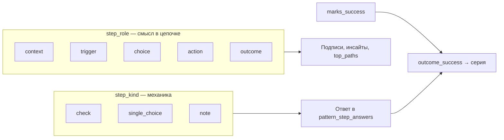

# Режим «Сценарий»: шаги, типы ответа и роли

Документ описывает **режим паттерна `scenario`** (пошаговый сценарий дня) и все настройки **шагов** внутри него. Сверка выполнена с кодом (`frontend`, `backend`, `db/init`) и [ТЗ.md](../ТЗ.md) по состоянию реализации.

---

## 1. Термины: не путать «режимы»

| Уровень | Поле / enum | Значения | Назначение |
|--------|-------------|----------|------------|
| **Режим паттерна** | `pattern_mode` | `habit`, `scenario`, `markers` | Как в целом фиксируется поведение за день |
| **Тип шага** | `step_kind` | `check`, `single_choice`, `note` | Какой UI и какое поле в `pattern_step_answers` |
| **Роль шага** | `step_role` | `context`, `trigger`, `choice`, `action`, `outcome` | Смысловая метка цепочки (аналитика, подписи в мастере) |
| **Флаги шага** | `is_required`, `marks_success` | bool | Обязательность при завершении дня; какой шаг задаёт итог серии |

В интерфейсе конструктора (`ScenarioBuilder`) «режим шага» — это пара **тип ответа** (`step_kind`) + **роль** (`step_role`).

---

## 2. Режим паттерна `scenario` (контекст)

**Суть:** один календарный день = одна **сессия** (`pattern_day_sessions`). Пользователь проходит цепочку шагов (`pattern_steps`), ответы пишутся в `pattern_step_answers`. Успех дня (`outcome_success`) определяет серию и статистику.

**Отличие от `habit`:** нет `pattern_logs` / вариантов `pattern_response_options` для отклика; вместо этого — шаги и сессия.

**Отличие от `markers`:** не точечные события в течение дня, а один проход цепочки с итогом.

Связанные сущности БД: `pattern_steps`, `pattern_day_sessions`, `pattern_step_answers` (миграция `002_patterns_v1.sql`, `db/init/03-tables.sql`).

---

## 3. Тип шага (`step_kind`) — как пользователь отвечает

### 3.1. `single_choice` — выбор из вариантов

| Аспект | Поведение |
|--------|-----------|
| Конструктор | Список `choices`: `{ id, label, is_success }` |
| Прохождение | Кнопки вариантов, в API уходит `choice_id` |
| Обязательный шаг | Считается заполненным, если есть `choice_id` |
| Успех дня | Только если этот шаг помечен как итог (`marks_success` / роль `outcome`) и выбран вариант с `is_success: true` |

**Юзер-кейсы**

1. **Развилка с итогом** — финальный шаг «Итог дня» с вариантами «чистый день» / «срыв»; флаг `is_success` на варианте задаёт серию (шаблон «Бросаю курить»).
2. **Промежуточный опрос** — триггеры, контекст, действия без `marks_success`; варианты могут быть без `is_success` (все `false`) — только для аналитики «картины».
3. **Частичный успех** — вариант «Частично» с `is_success: false` при positive-сценарии (шаблон «Утро без телефона»).

### 3.2. `check` — да / нет

| Аспект | Поведение |
|--------|-----------|
| Конструктор | Варианты не задаются (`choices: []`) |
| Прохождение | «Да, было» → `checked: true`, «Нет» → `checked: false` |
| Обязательный шаг | Заполнен, если `checked` не `null` |
| Успех дня | Если шаг — итог: **`checked === true` ⇒ успех**, `false` ⇒ срыв |

**Юзер-кейсы**

1. **Быстрый контекст** — «Конец рабочего дня?» без влияния на серию (`marks_success: false`).
2. **Итог как чекбокс** — «Проснулся без телефона?» как единственный итог positive-сценария (редко, но допустимо).
3. **Риск семантики** — для negative-паттерна кнопка «Да, было» на итоговом шаге будет засчитана как **успех дня**; формулировки должны быть позитивными («Удержался?» → Да = успех), иначе логика инвертируется.

### 3.3. `note` — свободный текст

| Аспект | Поведение |
|--------|-----------|
| Конструктор | Без вариантов |
| Прохождение | Textarea + «Сохранить» → `note_text` |
| Обязательный шаг | Непустой `note_text` после trim |
| Успех дня | **`_compute_outcome` не обрабатывает `note`** → при итоговом шаге типа `note` получится `outcome_success = null`, серия не увеличится |

**Юзер-кейсы**

1. **Дневниковая рефлексия** — необязательный шаг «Что помогло удержаться?» в конце цепочки.
2. **Нельзя использовать как единственный итог серии** — валидация при создании требует итог, но если вручную поставить `marks_success` на `note`, завершение дня технически возможно, а успех не вычислится (дефект согласованности).

---

## 4. Роль шага (`step_role`) — смысл в цепочке

Роли заданы enum `pattern_step_role_enum` (`db/init/02-types.sql`: «для аналитики»).

| Роль | UI-метка | Задумка | Влияние на логику |
|------|----------|---------|-------------------|
| `context` | Контекст | Обстановка, время, место | Нет |
| `trigger` | Триггер | Стресс, компания, желание | В инсайтах: при срывах ищутся «плохие» ответы на шагах `trigger` / `choice` |
| `choice` | Развилка | Решение «пойти / избежать» | То же |
| `action` | Действие | Замещающее поведение | Нет |
| `outcome` | Итог | Итог дня | При выборе роли в UI автоматически включается `marks_success` |

**Юзер-кейсы**

1. **Когнитивная цепочка (ABC)** — контекст → триггер → развилка → действие → итог (шаблон отказа от курения).
2. **Укороченный positive-сценарий** — контекст + действие + итог (шаблон «Утро без телефона»).
3. **Только метки для «Картины»** — роли не блокируют переход «Далее»; порядок важен для `top_paths` (цепочка выборов до итога).

**Важно:** роль **не** меняет обязательность и не подставляет варианты. Исключение — выбор `outcome` в конструкторе включает «Считает успех дня».

---

## 5. Флаги шага

### `is_required`

| Значение | Создание | Прохождение | Завершение дня |
|----------|----------|-------------|----------------|
| `true` | — | Без ответа нельзя «Далее» (если шаг текущий) | API `complete` вернёт 400, если шаг не в `answers` |
| `false` | — | `isScenarioStepAnswered` всегда `true` для необязательных | Можно завершить без ответа |

**Юзер-кейсы:** опциональный «Что сделали вместо?»; обязательные триггеры и итог.

### `marks_success` («Считает успех дня»)

- В конструкторе **только один** шаг с `marks_success: true` (`setMarksSuccess` сбрасывает остальные).
- На бэкенде итог ищется так: **первый** шаг, у которого `marks_success OR step_role === 'outcome'` (`_compute_outcome` в `patterns.py`).
- Валидация при сохранении: хотя бы один шаг с `marks_success` или ролью `outcome`.

**Юзер-кейсы**

1. Явный итог с вариантами «0 раз / 1 / 2+» — серия «дней без срыва».
2. Конфликт: два шага с ролью `outcome`, но `marks_success` только на одном — победит **первый по `sort_order`** в списке шагов с `marks_success || outcome`.

---

## 6. Сквозные пользовательские сценарии (E2E)

### 6.1. Создание и настройка

| ID | Как пользователь | Ожидаемый результат |
|----|------------------|---------------------|
| UC-S01 | Создаёт паттерн → режим «Сценарий» | `pattern_mode = scenario`, открывается `ScenarioBuilder` |
| UC-S02 | Выбирает шаблон «Бросаю курить» / «Утро без телефона» / «С нуля» | Подставляются шаги с ролями и итогом |
| UC-S03 | Меняет тип/роль, порядок (drag), дублирует шаг | Сохраняется через `PUT /patterns/{id}/steps` |
| UC-S04 | Сохраняет без названия шага / без вариантов / без итога | Ошибка `validateScenarioSteps` |
| UC-S05 | Задаёт расписание напоминаний | Как у habit: `pattern_schedules` (на прохождение не влияет) |
| UC-S06 | Привязывает к цели | Прогресс: завершённые сессии с `outcome_success = true` (`fn_goal_progress`) |

### 6.2. Прохождение за день

| ID | Как пользователь | Ожидаемый результат |
|----|------------------|---------------------|
| UC-S10 | «Пройти сценарий» в первый раз за день | `POST .../sessions/today` → `in_progress` |
| UC-S11 | Отвечает на шаги, «Далее» / «Назад» | `PATCH .../steps/{step_id}`, ответы перезаписываются |
| UC-S12 | Пропускает необязательные шаги | Можно дойти до «Завершить день» |
| UC-S13 | «Завершить день» без обязательных | 400 с перечислением шагов |
| UC-S14 | Завершает с успешным итогом | `status=completed`, `outcome_success=true`, серия ↑ |
| UC-S15 | Завершает с неуспешным итогом | `outcome_success=false`, серия обрывается |
| UC-S16 | Начал, но не завершил до конца дня | Календарь: `in_progress`; **серия на сегодня обрывается** (см. §7) |
| UC-S17 | Повторно открыть после завершения | Изменить ответы нельзя (`Сессия уже завершена`) |
| UC-S18 | День не в расписании | `today`: `not_scheduled`, прохождение недоступно по смыслу карточки |

### 6.3. Аналитика и обзор

| ID | Как пользователь | Ожидаемый результат |
|----|------------------|---------------------|
| UC-S20 | Смотрит серию на карточке | negative + scenario → подпись «Дней без срыва» |
| UC-S21 | «Картина» за 7–30 дней | Календарь, `choice_breakdown`, `top_paths` (цепочки до итога) |
| UC-S22 | Инсайт после срывов | Текст вида «N% срывов — после «…» на шаге «…»» по `trigger`/`choice` |
| UC-S23 | Полоса дней на карточке | success / failure / in_progress / pending / missed |

---

## 7. Проверка логичности (аудит реализации)

### Согласовано и логично

1. **Один итог на день** через `marks_success` + варианты `is_success` — согласуется с habit-режимом (один ответ = один день).
2. **Роли** отделены от обязательности: можно строить длинные опросники без ломки API.
3. **Серия по завершённым сессиям** — `fn_pattern_day_success` смотрит только `status = 'completed'` и `outcome_success`.
4. **Прошлые незавершённые дни** — в `fn_calculate_max_streak` день с `in_progress` даёт `has_answer`, но не `success` → серия сбрасывается (корректно для истории).
5. **Шаблоны** отражают домен: negative — много триггеров + итог; positive — короче.

### Несоответствия и риски

| # | Проблема | Серьёзность | Рекомендация |
|---|----------|-------------|--------------|
| L1 | **ТЗ** (§4.2.3 ФП-01…ФП-08) описывает только habit (`pattern_logs`), **режим `scenario` в ТЗ отсутствует** | Документация | Дополнить ТЗ блоком ФП-S* или сослаться на этот файл |
| L2 | Итог с `step_kind = note` → `outcome_success = null` | Средняя | Запретить `marks_success` для `note` в `validateScenarioSteps` или парсить текст |
| L3 | ~~Начата сессия (`in_progress`) рвёт серию за сегодня~~ | — | **Исправлено** в `007_pattern_logic_fixes.sql`: незавершённый сегодняшний день пропускается в `fn_calculate_streak` |
| L4 | Несколько шагов с `step_role=outcome` без единого `marks_success` — берётся **первый** в порядке sort | Низкая | Валидация: ровно один итог |
| L5 | `check` как итог: «Да» = успех — зависит от формулировки вопроса | UX | Подсказка в UI для negative/positive |
| L6 | Enum `abandoned` для сессий **нигде не выставляется** | Низкая | Удалить или реализовать «бросить сценарий» |
| L7 | Нет авто-`missed` для незавершённого сценария (в отличие от habit, 12 ч) | По замыслу? | Явно описать: день = `missed` в календаре, серия не растёт |
| L8 | `fn_pattern_day_has_answer` учитывает `in_progress` | Связано с L3 | Уточнить семантику «день отвечен» vs «день закрыт» |

### Сверка с [ТЗ.md](../ТЗ.md)

| Требование ТЗ | Реализация scenario |
|---------------|---------------------|
| ФП-04 отклик по уведомлению | Расписание есть; прохождение — вручную из карточки (уведомления — общие ФУ-02) |
| ФП-05 серии | Да, через `outcome_success` и те же `fn_calculate_*` |
| ФП-07 пропуск 12 ч | **Только habit** (`pattern_logs`); для scenario — незавершённый день остаётся `in_progress` / `missed` в календаре |
| ФП-03 варианты ответа | Аналог — `choices` внутри шагов, не `pattern_response_options` |
| Пользовательская история UC (паттерн с расписанием) | Частично покрыта; **пошаговый сценарий в ТЗ не описан** |

---

## 8. Связь «роль ↔ тип» и сводная таблица сочетаний

### 8.1. Почему связь неочевидна

В коде **роль и тип независимы**: в конструкторе два отдельных `<select>`, любая роль может стоять с любым типом. Связь — не жёсткое правило API, а **смысловая** (что вы спрашиваете и как удобнее ответить).

| Измерение | Поле | Отвечает на вопрос |
|-----------|------|-------------------|
| **Тип** | `step_kind` | **Как** пользователь вводит ответ (да/нет, кнопки, текст) |
| **Роль** | `step_role` | **Зачем** этот шаг в цепочке дня (фон, триггер, развилка, действие, итог) |

**Итог серии** задаётся не парой «роль+тип», а флагом **`marks_success`** (и/или ролью `outcome`). Тип влияет на то, **как** из ответа получится `outcome_success` (см. колонку «Влияние на серию»).

### 8.2. Матрица 5×3 (все 15 сочетаний)

Легенда: **Рек.** — рекомендуется; **Доп.** — работает, но реже; **Изб.** — технически можно, смысл слабый; **⛔** — ломает итог, если шаг с `marks_success`.

| Роль ↓ \ Тип → | `check` (да/нет) | `single_choice` (варианты) | `note` (текст) |
|----------------|------------------|----------------------------|----------------|
| **context** Контекст | **Рек.** «Вечер после работы?» → `checked` Серия: нет | **Доп.** «Где были?» (дом / офис / улица) Серия: нет | **Доп.** «Опишите обстановку» → `note_text` Серия: нет |
| **trigger** Триггер | **Доп.** «Было сильное желание?» Серия: нет | **Рек.** «Уровень стресса», «Закурил?» Серия: нет · **инсайты** при срывах | **Доп.** «Что стало триггером?» Серия: нет |
| **choice** Развилка | **Доп.** «Избежал ситуации?» Серия: нет | **Рек.** «Перекур с коллегами?» (нет / избежал / да) Серия: нет · **top_paths** | **Изб.** нет дискретного выбора Серия: нет |
| **action** Действие | **Рек.** «Завтрак / вода?» Серия: нет | **Рек.** «Что вместо курения?» Серия: нет | **Доп.** «Что помогло?» Серия: нет |
| **outcome** Итог | **Доп.**\* «День без срыва?» → Да = успех Серия: **да** | **Рек.** «Итог дня» + `is_success` на вариантах Серия: **да** | **⛔** `outcome_success = null` не использовать как итог |

\* Для `outcome` + `check`: успех = `checked === true`; формулировка должна быть так, чтобы **Да = хороший исход**.

### 8.3. Реестр (15 строк — для поиска и фильтрации)

| # | `step_role` | `step_kind` | Что сохраняется | `marks_success` | Серия | Аналитика | Вердикт |
|---|-------------|-------------|-----------------|-----------------|-------|-----------|---------|
| 1 | context | check | `checked` | нет | — | — | **Рек.** |
| 2 | context | single_choice | `choice_id` | нет | — | разбивка | Доп. |
| 3 | context | note | `note_text` | нет | — | — | Доп. |
| 4 | trigger | check | `checked` | нет | — | — | Доп. |
| 5 | trigger | single_choice | `choice_id` | нет | — | инсайты срывов | **Рек.** |
| 6 | trigger | note | `note_text` | нет | — | — | Доп. |
| 7 | choice | check | `checked` | нет | — | — | Доп. |
| 8 | choice | single_choice | `choice_id` | нет | — | top_paths | **Рек.** |
| 9 | choice | note | `note_text` | нет | — | — | Изб. |
| 10 | action | check | `checked` | нет | — | — | **Рек.** |
| 11 | action | single_choice | `choice_id` | нет | — | разбивка | **Рек.** |
| 12 | action | note | `note_text` | нет | — | — | Доп. |
| 13 | outcome | check | `checked` | **да** | Да → успех | — | Доп.\* |
| 14 | outcome | single_choice | `choice_id` | **да** | `is_success` на варианте | top_paths, календарь | **Рек.** |
| 15 | outcome | note | `note_text` | ⛔ | не вычисляется | — | **Изб.** |

### 8.4. Как это стыкуется в шаблонах проекта

| Шаблон | Пара роль + тип | Почему так |
|--------|-----------------|------------|
| Бросаю курить | context + check | Один факт «наступил вечер» — быстрее, чем список мест |
| Бросаю курить | trigger + single_choice | Триггер с градацией (низкий / средний / высокий стресс) |
| Бросаю курить | choice + single_choice | Развилка из трёх исходов, не да/нет |
| Бросаю курить | action + single_choice | Несколько стратегий замены |
| Бросаю курить | outcome + single_choice | Итог с уровнями срыва и флагами успеха |
| Утро без телефона | context + check | Бинарный факт «без телефона 15 мин» |
| Утро без телефона | action + check | «Завтрак / вода» — да/нет достаточно |
| Утро без телефона | outcome + single_choice | Нужен вариант «частично» → только список |

### 8.5. Шпаргалка выбора пары

| Ваша задача | Берите тип | Роль (обычно) |
|-------------|------------|---------------|
| Зафиксировать факт да/нет | `check` | context, action |
| Несколько исходов, «частично» | `single_choice` | trigger, choice, action, **outcome** |
| Свободный комментарий | `note` | context, action (необязательный шаг) |
| Считать серию / цель | `single_choice` (почти всегда) | **outcome** + `marks_success` |

---

## 9. API (кратко)

| Метод | Назначение |
|-------|------------|
| `POST /patterns` с `steps[]` | Создание scenario |
| `PUT /patterns/{id}/steps` | Замена цепочки |
| `POST /patterns/{id}/sessions/today` | Старт сессии |
| `PATCH .../sessions/{id}/steps/{step_id}` | Ответ на шаг |
| `POST .../sessions/{id}/complete` | Итог дня + `outcome_success` |
| `GET /patterns/{id}/today` | Статус дня для карточки |

---

## 10. Вывод для сопровождения проекта

Режим **«Сценарий»** — полноценная альтернатива habit для ситуаций «цепочка решений за день», а не один чеклист-ответ. **Тип шага** (`step_kind`) задаёт механику ввода; **роль** (`step_role`) — смысл для человека и аналитики; **итог** (`marks_success` / `outcome`) — единственная точка, от которой считаются серии и цели.

Реализация в целом **логична** для шаблонов «бросить курить» и «утро без телефона», но есть **разрыв с ТЗ** (сценарий не формализован) и **два практических края**: незавершённая сессия в текущий день рвёт серию; итог типа `note` не поддерживается вычислением успеха.

Документ следует обновлять при изменении `validateScenarioSteps`, `_compute_outcome` или функций `fn_pattern_day_*`.

---

*Файл создан по результатам ревью кодовой базы `bd_curs`. Ссылка из [README.md](../README.md).*
