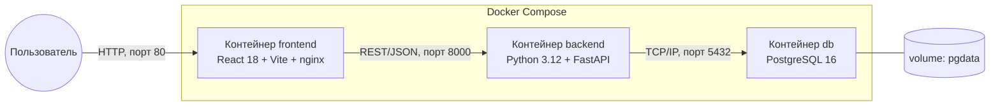
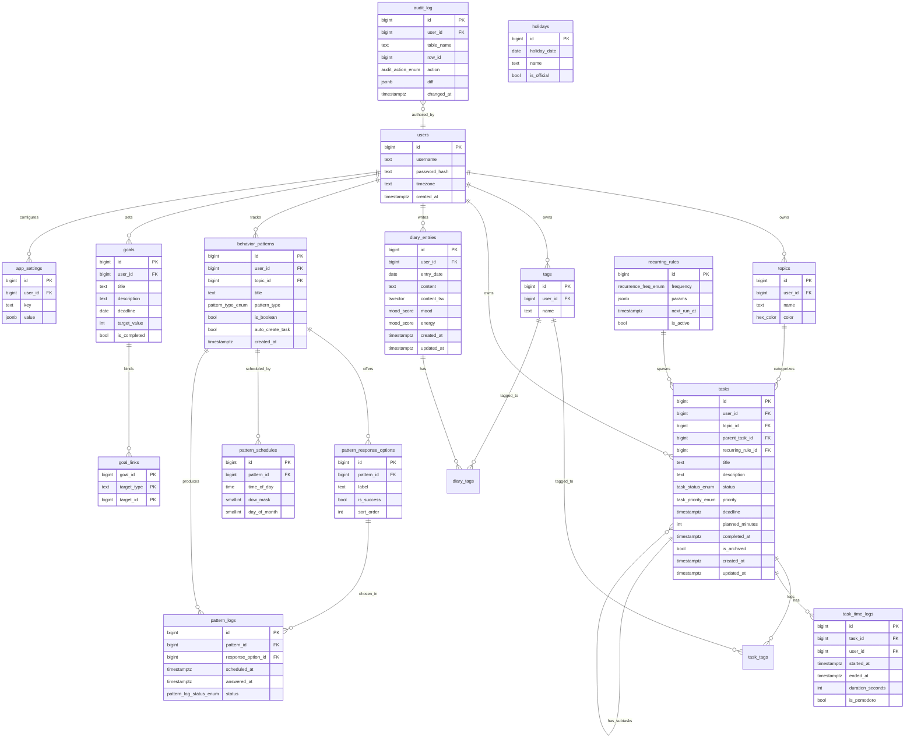
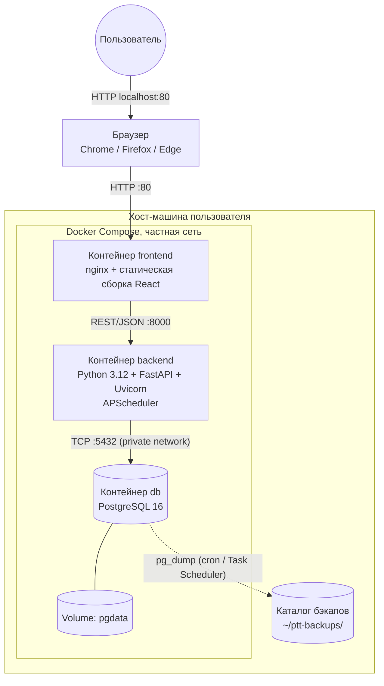

# ТЕХНИЧЕСКОЕ ЗАДАНИЕ

## на разработку системы «Персональный таск-трекер»

---

**Документ оформлен в соответствии с гибридной структурой:**

- ГОСТ 34.602-89 «Информационная технология. Комплекс стандартов на автоматизированные системы. Техническое задание на создание автоматизированной системы»;
- с элементами ГОСТ 19.201-78 «Единая система программной документации. Техническое задание. Требования к содержанию и оформлению».

---

| Реквизит | Значение |
|---|---|
| Полное наименование | Персональный таск-трекер с дневником, паттернами поведения и календарём прогресса |
| Условное обозначение | ПТТ |
| Шифр темы | КР-БД-2026-ПТТ |
| Стадия разработки | Техническое задание (предварительное проектирование) |
| Разработчик | Студент, группа `<номер>`, ФГБОУ ВО ННГУ им. Н. И. Лобачевского |
| Руководитель | `<ФИО, учёная степень, должность>` |
| Дата | `<дд.мм.гггг>` |

---

## Содержание

1. [Общие сведения](#1-общие-сведения)
2. [Назначение и цели создания системы](#2-назначение-и-цели-создания-системы)
3. [Характеристика объекта автоматизации](#3-характеристика-объекта-автоматизации)
4. [Требования к системе](#4-требования-к-системе)
   - 4.1. [Требования к системе в целом](#41-требования-к-системе-в-целом)
   - 4.2. [Требования к функциям системы](#42-требования-к-функциям-системы)
   - 4.3. [Требования к видам обеспечения](#43-требования-к-видам-обеспечения)
5. [Состав и содержание работ по созданию системы](#5-состав-и-содержание-работ-по-созданию-системы)
6. [Порядок контроля и приёмки системы](#6-порядок-контроля-и-приёмки-системы)
7. [Требования к подготовке объекта автоматизации к вводу системы в действие](#7-требования-к-подготовке-объекта-автоматизации-к-вводу-системы-в-действие)
8. [Требования к документированию](#8-требования-к-документированию)
9. [Источники разработки](#9-источники-разработки)

**Приложения:**

- А. ER-диаграмма;
- Б. Схема развёртывания (контейнеризация);
- В. Полный перечень объектов базы данных;
- Г. Описание экранов пользовательского интерфейса;
- Д. Перечень эндпоинтов REST API;
- Е. Требования к рабочей станции;
- Ж. Инструкция по первичному развёртыванию.

---

## 1. Общие сведения

### 1.1. Полное наименование системы и её условное обозначение

Полное наименование: **«Персональный таск-трекер с дневником, паттернами поведения и календарём прогресса»**.

Условное обозначение: **ПТТ**.

### 1.2. Шифр темы

КР-БД-2026-ПТТ.

### 1.3. Наименование организации-разработчика

Студент `<ФИО>`, группа `<номер>`, факультет/институт `<наименование>`, ФГБОУ ВО «Национальный исследовательский Нижегородский государственный университет им. Н. И. Лобачевского».

Заказчик в данной работе совпадает с разработчиком (учебная курсовая работа).

### 1.4. Перечень документов, на основании которых создаётся система

Разработка системы ведётся на основании:

- учебного плана направления подготовки;
- задания на курсовую работу по дисциплине «Базы данных»;
- ГОСТ 34.602-89;
- ГОСТ 19.201-78;
- методических указаний кафедры по выполнению и оформлению курсовой работы.

### 1.5. Плановые сроки начала и окончания работ

| Этап | Срок |
|---|---|
| Начало работ | `<дд.мм.гггг>` |
| Окончание работ (защита курсовой) | `<дд.мм.гггг>` |

Детализация по этапам приведена в разделе 5.

### 1.6. Сведения об источниках и порядке финансирования

Разработка ведётся в учебных целях, без коммерческого финансирования. Используется свободно распространяемое программное обеспечение с лицензиями MIT, Apache 2.0, BSD, PostgreSQL и совместимыми.

### 1.7. Порядок оформления и предъявления заказчику результатов работ

Результаты работы предъявляются в виде:

- настоящего технического задания;
- пояснительной записки к курсовой работе;
- исходного кода в Git-репозитории;
- собранных образов Docker и файла `docker-compose.yml`;
- демонстрации работающей системы на защите.

Приёмка проводится в форме защиты курсовой работы перед комиссией кафедры.

---

## 2. Назначение и цели создания системы

### 2.1. Назначение системы

Система предназначена для индивидуального использования одним пользователем (одно-пользовательский режим) и обеспечивает:

а) ведение списка задач с темами, тегами, приоритетами, дедлайнами и плановым временем выполнения;

б) ведение личного дневника с оценкой настроения, уровня энергии и тегированием записей;

в) проектирование паттернов поведения для формирования полезных и отказа от вредных привычек;

г) визуализацию прогресса в виде интерактивного календаря и тепловой карты года;

д) сбор и отображение статистики в различных временных и тематических разрезах, включая корреляцию данных дневника с продуктивностью;

е) учёт фактического времени, затраченного на задачи, в том числе посредством Pomodoro-таймера;

ж) долгосрочное целеполагание с привязкой задач и паттернов к целям;

з) импорт и экспорт пользовательских данных в формате CSV/JSON.

В соответствии с заданием курсовой работы по дисциплине «Базы данных» все вычислительные операции, связанные с агрегацией данных (расчёт прогресса, серий, корреляций, поиск), выполняются на стороне сервера баз данных средствами SQL (представления, функции, хранимые процедуры, триггеры).

### 2.2. Цели создания системы

Достижение следующих целей:

- **Ц1.** Сокращение времени на ежедневное планирование до 10 минут за счёт быстрого ввода задач (горячие клавиши, шаблоны, повторяющиеся задачи).
- **Ц2.** Повышение доли своевременно выполненных задач не менее чем до 80 % относительно общего числа задач за месяц.
- **Ц3.** Формирование непрерывных серий выполнения положительных паттернов длиной не менее 21 дня.
- **Ц4.** Снижение частоты повторений отрицательных паттернов за счёт визуализации и анти-серий.
- **Ц5.** Получение объективной картины распределения времени по темам в течение недели/месяца/года для последующего пересмотра приоритетов.
- **Ц6.** Сохранность пользовательских данных при сбоях за счёт их размещения в локальной транзакционной СУБД с поддержкой ACID и регулярного резервного копирования.
- **Ц7.** Получение опыта проектирования и реализации нетривиальной реляционной БД с активным использованием возможностей SQL (требование курсовой работы).

### 2.3. Критерии достижения целей

Каждая цель достижима при выполнении следующих количественных метрик (см. также раздел 6):

- среднее время отклика API не превышает 200 мс на 95-м перцентиле;
- автоматические тесты SQL-объектов покрывают не менее 70 % хранимой бизнес-логики;
- система должна штатно работать с базой объёмом до 100 000 задач, 30 000 записей дневника, 50 000 записей журнала паттернов;
- запуск системы — единственной командой `docker compose up -d` без дополнительной настройки.

---

## 3. Характеристика объекта автоматизации

### 3.1. Описание объекта

Объектом автоматизации является деятельность отдельного пользователя по личному планированию, ведению заметок, отслеживанию привычек и анализу собственной продуктивности.

В существующей деятельности (AS-IS) пользователь применяет разрозненные инструменты: бумажный ежедневник, заметки на смартфоне, мессенджеры (напоминания самому себе), сторонние сервисы (Google Calendar, Notion). Это приводит к:

- невозможности сводного анализа данных, накопленных в разных инструментах;
- риску потери данных при смене сервиса или устройства;
- отсутствию единой картины прогресса и привычек.

Целевое состояние (TO-BE) — единая локальная система с собственной БД, которая агрегирует все перечисленные сценарии и обеспечивает прозрачную аналитику.

### 3.2. Категории пользователей

В системе предусмотрена единственная категория — **Владелец данных**. Иные роли (администратор, аналитик и т. п.) не выделяются ввиду одно-пользовательского режима. Структура БД содержит таблицу `users` для возможного будущего перехода в многопользовательский режим без модификации схемы.

### 3.3. Пользовательские истории (User Stories) с критериями приёмки

Пользовательские сценарии сформулированы в формате «Как роль — я хочу действие — для того, чтобы цель», с критериями приёмки.

**US-01. Создание задачи.**
Как пользователь, я хочу создать задачу с темой, описанием, дедлайном и плановым временем, чтобы запланировать её выполнение.
*Критерии приёмки:* задача сохраняется в БД; в списке задач появляется в течение 1 секунды; обязательные поля — заголовок и тема; необязательные — описание, дедлайн, плановое время, теги, приоритет.

**US-02. Завершение задачи.**
Как пользователь, я хочу отметить задачу выполненной нажатием на чек-бокс, чтобы зафиксировать результат.
*Критерии приёмки:* при нажатии меняется статус, фиксируется дата фактического выполнения; если момент выполнения позже дедлайна и был указан плановый период, задача автоматически помечается как «просроченная» (триггер `trg_task_overdue_check`).

**US-03. Учёт времени.**
Как пользователь, я хочу запустить таймер на задаче или ввести время вручную, чтобы фиксировать фактически потраченное время.
*Критерии приёмки:* поддерживается несколько сессий времени на одну задачу; сумма фактического времени отображается в карточке задачи и доступна для отчётов.

**US-04. Дневник.**
Как пользователь, я хочу записать впечатления дня, отметить настроение и энергию, чтобы потом видеть динамику.
*Критерии приёмки:* одна запись на дату (UNIQUE-констрейнт); запись поддерживает тегирование; есть полнотекстовый поиск по содержимому.

**US-05. Паттерн поведения.**
Как пользователь, я хочу описать паттерн (например, «зарядка утром») с расписанием уведомлений и набором вариантов ответа, чтобы фиксировать его исполнение.
*Критерии приёмки:* в назначенное время приходит уведомление; пользователь выбирает один из заранее настроенных вариантов ответа; результат сохраняется и учитывается в текущей серии.

**US-06. Календарь.**
Как пользователь, я хочу видеть месяц/год календаря, в котором каждый день закрашен в зависимости от прогресса и подписан дробью «выполнено/всего», и чтобы праздники были выделены, — для общей картины прогресса.
*Критерии приёмки:* поддерживается переключение представлений «День / Месяц / Год»; цвет — градиент от серого (0 %) до насыщенно-зелёного (100 %); число задач отображается мелким шрифтом под номером дня; государственные праздники РФ выделяются цветом.

**US-07. Статистика.**
Как пользователь, я хочу видеть отчёты с разрезами по времени и темам, чтобы оценивать собственную продуктивность.
*Критерии приёмки:* доступны разрезы день / неделя / месяц / квартал / год; поддерживается фильтр по темам и тегам; вычисления выполняются на стороне БД.

**US-08. Цель.**
Как пользователь, я хочу поставить долгосрочную цель и привязать к ней задачи и паттерны, чтобы видеть прогресс.
*Критерии приёмки:* у цели есть метрика (число выполненных привязанных задач или достигнутых серий) и срок; текущий прогресс рассчитывается представлением `v_goal_progress`.

**US-09. Импорт/экспорт.**
Как пользователь, я хочу выгружать и загружать данные в формате CSV или JSON, чтобы переносить их или создавать резервные копии.
*Критерии приёмки:* экспорт всей базы пользователя одним JSON-файлом; импорт с проверкой схемы и идемпотентным поведением (повторный импорт не создаёт дубликатов).

**US-10. Развёртывание.**
Как пользователь, я хочу запустить систему одной командой `docker compose up -d`, чтобы не настраивать стек вручную.
*Критерии приёмки:* три контейнера запускаются и взаимодействуют корректно; миграции БД накатываются автоматически при первом запуске; фронтенд доступен по адресу `http://localhost`.

**US-11. Корреляция настроения и продуктивности.**
Как пользователь, я хочу увидеть, как моё настроение и уровень энергии (из дневника) влияют на процент выполнения задач, чтобы понять собственные паттерны эффективности.
*Критерии приёмки:* доступен отчёт за выбранный период с коэффициентом корреляции Пирсона между значениями `mood`/`energy` и долей выполненных задач; коэффициент рассчитывается на стороне БД.

**US-12. Тепловая карта года.**
Как пользователь, я хочу видеть весь год в виде тепловой карты (как в GitHub-contributions), чтобы оценивать активность за длительный период.
*Критерии приёмки:* отображаются 365/366 ячеек с градиентной заливкой по плотности активности (задачи, паттерны, дневник); при наведении — числовая подсказка.

---

## 4. Требования к системе

### 4.1. Требования к системе в целом

#### 4.1.1. Структура и архитектура

Система реализуется в трёхзвенной микросервисной архитектуре, развёртываемой посредством Docker Compose. Каждое звено выделено в отдельный контейнер.



Назначение контейнеров:

- **Контейнер `frontend`** — статически собранное React-приложение, раздаваемое веб-сервером nginx. Отвечает исключительно за пользовательский интерфейс и обращается к бэкенду через REST API. Порт `80` публикуется наружу.
- **Контейнер `backend`** — REST-API на базе FastAPI. Отвечает за маршрутизацию запросов, валидацию входных данных, делегирование вычислений в БД (через вызов хранимых процедур и функций), формирование JSON-ответов. Порт `8000` публикуется наружу для удобства отладки и работы документации `/docs` (в продуктивной поставке может быть скрыт).
- **Контейнер `db`** — СУБД PostgreSQL 16 с предварительно загруженной схемой БД, представлениями, функциями, процедурами, триггерами. Порт `5432` **не публикуется** наружу — доступ только из внутренней сети Docker. Данные сохраняются в именованном Docker-томе `pgdata`.

Особенности архитектуры:

- Логика вычислений (агрегации, корреляции, полнотекстовый поиск, расчёт серий) сосредоточена в БД (требование курсовой работы по дисциплине «Базы данных»);
- Бэкенд является «тонким» слоем над БД и в основном служит как HTTP-обёртка с валидацией входов/выходов;
- Между контейнерами используется частная Docker-сеть; СУБД не доступна извне хоста;
- Конфигурация сервисов задаётся через переменные окружения, описываемые в файле `.env`.

#### 4.1.2. Требования к режиму функционирования

- Режим работы: круглосуточный, на рабочей станции пользователя; реальное использование — порядка 1–4 часов в сутки;
- Отказ от работы при отсутствии сетевого подключения не предусмотрен (фронтенд может работать в офлайн-режиме чтения благодаря кэшу TanStack Query, мутации откладываются до восстановления соединения с бэкендом);
- Обновление компонентов системы — через перезапуск контейнеров (`docker compose pull && docker compose up -d`).

#### 4.1.3. Требования к надёжности

- Восстановление при сбоях БД — через резервные копии `pg_dump`, формируемые планировщиком хост-системы (cron / Task Scheduler) ежесуточно;
- Каждое изменение в ключевых таблицах фиксируется в `audit_log` (см. п. 4.3.1.9);
- Все мутирующие SQL-операции упакованы в транзакции; атомарность гарантируется ACID-свойствами PostgreSQL;
- При повторном запуске контейнера состояние БД восстанавливается из persistent volume;
- Среднее время восстановления после сбоя (RTO) — не более 5 минут;
- Допустимая потеря данных (RPO) — не более 24 часов (соответствует периодичности бэкапов).

#### 4.1.4. Требования к производительности

| Показатель | Значение |
|---|---|
| Время отклика API на типовых запросах (95-й перцентиль) | ≤ 200 мс |
| Время первичной загрузки веб-приложения (LAN/10 Мбит/с) | ≤ 2 с |
| Полнотекстовый поиск по дневнику (до 30 000 записей) | ≤ 300 мс |
| Расчёт месячной статистики календаря (до 10 000 задач) | ≤ 250 мс |
| Количество одновременных пользователей | 1 |
| Размер БД через 5 лет эксплуатации | ≤ 1 ГБ |

Достижение целевых показателей обеспечивается:

- размещением вычислений в БД и применением подходящих индексов (B-tree, GIN, BRIN, partial);
- использованием материализованных представлений для тяжёлых запросов;
- кешированием ответов на стороне фронтенда (TanStack Query, stale-while-revalidate).

#### 4.1.5. Требования к безопасности и защите от несанкционированного доступа

- Порт СУБД `5432` не публикуется на хост-машине; доступ к БД возможен только из контейнера `backend` по внутренней Docker-сети;
- Пароль и имя пользователя СУБД задаются через переменные окружения и не коммитятся в репозиторий (`.env` находится в `.gitignore`, в репозитории — только `.env.example`);
- Веб-сервер фронтенда настроен с заголовками `Content-Security-Policy`, `X-Frame-Options: DENY`, `X-Content-Type-Options: nosniff`;
- Все запросы между фронтендом и бэкендом проверяются на стороне сервера (Pydantic-валидация, защита от SQL-инъекций обеспечивается параметризованными запросами);
- На текущем этапе аутентификация не требуется (одно-пользовательский режим); структура БД содержит таблицу `users` с полем `password_hash` для возможного будущего расширения.

#### 4.1.6. Требования к эргономике и пользовательскому интерфейсу

- Адаптивная вёрстка под экраны от 1024×768 до 4K;
- Поддержка светлой и тёмной темы оформления; смена темы доступна в один клик и сохраняется;
- Доступность: контрастность не ниже WCAG 2.1 AA, навигация с клавиатуры, корректные семантические теги, ARIA-метки;
- Локализация: русский язык; даты в формате `DD.MM.YYYY`; время в 24-часовом формате; первый день недели — понедельник;
- Горячие клавиши:
  - `Ctrl + N` — создать задачу;
  - `Ctrl + J` — открыть дневник;
  - `Ctrl + /` — глобальный поиск;
  - `G + T` — перейти к задачам;
  - `G + C` — перейти к календарю;
  - `G + S` — перейти к статистике;
- Все действия, изменяющие состояние, имеют возможность отмены (toast с кнопкой «Отменить») в течение 5 секунд после совершения.

#### 4.1.7. Требования к стандартизации и унификации

- API соответствует архитектурному стилю REST; формат данных — JSON; описание — OpenAPI 3.1 (генерируется FastAPI автоматически по адресу `/openapi.json`);
- Имена объектов БД — в нижнем регистре, snake_case; первичные ключи — `id`, внешние — `<entity>_id`;
- Все временные метки хранятся как `TIMESTAMP WITH TIME ZONE` в UTC; отображаются в локальной таймзоне пользователя;
- Имена компонентов фронтенда — в PascalCase, файлы — kebab-case;
- Стиль кода Python — PEP 8 (контролируется `ruff` и `black`);
- Стиль кода TypeScript — ESLint + Prettier с настройками проекта.

#### 4.1.8. Требования к численности и квалификации персонала

- Эксплуатация — один человек, не требует специальной подготовки;
- Установка и обновление — пользователь с базовыми навыками работы с командной строкой и Docker (или работающий по инструкции из приложения Ж).

#### 4.1.9. Требования к защите информации от внешних воздействий

- Хранилище БД (Docker-том) защищено правами файловой системы хоста;
- Резервные копии хранятся в отдельной директории и могут быть зашифрованы средствами хост-ОС (BitLocker/FileVault/LUKS);
- При импорте данных выполняется валидация формата и схемы.

#### 4.1.10. Требования к патентной чистоте

Используется свободно распространяемое ПО с открытыми лицензиями (MIT, Apache 2.0, BSD, PostgreSQL); запатентованные алгоритмы и проприетарные библиотеки не применяются.

---

### 4.2. Требования к функциям системы

Система состоит из взаимосвязанных функциональных подсистем, перечисленных ниже. Каждая функция имеет уникальный код и кратко связана с реализующими её объектами БД (детали — в разделе 4.3.1 и приложении В).

#### 4.2.1. Подсистема управления задачами

Назначение: ведение списка дел.

| Код | Функция | Описание | Реализующие объекты БД |
|---|---|---|---|
| ФЗ-01 | Создание задачи | Заголовок, описание, тема, теги, приоритет, дедлайн, плановое время в минутах, ссылка на цель | таблицы `tasks`, `task_tags` |
| ФЗ-02 | Редактирование задачи | Изменение любых полей кроме `id` и `created_at` | `tasks`, триггер `trg_audit_tasks` |
| ФЗ-03 | Завершение задачи | Перевод в статус `done` через чек-бокс | процедура `sp_complete_task` |
| ФЗ-04 | Автоматическая просрочка | Задача переходит в статус `overdue`, если момент фактического выполнения позже дедлайна и был указан плановый период | триггер `trg_task_overdue_check` |
| ФЗ-05 | Подзадачи | Иерархия задач (self-FK `parent_task_id`); прогресс родителя считается по подзадачам | `tasks` (рекурсивный CTE в `v_task_subtree_progress`) |
| ФЗ-06 | Повторяющиеся задачи | Правило повторения (`daily`, `weekly`, `monthly`, `custom` с маской дней недели); экземпляры порождаются процедурой по расписанию | `recurring_rules`, `tasks`, процедура `sp_spawn_recurring_tasks`, триггер `trg_recurring_spawn_on_complete` |
| ФЗ-07 | Учёт фактического времени | Ручной ввод и Pomodoro-сессии; несколько сессий на задачу | `task_time_logs`, exclusion-constraint на пересечения |
| ФЗ-08 | Фильтрация и сортировка | По темам, тегам, дате, приоритету, статусу | индексы `idx_tasks_*` |
| ФЗ-09 | Поиск по тексту задачи | Полнотекстовый поиск по `title` и `description` на русском языке | GIN-индекс `idx_tasks_search_gin` |
| ФЗ-10 | Пакетные операции | «Отметить выполненными», «Перенести на завтра», «Удалить» — над выделенным набором | транзакция, процедура-обёртка |
| ФЗ-11 | Архивирование | Старые завершённые задачи скрываются из основного списка, доступны через фильтр «архив» | флаг `is_archived` |
| ФЗ-12 | Привязка к цели | Связь задачи с одной или несколькими целями | `goal_links` |

#### 4.2.2. Подсистема дневника

Назначение: ежедневные записи о состоянии и событиях.

| Код | Функция | Описание | Реализующие объекты БД |
|---|---|---|---|
| ФД-01 | Создание/редактирование записи | Одна запись в день (UNIQUE по `(user_id, entry_date)`) | `diary_entries` |
| ФД-02 | Оценка настроения | Шкала `mood ∈ {1..5}`, реализована через DOMAIN | DOMAIN `mood_score` |
| ФД-03 | Оценка уровня энергии | Шкала `energy ∈ {1..5}`, аналогично | DOMAIN `mood_score` |
| ФД-04 | Тегирование | Связь записи с тегами M:N | `diary_tags` |
| ФД-05 | Полнотекстовый поиск | Поиск по содержимому с использованием PostgreSQL FTS | поле `content_tsv tsvector`, GIN-индекс, функция `fn_search_diary` |
| ФД-06 | Хронологическая лента | Просмотр записей в обратном порядке с пагинацией | индекс по `entry_date DESC` |
| ФД-07 | Тепловая карта дневника | Визуализация наличия записей по дням года | представление `v_year_heatmap` |
| ФД-08 | Связь с задачами дня | В записи отображается список выполненных за этот день задач | JOIN с `tasks` через `entry_date = completed_at::date` |

#### 4.2.3. Подсистема паттернов поведения

Назначение: формирование полезных и отказ от вредных привычек.

| Код | Функция | Описание | Реализующие объекты БД |
|---|---|---|---|
| ФП-01 | Создание паттерна | Тип (`positive` / `negative`), тема, описание, признак «булев ответ» | `behavior_patterns` |
| ФП-02 | Расписание уведомлений | Несколько триггеров на паттерн: ежедневно в HH:MM, по будням, по дням недели, в дату месяца | `pattern_schedules` |
| ФП-03 | Варианты ответа | Список из N вариантов (например, «Сделал», «Не сделал», «Частично») либо булев Y/N | `pattern_response_options` |
| ФП-04 | Регистрация отклика | В назначенное время приходит уведомление; пользователь выбирает вариант ответа | `pattern_logs`, процедура `sp_log_pattern_response` |
| ФП-05 | Расчёт серий | Текущая и максимальная серия успешных откликов (для positive); длина анти-серии (для negative) | функции `fn_calculate_streak`, `fn_calculate_max_streak`, `fn_calculate_anti_streak`; представление `v_pattern_streaks` |
| ФП-06 | Статистика паттерна | Процент успешных откликов в неделе/месяце; распределение ответов | агрегатные запросы по `pattern_logs` |
| ФП-07 | Пропуск ответа | Если пользователь не ответил в течение 12 часов — фиксируется пропуск (`missed`); серия для positive — обнуляется | планировщик + процедура `sp_close_overdue_pattern_logs` |
| ФП-08 | Связь с задачами | Опциональное автоматическое создание задачи в день срабатывания паттерна | триггер `trg_pattern_to_task` |

#### 4.2.4. Подсистема календаря

Назначение: визуализация прогресса.

| Код | Функция | Описание | Реализующие объекты БД |
|---|---|---|---|
| ФК-01 | Переключение представлений | «День / Месяц / Год» | — (на стороне UI) |
| ФК-02 | Заливка ячейки дня | Градиент от серого (0 %) до насыщенно-зелёного (100 %), пропорциональный проценту выполнения задач за день | функция `fn_day_color`, представление `v_calendar_day_stats` |
| ФК-03 | Подпись «выполнено / всего» | Под номером дня мелким шрифтом отображается дробь `done/total` | `v_calendar_day_stats` |
| ФК-04 | Праздники РФ | Государственные праздники выделяются отдельным цветом и имеют название | таблица `holidays`, JOIN в представлении |
| ФК-05 | Переход к задачам дня | По клику на день открывается список задач | API-запрос с фильтром по дате |
| ФК-06 | Тепловая карта года | Год в стиле GitHub-contributions | `v_year_heatmap` |
| ФК-07 | Отметки записей дневника | Иконка наличия записи дневника на дне | `v_calendar_day_stats.has_diary` |
| ФК-08 | Иконки паттернов | Маркеры выполненных/пропущенных паттернов | агрегаты по `pattern_logs` |

#### 4.2.5. Подсистема статистики

Назначение: отчётность и анализ.

| Код | Функция | Описание | Реализующие объекты БД |
|---|---|---|---|
| ФС-01 | Отчёты по времени | Разрезы день / неделя / месяц / квартал / год | представление `v_weekly_summary` и параметризованные функции |
| ФС-02 | Отчёты по темам | Распределение фактического времени, процент выполнения, средняя просрочка | `v_task_topic_breakdown` |
| ФС-03 | Отчёты по тегам | Аналогично, но в разрезе тегов | агрегаты по `task_tags` |
| ФС-04 | Корреляция настроения и продуктивности | Коэффициент корреляции Пирсона между средним настроением и долей выполненных задач за период; реализуется средствами `corr()` PostgreSQL | `v_mood_productivity_correlation`, `fn_mood_productivity_corr` |
| ФС-05 | Серии и анти-серии паттернов | Визуализация серий, истории срабатываний | `v_pattern_streaks` |
| ФС-06 | Графики | Гистограммы, линейные графики, тепловые карты, круговые диаграммы — на стороне фронтенда | данные из API/представлений |
| ФС-07 | Сравнение периодов | Сравнение текущего месяца с предыдущим, текущей недели с прошлой | оконные функции `LAG()` в SQL |
| ФС-08 | Лучший/худший день | Какой день недели самый продуктивный | агрегаты с `EXTRACT(dow ...)` |

#### 4.2.6. Подсистема целей

Назначение: долгосрочное целеполагание.

| Код | Функция | Описание | Реализующие объекты БД |
|---|---|---|---|
| ФЦ-01 | Создание цели | Название, описание, срок, метрика (число выполненных привязанных задач или достигнутая длина серии паттерна) | `goals` |
| ФЦ-02 | Привязка задач/паттернов | M:N связь цели с задачами и/или паттернами | `goal_links` |
| ФЦ-03 | Расчёт прогресса | Текущий процент выполнения цели | `v_goal_progress`, функция `fn_goal_progress` |
| ФЦ-04 | Уведомление о завершении | Уведомление при достижении 100 % | триггер `trg_goal_completed` |

#### 4.2.7. Подсистема уведомлений

| Код | Функция | Описание |
|---|---|---|
| ФУ-01 | Уведомления о дедлайнах | Через Web Notifications API, за заданное время до дедлайна |
| ФУ-02 | Уведомления по расписанию паттернов | Срабатывают согласно `pattern_schedules` |
| ФУ-03 | Уведомления о завершении цели | По триггеру при достижении 100 % |
| ФУ-04 | Режим «Не беспокоить» | Настройка тишины по часам и дням недели |
| ФУ-05 | Канал доставки | Браузерные push-уведомления; в перспективе — Telegram-бот, e-mail (в данной редакции ТЗ не реализуется) |

#### 4.2.8. Подсистема Pomodoro-таймера

| Код | Функция | Описание |
|---|---|---|
| ФТ-01 | Запуск таймера | По умолчанию 25 минут, длительность настраивается |
| ФТ-02 | Привязка к задаче | При завершении сессии создаётся запись в `task_time_logs` |
| ФТ-03 | Перерывы | Короткий (5 мин) и длинный (15 мин) каждые 4 цикла |
| ФТ-04 | Сохранение состояния | При перезагрузке страницы таймер восстанавливается |
| ФТ-05 | Звуковое оповещение | По окончании сессии и перерыва |

#### 4.2.9. Подсистема импорта и экспорта данных

| Код | Функция | Описание |
|---|---|---|
| ФЭ-01 | Экспорт всей БД пользователя | В JSON-файл с указанием версии схемы |
| ФЭ-02 | Экспорт сущности | Задачи / дневник / паттерны / журнал — в CSV |
| ФЭ-03 | Импорт JSON | С валидацией схемы (Pydantic) и идемпотентной вставкой по натуральным ключам |
| ФЭ-04 | Резервное копирование БД | Команда `docker exec ... pg_dump` (приложение Ж) |
| ФЭ-05 | Восстановление из бэкапа | Команда `docker exec ... pg_restore` |

#### 4.2.10. Подсистема настроек

| Код | Функция | Описание |
|---|---|---|
| ФН-01 | Тема оформления | Светлая / тёмная / системная |
| ФН-02 | Часовой пояс | Выбор из списка IANA tzdata |
| ФН-03 | Первый день недели | Понедельник (по умолчанию) или воскресенье |
| ФН-04 | Длительность Pomodoro | 25/50/90 минут |
| ФН-05 | Режим «Не беспокоить» | Часы тишины |
| ФН-06 | Управление темами и тегами | CRUD для справочников |
| ФН-07 | Управление праздниками | Возможность добавлять/скрывать собственные памятные даты |

---

### 4.3. Требования к видам обеспечения

#### 4.3.1. Информационное обеспечение (структура базы данных)

Информационное обеспечение реализуется средствами СУБД PostgreSQL 16. Сущности предметной области моделируются реляционно, целостность — через декларативные констрейнты, бизнес-логика расчётов — через представления, функции, процедуры и триггеры.

В соответствии с требованием курсовой работы по дисциплине «Базы данных» в системе должны быть применены не менее:

- 15 таблиц;
- 8 представлений (включая материализованные);
- 8 функций (`LANGUAGE plpgsql` / `LANGUAGE sql`);
- 5 хранимых процедур (`CREATE PROCEDURE`);
- 6 триггеров (`AFTER`/`BEFORE`);
- 12 индексов различных типов (B-tree, GIN, BRIN, partial, unique, exclusion);
- использование транзакций, оконных функций, рекурсивных CTE, полнотекстового поиска;
- декларативные констрейнты `PRIMARY KEY`, `FOREIGN KEY`, `UNIQUE`, `CHECK`, `EXCLUSION`, доменные типы (`DOMAIN`), перечисления (`ENUM`).

##### 4.3.1.1. Концептуальная схема (ER-диаграмма)

См. приложение А.

##### 4.3.1.2. Перечень таблиц

| № | Таблица | Назначение | Ориентировочный объём за 5 лет |
|---|---|---|---|
| 1 | `users` | Пользователи (1 запись в одно-пользовательском режиме) | 1 |
| 2 | `topics` | Темы (категории) задач | 50 |
| 3 | `tags` | Универсальные теги для задач и записей дневника | 200 |
| 4 | `tasks` | Задачи | 100 000 |
| 5 | `task_tags` | Связка M:N «задача-тег» | 300 000 |
| 6 | `task_time_logs` | Журнал отрезков времени по задачам (ручной ввод и Pomodoro) | 200 000 |
| 7 | `recurring_rules` | Правила повторения задач | 200 |
| 8 | `diary_entries` | Записи дневника | 2 000 |
| 9 | `diary_tags` | Связка M:N «запись дневника-тег» | 8 000 |
| 10 | `behavior_patterns` | Паттерны поведения | 100 |
| 11 | `pattern_response_options` | Варианты ответа на паттерн | 500 |
| 12 | `pattern_schedules` | Расписания уведомлений по паттернам | 300 |
| 13 | `pattern_logs` | Журнал откликов по паттернам | 50 000 |
| 14 | `goals` | Долгосрочные цели | 100 |
| 15 | `goal_links` | Связка цели с задачами/паттернами | 2 000 |
| 16 | `holidays` | Государственные праздники | 200 |
| 17 | `audit_log` | Журнал изменений ключевых таблиц | 1 000 000 |
| 18 | `app_settings` | Пользовательские настройки (ключ-значение) | 50 |

Полный DDL с типами полей и констрейнтами — приложение В.

##### 4.3.1.3. Перечень доменов и перечислений

Используются пользовательские типы данных:

- `task_status_enum` ∈ `{ pending, in_progress, done, overdue, cancelled }`;
- `task_priority_enum` ∈ `{ low, medium, high, urgent }`;
- `pattern_type_enum` ∈ `{ positive, negative }`;
- `pattern_log_status_enum` ∈ `{ pending, answered, missed }`;
- `recurrence_freq_enum` ∈ `{ daily, weekly, monthly, custom }`;
- `audit_action_enum` ∈ `{ insert, update, delete }`;
- DOMAIN `mood_score` на основе `SMALLINT` с `CHECK BETWEEN 1 AND 5`;
- DOMAIN `percentage` на `NUMERIC(5,2)` с `CHECK BETWEEN 0 AND 100`;
- DOMAIN `positive_int` на `INTEGER` с `CHECK > 0`;
- DOMAIN `hex_color` на `CHAR(7)` с `CHECK (VALUE ~ '^#[0-9A-Fa-f]{6}$')`.

##### 4.3.1.4. Перечень декларативных констрейнтов

(Полные определения — приложение В.)

- **PRIMARY KEY** во всех таблицах:
  - суррогатные `id BIGSERIAL` или `BIGINT GENERATED ALWAYS AS IDENTITY`;
  - составные в связках M:N (`task_tags(task_id, tag_id)`, `diary_tags(entry_id, tag_id)`, `goal_links(goal_id, target_type, target_id)`).
- **FOREIGN KEY**:
  - `ON DELETE CASCADE` для зависимых сущностей (`task_tags`, `diary_tags`, `pattern_logs`, `pattern_schedules`, `pattern_response_options`, `task_time_logs`);
  - `ON DELETE RESTRICT` для справочников (`topics`, `tags`, `holidays`);
  - `ON DELETE SET NULL` для опциональных связей (`tasks.parent_task_id`).
- **UNIQUE**:
  - `diary_entries (user_id, entry_date)` — одна запись в день;
  - `holidays (holiday_date)` — один праздник на дату;
  - `tags (user_id, name)` — теги уникальны в рамках пользователя;
  - `topics (user_id, name)` — то же для тем;
  - `app_settings (user_id, key)`.
- **CHECK** (избранные):
  - `tasks.planned_minutes > 0`;
  - `tasks.deadline IS NULL OR tasks.deadline > tasks.created_at`;
  - `tasks.completed_at IS NULL OR tasks.completed_at >= tasks.created_at`;
  - `task_time_logs.duration_seconds > 0`;
  - `task_time_logs.ended_at > task_time_logs.started_at`;
  - `diary_entries.mood BETWEEN 1 AND 5` (через DOMAIN);
  - `diary_entries.energy BETWEEN 1 AND 5`;
  - `pattern_schedules.time_of_day BETWEEN '00:00:00' AND '23:59:59'`;
  - `goals.target_value > 0 AND goals.deadline > goals.created_at`.
- **NOT NULL** на всех ключевых полях (заголовки, идентификаторы, временные метки).
- **EXCLUSION CONSTRAINT** на `task_time_logs` для исключения наложений интервалов в рамках одного пользователя — реализуется через `EXCLUDE USING gist (user_id WITH =, tstzrange(started_at, ended_at, '[)') WITH &&)`. Требует расширения `btree_gist`.

##### 4.3.1.5. Перечень индексов

Индексы выбраны исходя из ожидаемых сценариев чтения. Каждое решение обосновано.

| № | Индекс | Тип | Поля | Обоснование |
|---|---|---|---|---|
| 1 | `idx_tasks_deadline` | B-tree | `tasks(deadline)` | Сортировка/фильтр «ближайшие задачи» |
| 2 | `idx_tasks_topic_status` | B-tree (составной) | `tasks(topic_id, status)` | Группировка по темам с фильтром по статусу |
| 3 | `idx_tasks_user_completed_at` | B-tree | `tasks(user_id, completed_at)` | Календарь и расчёт серий выполнения |
| 4 | `idx_tasks_overdue_partial` | B-tree (partial) | `tasks(deadline) WHERE status = 'overdue'` | Узкая выборка просрочек, индекс мал по объёму |
| 5 | `idx_tasks_search_gin` | GIN | `to_tsvector('russian', title \|\| ' ' \|\| coalesce(description,''))` | Поиск по задачам |
| 6 | `idx_diary_entry_date` | B-tree (UNIQUE) | `diary_entries(user_id, entry_date)` | Поиск по дате, уникальность |
| 7 | `idx_diary_fts_gin` | GIN | `diary_entries(content_tsv)` | Полнотекстовый поиск дневника |
| 8 | `idx_audit_log_brin` | BRIN | `audit_log(changed_at)` | Журнал последовательно растёт по времени, BRIN экономит место |
| 9 | `idx_pattern_logs_brin` | BRIN | `pattern_logs(scheduled_at)` | Аналогично |
| 10 | `idx_pattern_logs_pattern_date` | B-tree | `pattern_logs(pattern_id, scheduled_at DESC)` | Расчёт текущей серии (выборка последних N) |
| 11 | `idx_holidays_date` | B-tree (UNIQUE) | `holidays(holiday_date)` | Подмешивание в календарь |
| 12 | `idx_task_tags_tag` | B-tree | `task_tags(tag_id, task_id)` | Поиск задач по тегу |
| 13 | `idx_diary_tags_tag` | B-tree | `diary_tags(tag_id, entry_id)` | Поиск записей по тегу |
| 14 | `idx_goals_deadline_active` | B-tree (partial) | `goals(deadline) WHERE is_completed = false` | Список активных целей |
| 15 | `idx_recurring_rules_next_run` | B-tree | `recurring_rules(next_run_at) WHERE is_active = true` | Планировщик повторяющихся задач |

##### 4.3.1.6. Перечень представлений (VIEW)

Все представления документируются комментариями `COMMENT ON VIEW ...`.

| № | Представление | Тип | Назначение |
|---|---|---|---|
| 1 | `v_calendar_day_stats` | VIEW | На каждый день: число задач, число выполненных, доля выполнения, цвет заливки, признак праздника, признак наличия записи дневника |
| 2 | `v_task_topic_breakdown` | VIEW | Агрегаты по темам: число задач, % выполнения, среднее плановое vs фактическое время, средняя просрочка |
| 3 | `v_pattern_streaks` | VIEW | Текущая и максимальная серии, длина анти-серии для каждого паттерна |
| 4 | `v_overdue_tasks` | MATERIALIZED VIEW | Список просроченных задач с обновлением раз в час процедурой `sp_recalc_calendar_cache` |
| 5 | `v_mood_productivity_correlation` | VIEW | По периодам: средний `mood`, средний `energy`, % выполнения, коэффициент корреляции Пирсона |
| 6 | `v_weekly_summary` | VIEW | Сводка за неделю: задачи (всего/выполнено), Pomodoro-минуты, паттерны, число записей дневника |
| 7 | `v_year_heatmap` | VIEW | Для тепловой карты года: дата → счётчик активности (задачи + паттерны + дневник) |
| 8 | `v_goal_progress` | VIEW | Текущий процент выполнения цели на основании привязанных задач и паттернов |
| 9 | `v_task_subtree_progress` | VIEW (рекурсивный CTE) | Прогресс родительской задачи на основе подзадач |
| 10 | `v_topic_time_distribution` | VIEW | Распределение фактического времени по темам за период |

##### 4.3.1.7. Перечень функций

Все функции документируются комментариями `COMMENT ON FUNCTION ...`. Каждая функция объявляется с подходящим уровнем волатильности (`STABLE`, `IMMUTABLE`, `VOLATILE`).

| № | Функция | Сигнатура | Возвращает | Назначение |
|---|---|---|---|---|
| 1 | `fn_get_calendar_stats` | `(p_user_id BIGINT, p_year INT, p_month INT)` | `TABLE(day DATE, total INT, done INT, ratio NUMERIC, color TEXT, is_holiday BOOL, holiday_name TEXT, has_diary BOOL)` | Данные для месяца календаря |
| 2 | `fn_calculate_streak` | `(p_pattern_id BIGINT)` | `INT` | Текущая серия успешных откликов |
| 3 | `fn_calculate_max_streak` | `(p_pattern_id BIGINT)` | `INT` | Максимальная серия в истории |
| 4 | `fn_calculate_anti_streak` | `(p_pattern_id BIGINT)` | `INT` | Длина анти-серии (для negative-паттерна) |
| 5 | `fn_completion_rate` | `(p_user_id BIGINT, p_from DATE, p_to DATE, p_topic_id BIGINT DEFAULT NULL)` | `percentage` | Процент выполнения за период |
| 6 | `fn_search_diary` | `(p_user_id BIGINT, p_query TEXT, p_limit INT DEFAULT 50)` | `TABLE(entry_id BIGINT, entry_date DATE, rank REAL, snippet TEXT)` | Полнотекстовый поиск с подсветкой |
| 7 | `fn_day_color` | `(p_ratio NUMERIC)` | `hex_color` | HEX-цвет градиента для дня (от `#E5E7EB` до `#16A34A`) |
| 8 | `fn_mood_productivity_corr` | `(p_user_id BIGINT, p_from DATE, p_to DATE)` | `NUMERIC` | Коэффициент корреляции Пирсона `mood ↔ % выполнения` (использует агрегат `corr()`) |
| 9 | `fn_goal_progress` | `(p_goal_id BIGINT)` | `percentage` | Процент выполнения цели |
| 10 | `fn_next_recurring_date` | `(p_rule_id BIGINT, p_from DATE)` | `DATE` | Следующая дата повторения по правилу |
| 11 | `fn_topic_time_breakdown` | `(p_user_id BIGINT, p_from DATE, p_to DATE)` | `TABLE(topic_id BIGINT, topic_name TEXT, minutes INT, share NUMERIC)` | Распределение времени по темам |

##### 4.3.1.8. Перечень хранимых процедур

| № | Процедура | Сигнатура | Назначение |
|---|---|---|---|
| 1 | `sp_complete_task` | `(p_task_id BIGINT)` | Атомарно отметить задачу выполненной с фиксацией времени, проверкой дедлайна и записью в `audit_log` |
| 2 | `sp_log_pattern_response` | `(p_pattern_id BIGINT, p_response_option_id BIGINT, p_scheduled_at TIMESTAMPTZ)` | Зафиксировать отклик и обновить серии |
| 3 | `sp_spawn_recurring_tasks` | `(p_date DATE)` | Породить экземпляры повторяющихся задач на дату; вызывается планировщиком ежесуточно |
| 4 | `sp_close_overdue_pattern_logs` | `(p_now TIMESTAMPTZ DEFAULT now())` | Перевести просроченные ожидания ответа в статус `missed` (через 12 часов) |
| 5 | `sp_archive_old_audit` | `(p_keep_days INT DEFAULT 365)` | Архивировать журнал аудита старше N дней |
| 6 | `sp_recalc_calendar_cache` | `()` | Пересчёт `v_overdue_tasks` (`REFRESH MATERIALIZED VIEW CONCURRENTLY`) |
| 7 | `sp_export_user_data` | `(p_user_id BIGINT, OUT p_json JSONB)` | Сборка всей пользовательской БД в один JSONB-документ |
| 8 | `sp_import_user_data` | `(p_user_id BIGINT, p_json JSONB)` | Идемпотентный импорт JSON-документа в одну транзакцию |

##### 4.3.1.9. Перечень триггеров

| № | Триггер | Таблица | Событие | Назначение |
|---|---|---|---|---|
| 1 | `trg_task_overdue_check` | `tasks` | `BEFORE UPDATE` | Если `completed_at > deadline` и был указан `planned_minutes` — выставить статус `overdue` |
| 2 | `trg_task_set_completed_at` | `tasks` | `BEFORE UPDATE` | Автоматически проставить `completed_at = now()` при переходе статуса в `done` |
| 3 | `trg_task_updated_at` | `tasks`, `diary_entries`, `goals`, `behavior_patterns` | `BEFORE UPDATE` | Поддерживать `updated_at = now()` (одна общая функция-обработчик `fn_set_updated_at()`) |
| 4 | `trg_diary_tsv_update` | `diary_entries` | `BEFORE INSERT/UPDATE` | Поддержка `content_tsv = to_tsvector('russian', content)` |
| 5 | `trg_audit_changes` | `tasks`, `diary_entries`, `behavior_patterns`, `goals`, `pattern_logs` | `AFTER INSERT/UPDATE/DELETE` | Записать изменение в `audit_log` (одна общая функция-обработчик `fn_audit_log()`) |
| 6 | `trg_pattern_streak_recalc` | `pattern_logs` | `AFTER INSERT` | Инвалидировать кеш серий (или пересчитать инкрементально) |
| 7 | `trg_recurring_spawn_on_complete` | `tasks` | `AFTER UPDATE OF status` | Если задача порождена правилом повторения и завершена — породить следующий экземпляр (через `sp_spawn_recurring_tasks` или вычисление `fn_next_recurring_date`) |
| 8 | `trg_tag_user_match` | `task_tags`, `diary_tags` | `BEFORE INSERT` | Проверить, что тег принадлежит тому же пользователю, что и сущность (защита от пересечения данных пользователей при будущем многопользовательском режиме) |
| 9 | `trg_goal_completed` | `goals` | `BEFORE UPDATE` | При достижении 100 % проставить `is_completed = true`, `completed_at = now()` |
| 10 | `trg_pattern_to_task` | `pattern_schedules` | `AFTER INSERT/UPDATE` | (опционально) Создать привязанную задачу на день срабатывания, если паттерн помечен `auto_create_task` |

##### 4.3.1.10. Использование расширенных возможностей SQL

Помимо базовых конструкций, в реализации применяются:

- **транзакции** с уровнем изоляции `READ COMMITTED` (по умолчанию) и `REPEATABLE READ` для отчётов;
- **оконные функции** `LAG()`, `ROW_NUMBER()`, `SUM() OVER (...)`, `AVG() OVER (...)` — в представлениях статистики и серий;
- **рекурсивные CTE** (`WITH RECURSIVE`) — в `v_task_subtree_progress` (обход иерархии подзадач) и `fn_calculate_streak` (последовательность дней);
- **полнотекстовый поиск** (`tsvector`, `tsquery`, `to_tsvector('russian', ...)`, `ts_rank`, `ts_headline`);
- **агрегаты для статистики** — `corr(x, y)`, `regr_slope(y, x)`, `stddev_samp`, `percentile_cont`;
- **расширения** `btree_gist` (для exclusion constraints), `pg_trgm` (для нечёткого поиска по тегам/темам), `unaccent` (опционально, для поиска без диакритики);
- **JSON/JSONB** — для импорта/экспорта (`sp_export_user_data`, `sp_import_user_data`) и хранения метаданных правил повторения (`recurring_rules.params JSONB`).

##### 4.3.1.11. Объёмные характеристики БД

Ожидаемые объёмы за 5 лет эксплуатации в одно-пользовательском режиме:

- общий размер БД — не более 1 ГБ (без учёта журнала аудита);
- журнал аудита — до 1 000 000 записей; периодически архивируется процедурой `sp_archive_old_audit`;
- крупнейшие по числу строк таблицы: `audit_log`, `task_tags`, `task_time_logs`, `pattern_logs`.

##### 4.3.1.12. Стратегия миграций

- DDL разбивается на нумерованные миграции `V001__init.sql`, `V002__patterns.sql`, ...;
- Версионный контроль миграций — Alembic (для частей, генерируемых из ORM) и raw-SQL-миграции (для процедур, функций, триггеров — версионируются файлами и применяются командой `psql -f`);
- При первом старте контейнера `db` все скрипты из `/docker-entrypoint-initdb.d/` выполняются автоматически в алфавитном порядке.

#### 4.3.2. Программное обеспечение

##### 4.3.2.1. Общесистемное ПО

- ОС хост-машины: Windows 10/11 64-bit, Linux (Ubuntu 22.04+), macOS 13+;
- Docker Desktop (Windows/macOS) или Docker Engine + Compose-plugin (Linux), версия 24.0+;
- Браузер: последние две стабильные версии Chrome, Firefox, Edge, Safari.

##### 4.3.2.2. Серверная часть (контейнер `db`)

- Базовый образ: `postgres:16-alpine`;
- Расширения: `pg_trgm`, `btree_gist`, `unaccent` (опционально);
- Локаль СУБД: `ru_RU.UTF-8`;
- Конфигурационные параметры по умолчанию (могут уточняться):
  - `shared_buffers = 256MB`;
  - `work_mem = 16MB`;
  - `maintenance_work_mem = 64MB`;
  - `default_statistics_target = 100`.

##### 4.3.2.3. Серверная часть (контейнер `backend`)

| Компонент | Версия | Назначение |
|---|---|---|
| Python | 3.12 | Среда выполнения |
| FastAPI | 0.110+ | HTTP-фреймворк (ASGI) |
| Uvicorn | 0.27+ | ASGI-сервер |
| Pydantic | 2.6+ | Валидация DTO |
| SQLAlchemy | 2.0+ | ORM (тонкий маппер для CRUD) |
| asyncpg | 0.29+ | Асинхронный драйвер PostgreSQL |
| Alembic | 1.13+ | Миграции схемы |
| APScheduler | 3.10+ | Планировщик (`sp_spawn_recurring_tasks` ежесуточно, `sp_close_overdue_pattern_logs` ежечасно, `sp_recalc_calendar_cache` каждый час) |
| python-dotenv | 1.0+ | Загрузка переменных окружения |
| pytest, pytest-asyncio | актуальные | Тестирование |
| ruff, black, mypy | актуальные | Линтинг и проверка типов |

##### 4.3.2.4. Клиентская часть (контейнер `frontend`)

| Компонент | Версия | Назначение |
|---|---|---|
| Node.js | 20 LTS | Среда сборки |
| React | 18 | UI-фреймворк |
| TypeScript | 5.4+ | Статическая типизация |
| Vite | 5.0+ | Сборщик |
| React Router | 6 | Маршрутизация SPA |
| TanStack Query | 5 | Запросы к API, кеширование |
| Tailwind CSS | 3 | Стилизация |
| shadcn/ui | актуальный | Компоненты UI |
| Recharts | 2 | Графики |
| date-fns | 3 | Работа с датами |
| react-hook-form + zod | актуальные | Формы и валидация |
| Vitest, Testing Library | актуальные | Тестирование |
| ESLint, Prettier | актуальные | Стиль кода |
| nginx | 1.25-alpine | Раздача статики в продуктивной поставке |

##### 4.3.2.5. Контейнеризация

- Docker Compose v2; файл `docker-compose.yml` описывает три сервиса (`db`, `backend`, `frontend`);
- Образы строятся командой `docker compose build`;
- Healthchecks: `pg_isready` для `db`, HTTP-проверка `/health` для `backend`, HTTP-проверка `/` для `frontend`;
- Volume `pgdata` для персистентности БД.

#### 4.3.3. Техническое обеспечение

Минимальные требования к рабочей станции:

| Параметр | Минимум | Рекомендуется |
|---|---|---|
| Процессор | x86-64, 2 ядра, 2 ГГц | 4 ядра, 3 ГГц |
| Оперативная память | 8 ГБ | 16 ГБ |
| Свободное место на диске | 5 ГБ | 10 ГБ (с запасом под бэкапы) |
| Дисплей | 1024×768 | 1920×1080 и выше |
| Сеть | не требуется (локальная установка) | широкополосный Интернет — для первоначальной загрузки образов |

Подробности — приложение Е.

#### 4.3.4. Лингвистическое обеспечение

- Язык интерфейса: русский;
- Язык исходного кода и комментариев: английский (имена сущностей и переменных), допускаются русскоязычные комментарии для специфичных доменных терминов;
- Естественный язык документации: русский;
- Язык запросов к БД: SQL (диалект PostgreSQL 16);
- Текстовые данные пользователя — кодировка UTF-8;
- Локаль для FTS — `russian` (со словарём snowball);
- Формат дат — `DD.MM.YYYY`, времени — 24-часовой `HH:MM`.

#### 4.3.5. Методическое обеспечение

В состав методического обеспечения входят:

- настоящее техническое задание;
- руководство пользователя;
- описание схемы БД с диаграммой и пояснениями;
- инструкция по развёртыванию (приложение Ж);
- тест-кейсы приёмки (раздел 6);
- комментарии к ключевым SQL-объектам через `COMMENT ON ...`.

#### 4.3.6. Организационное обеспечение

- Поддержка ведётся самостоятельно автором работы;
- Резервное копирование — задача пользователя; рекомендуемая периодичность — раз в сутки;
- Обновление версий — через `git pull && docker compose build && docker compose up -d`.

---

## 5. Состав и содержание работ по созданию системы

Работы организуются в 7 этапов в соответствии со стадиями ГОСТ 34.601-90.

| Этап | Стадия по ГОСТ 34.601 | Содержание | Результат | Ориентировочный срок |
|---|---|---|---|---|
| 1 | Формирование требований к АС | Сбор требований, утверждение ТЗ, проектирование БД, разработка ER-диаграммы | Настоящее ТЗ, ER-диаграмма, концептуальная схема | 1 неделя |
| 2 | Разработка концепции | Выбор стека, прототипирование интерфейсов, разработка макетов (wireframes) | Макеты экранов, обоснование архитектуры | 0,5 недели |
| 3 | Технический проект (БД) | Реализация таблиц, доменов, перечислений, констрейнтов, индексов, представлений, функций, процедур, триггеров; написание миграций; тесты SQL-объектов | DDL/DML-скрипты в репозитории, юнит-тесты PL/pgSQL | 2 недели |
| 4 | Технический проект (бэкенд) | REST API, OpenAPI-спецификация, интеграция с БД, планировщик задач, интеграционные тесты | Контейнер `backend`, образ `backend:latest` | 2 недели |
| 5 | Технический проект (фронтенд) | Реализация экранов, интеграция с API, адаптивная вёрстка, темизация, графики | Контейнер `frontend`, образ `frontend:latest` | 2 недели |
| 6 | Ввод в действие | Сборка `docker-compose.yml`, написание `.env.example`, инструкции по развёртыванию | Развёрнутая система | 0,5 недели |
| 7 | Сопровождение | Документирование, оформление отчёта (пояснительной записки), подготовка презентации | Пакет документов, презентация | 1 неделя |

Календарный план уточняется в задании на курсовую работу.

---

## 6. Порядок контроля и приёмки системы

### 6.1. Виды испытаний

Проводятся следующие виды испытаний (по ГОСТ 34.603-92):

- **предварительные** — на стороне разработчика; включают unit-тесты Python (pytest) и SQL (через `pgTAP` или скрипты `DO $$ ... ASSERT ... $$`), запуск интеграционных тестов API, прогон линтеров;
- **опытная эксплуатация** — самостоятельное использование автором в течение не менее одной недели для выявления дефектов в реальных сценариях;
- **приёмочные** — демонстрация на защите курсовой работы, прогон тест-кейсов из 6.3 в присутствии комиссии.

### 6.2. Критерии приёмки

Система считается готовой к приёмке, если выполнены **все** условия:

1. развёртывание производится одной командой `docker compose up -d` без дополнительных шагов;
2. все user stories из раздела 3.3 проходят соответствующие критерии приёмки;
3. в БД присутствуют все объекты, перечисленные в разделе 4.3.1, и обеспечена их работоспособность;
4. покрытие SQL-объектов автотестами не ниже 70 %;
5. среднее время отклика API ≤ 200 мс на тестовом наборе из 1000 запросов;
6. отсутствуют ошибки уровня `error` в логах контейнеров за 24 часа опытной эксплуатации;
7. документация (раздел 8) подготовлена в полном объёме.

### 6.3. Перечень тест-кейсов

| ID | Сценарий | Ожидаемый результат |
|---|---|---|
| ТС-01 | Создать задачу с дедлайном «завтра», плановое время 60 мин | Задача появляется в списке; в календаре день «завтра» получает заливку 0/1 |
| ТС-02 | Отметить задачу выполненной до дедлайна | Статус `done`; заливка дня 1/1; цвет — насыщенно-зелёный |
| ТС-03 | Отметить задачу выполненной после дедлайна, при заданном `planned_minutes` | Триггер `trg_task_overdue_check` устанавливает статус `overdue` |
| ТС-04 | Создать запись дневника на сегодня и выполнить FTS-поиск по слову из неё | Запись находится; функция `fn_search_diary` возвращает запись с подсветкой |
| ТС-05 | Создать паттерн «Зарядка» с расписанием 07:00 ежедневно и тремя вариантами ответа; зафиксировать ответ «Сделал» 7 дней подряд | Серия `fn_calculate_streak` = 7 |
| ТС-06 | Имитировать отсутствие отклика на 1 день (через `sp_close_overdue_pattern_logs`) | Серия обнуляется до 0 |
| ТС-07 | Создать повторяющуюся задачу `daily` и завершить её | Триггер `trg_recurring_spawn_on_complete` порождает следующий экземпляр на завтра |
| ТС-08 | Запросить статистику корреляции настроения за 30 дней | `v_mood_productivity_correlation` возвращает значение в `[-1; 1]`; время выполнения ≤ 250 мс |
| ТС-09 | Экспорт всей базы в JSON (`sp_export_user_data`) и импорт в чистую БД (`sp_import_user_data`) | Состояние БД после импорта эквивалентно исходному; повторный импорт не создаёт дубликатов |
| ТС-10 | Перезапустить контейнеры (`docker compose down && docker compose up -d`) | Данные сохранены; сервисы поднимаются; миграции не применяются повторно |
| ТС-11 | Создать 100 000 задач скриптом, открыть календарь | Время отклика API на запрос месяца ≤ 250 мс |
| ТС-12 | Попытаться создать пересекающиеся `task_time_logs` по одной задаче | Exclusion constraint отклоняет вставку с ошибкой |
| ТС-13 | Открыть OpenAPI документацию | Доступна по адресу `http://localhost:8000/docs` |
| ТС-14 | Включить тёмную тему | Все экраны корректно перекрашиваются; настройка сохраняется |
| ТС-15 | Сценарий доступности: навигация только с клавиатуры | Все основные действия достижимы через `Tab`/`Enter`/горячие клавиши |

### 6.4. Перечень проверок объектов БД

Дополнительный чек-лист для приёмки именно базы данных (соответствие требованию курсовой):

- наличие всех таблиц из 4.3.1.2;
- наличие всех представлений из 4.3.1.6;
- наличие всех функций из 4.3.1.7;
- наличие всех процедур из 4.3.1.8;
- наличие всех триггеров из 4.3.1.9;
- наличие всех индексов из 4.3.1.5;
- демонстрация работы триггера `trg_task_overdue_check` (проверяется по логу аудита);
- демонстрация работы транзакции (откат при ошибке);
- демонстрация полнотекстового поиска;
- демонстрация рекурсивного CTE (подзадачи).

---

## 7. Требования к подготовке объекта автоматизации к вводу системы в действие

Подготовка рабочей станции к запуску системы:

1. Установить Docker Desktop (Windows/macOS) либо Docker Engine с Compose-plugin (Linux). См. приложение Ж.
2. Клонировать Git-репозиторий проекта: `git clone <url> && cd <repo>`.
3. Скопировать `.env.example` в `.env` и при необходимости поменять пароль СУБД.
4. Выполнить `docker compose up -d`. При первом запуске:
   - Docker подтянет образы и соберёт `backend` и `frontend`;
   - в контейнере `db` отработают init-скрипты из `/docker-entrypoint-initdb.d/` (создание схемы, наполнение справочников `topics`, `tags`, `holidays`, заведение единственного пользователя).
5. Открыть `http://localhost` в браузере.
6. (Опционально) Настроить ежесуточное резервное копирование средствами хост-ОС.

При штатной эксплуатации никаких дополнительных действий не требуется.

---

## 8. Требования к документированию

В рамках работы должны быть подготовлены следующие документы:

1. **Техническое задание** — настоящий документ.
2. **Пояснительная записка к курсовой работе** — оформляется отдельно по требованиям кафедры; включает описание предметной области, обоснование принятых решений, диаграммы, листинги ключевых SQL-объектов.
3. **ER-диаграмма** — приложение А (в составе пояснительной записки — отдельным изображением высокого разрешения).
4. **Описание схемы БД** — приложение В (с DDL-листингами и пояснениями).
5. **Руководство пользователя** — отдельный документ; описывает экраны, типовые сценарии работы, горячие клавиши, экспорт/импорт.
6. **Инструкция по развёртыванию** — приложение Ж.
7. **Документация API** (OpenAPI 3.1) — генерируется FastAPI автоматически по адресу `/docs` (Swagger UI) и `/redoc` (ReDoc); сохраняется выгрузкой `openapi.json` в репозиторий.
8. **README.md** репозитория — краткое описание, инструкции по разработке.

Все документы оформляются на русском языке. Текстовые документы — в формате Markdown с возможностью конвертации в DOCX/PDF посредством Pandoc.

---

## 9. Источники разработки

### 9.1. Нормативные документы

1. ГОСТ 34.602-89. Информационная технология. Комплекс стандартов на автоматизированные системы. Техническое задание на создание автоматизированной системы.
2. ГОСТ 19.201-78. Единая система программной документации. Техническое задание. Требования к содержанию и оформлению.
3. ГОСТ 34.601-90. Информационная технология. Комплекс стандартов на автоматизированные системы. Автоматизированные системы. Стадии создания.
4. ГОСТ 34.603-92. Информационная технология. Виды испытаний автоматизированных систем.

### 9.2. Техническая документация

5. Документация PostgreSQL 16. URL: <https://www.postgresql.org/docs/16/>.
6. Документация FastAPI. URL: <https://fastapi.tiangolo.com/>.
7. Документация React 18. URL: <https://react.dev/>.
8. Документация Docker и Docker Compose. URL: <https://docs.docker.com/>.
9. Документация SQLAlchemy 2.0. URL: <https://docs.sqlalchemy.org/en/20/>.
10. Документация TanStack Query. URL: <https://tanstack.com/query/latest>.

### 9.3. Стандарты и спецификации

11. RFC 7231. Hypertext Transfer Protocol (HTTP/1.1): Semantics and Content.
12. RFC 5545. Internet Calendaring and Scheduling Core Object Specification (iCalendar) — для модели повторяющихся задач.
13. RFC 7519. JSON Web Token (JWT) — для перспективной аутентификации.
14. WCAG 2.1. Web Content Accessibility Guidelines.
15. OpenAPI Specification 3.1. URL: <https://spec.openapis.org/oas/v3.1.0>.

### 9.4. Учебная и научная литература

16. Codd E. F. A Relational Model of Data for Large Shared Data Banks // Communications of the ACM. — 1970. — Vol. 13, No. 6.
17. Date C. J. An Introduction to Database Systems. — 8-е изд. — Pearson, 2003.
18. Karwin B. SQL Antipatterns: Avoiding the Pitfalls of Database Programming. — Pragmatic Bookshelf, 2010.
19. Connolly T., Begg C. Database Systems: A Practical Approach to Design, Implementation, and Management. — 6-е изд. — Pearson, 2014.

---

# Приложения

## Приложение А. ER-диаграмма

ER-диаграмма системы в нотации Crow's Foot (mermaid `erDiagram`).



---

## Приложение Б. Схема развёртывания (контейнеризация)



Внутренние имена хостов в Docker-сети: `db`, `backend`, `frontend`. Они используются в строках подключения вместо `localhost`.

---

## Приложение В. Полный перечень объектов базы данных

В приложении приведён DDL-каркас, отражающий структуру, типы полей, констрейнты, индексы, представления, функции, процедуры и триггеры. Финальные тексты могут содержать незначительные уточнения, не затрагивающие интерфейсов.

### В.1. Расширения и пользовательские типы

```sql
CREATE EXTENSION IF NOT EXISTS pg_trgm;
CREATE EXTENSION IF NOT EXISTS btree_gist;

CREATE TYPE task_status_enum     AS ENUM ('pending','in_progress','done','overdue','cancelled');
CREATE TYPE task_priority_enum   AS ENUM ('low','medium','high','urgent');
CREATE TYPE pattern_type_enum    AS ENUM ('positive','negative');
CREATE TYPE pattern_log_status_enum AS ENUM ('pending','answered','missed');
CREATE TYPE recurrence_freq_enum AS ENUM ('daily','weekly','monthly','custom');
CREATE TYPE audit_action_enum    AS ENUM ('insert','update','delete');

CREATE DOMAIN mood_score   AS SMALLINT      CHECK (VALUE BETWEEN 1 AND 5);
CREATE DOMAIN percentage   AS NUMERIC(5,2)  CHECK (VALUE BETWEEN 0 AND 100);
CREATE DOMAIN positive_int AS INTEGER       CHECK (VALUE > 0);
CREATE DOMAIN hex_color    AS CHAR(7)       CHECK (VALUE ~ '^#[0-9A-Fa-f]{6}$');
```

### В.2. Таблицы

```sql
CREATE TABLE users (
    id            BIGSERIAL PRIMARY KEY,
    username      TEXT NOT NULL UNIQUE,
    password_hash TEXT,
    timezone      TEXT NOT NULL DEFAULT 'Europe/Moscow',
    created_at    TIMESTAMPTZ NOT NULL DEFAULT now()
);

CREATE TABLE topics (
    id        BIGSERIAL PRIMARY KEY,
    user_id   BIGINT NOT NULL REFERENCES users(id) ON DELETE CASCADE,
    name      TEXT   NOT NULL,
    color     hex_color NOT NULL DEFAULT '#3B82F6',
    UNIQUE (user_id, name)
);

CREATE TABLE tags (
    id      BIGSERIAL PRIMARY KEY,
    user_id BIGINT NOT NULL REFERENCES users(id) ON DELETE CASCADE,
    name    TEXT   NOT NULL,
    UNIQUE (user_id, name)
);

CREATE TABLE recurring_rules (
    id          BIGSERIAL PRIMARY KEY,
    frequency   recurrence_freq_enum NOT NULL,
    params      JSONB NOT NULL DEFAULT '{}'::jsonb,
    next_run_at TIMESTAMPTZ,
    is_active   BOOLEAN NOT NULL DEFAULT TRUE
);

CREATE TABLE tasks (
    id                BIGSERIAL PRIMARY KEY,
    user_id           BIGINT NOT NULL REFERENCES users(id) ON DELETE CASCADE,
    topic_id          BIGINT NOT NULL REFERENCES topics(id) ON DELETE RESTRICT,
    parent_task_id    BIGINT REFERENCES tasks(id) ON DELETE SET NULL,
    recurring_rule_id BIGINT REFERENCES recurring_rules(id) ON DELETE SET NULL,
    title             TEXT NOT NULL,
    description       TEXT,
    status            task_status_enum   NOT NULL DEFAULT 'pending',
    priority          task_priority_enum NOT NULL DEFAULT 'medium',
    deadline          TIMESTAMPTZ,
    planned_minutes   positive_int,
    completed_at      TIMESTAMPTZ,
    is_archived       BOOLEAN NOT NULL DEFAULT FALSE,
    created_at        TIMESTAMPTZ NOT NULL DEFAULT now(),
    updated_at        TIMESTAMPTZ NOT NULL DEFAULT now(),
    CHECK (deadline IS NULL OR deadline > created_at),
    CHECK (completed_at IS NULL OR completed_at >= created_at)
);

CREATE TABLE task_tags (
    task_id BIGINT NOT NULL REFERENCES tasks(id) ON DELETE CASCADE,
    tag_id  BIGINT NOT NULL REFERENCES tags(id)  ON DELETE CASCADE,
    PRIMARY KEY (task_id, tag_id)
);

CREATE TABLE task_time_logs (
    id               BIGSERIAL PRIMARY KEY,
    task_id          BIGINT NOT NULL REFERENCES tasks(id) ON DELETE CASCADE,
    user_id          BIGINT NOT NULL REFERENCES users(id) ON DELETE CASCADE,
    started_at       TIMESTAMPTZ NOT NULL,
    ended_at         TIMESTAMPTZ NOT NULL,
    duration_seconds INTEGER GENERATED ALWAYS AS (
        EXTRACT(EPOCH FROM (ended_at - started_at))::INT
    ) STORED,
    is_pomodoro      BOOLEAN NOT NULL DEFAULT FALSE,
    CHECK (ended_at > started_at),
    EXCLUDE USING gist (
        user_id WITH =,
        tstzrange(started_at, ended_at, '[)') WITH &&
    )
);

CREATE TABLE diary_entries (
    id          BIGSERIAL PRIMARY KEY,
    user_id     BIGINT NOT NULL REFERENCES users(id) ON DELETE CASCADE,
    entry_date  DATE   NOT NULL,
    content     TEXT   NOT NULL,
    content_tsv TSVECTOR,
    mood        mood_score,
    energy      mood_score,
    created_at  TIMESTAMPTZ NOT NULL DEFAULT now(),
    updated_at  TIMESTAMPTZ NOT NULL DEFAULT now(),
    UNIQUE (user_id, entry_date)
);

CREATE TABLE diary_tags (
    entry_id BIGINT NOT NULL REFERENCES diary_entries(id) ON DELETE CASCADE,
    tag_id   BIGINT NOT NULL REFERENCES tags(id)          ON DELETE CASCADE,
    PRIMARY KEY (entry_id, tag_id)
);

CREATE TABLE behavior_patterns (
    id               BIGSERIAL PRIMARY KEY,
    user_id          BIGINT NOT NULL REFERENCES users(id)  ON DELETE CASCADE,
    topic_id         BIGINT REFERENCES topics(id) ON DELETE RESTRICT,
    title            TEXT   NOT NULL,
    description      TEXT,
    pattern_type     pattern_type_enum NOT NULL DEFAULT 'positive',
    is_boolean       BOOLEAN NOT NULL DEFAULT FALSE,
    auto_create_task BOOLEAN NOT NULL DEFAULT FALSE,
    created_at       TIMESTAMPTZ NOT NULL DEFAULT now()
);

CREATE TABLE pattern_response_options (
    id         BIGSERIAL PRIMARY KEY,
    pattern_id BIGINT NOT NULL REFERENCES behavior_patterns(id) ON DELETE CASCADE,
    label      TEXT   NOT NULL,
    is_success BOOLEAN NOT NULL,
    sort_order INTEGER NOT NULL DEFAULT 0
);

CREATE TABLE pattern_schedules (
    id            BIGSERIAL PRIMARY KEY,
    pattern_id    BIGINT NOT NULL REFERENCES behavior_patterns(id) ON DELETE CASCADE,
    time_of_day   TIME   NOT NULL,
    dow_mask      SMALLINT NOT NULL DEFAULT 127, -- 7 бит, 1=Mon..64=Sun
    day_of_month  SMALLINT,
    CHECK (dow_mask BETWEEN 0 AND 127),
    CHECK (day_of_month IS NULL OR day_of_month BETWEEN 1 AND 31)
);

CREATE TABLE pattern_logs (
    id                  BIGSERIAL PRIMARY KEY,
    pattern_id          BIGINT NOT NULL REFERENCES behavior_patterns(id) ON DELETE CASCADE,
    response_option_id  BIGINT REFERENCES pattern_response_options(id),
    scheduled_at        TIMESTAMPTZ NOT NULL,
    answered_at         TIMESTAMPTZ,
    status              pattern_log_status_enum NOT NULL DEFAULT 'pending'
);

CREATE TABLE goals (
    id            BIGSERIAL PRIMARY KEY,
    user_id       BIGINT NOT NULL REFERENCES users(id) ON DELETE CASCADE,
    title         TEXT   NOT NULL,
    description   TEXT,
    deadline      DATE,
    target_value  positive_int NOT NULL DEFAULT 1,
    is_completed  BOOLEAN NOT NULL DEFAULT FALSE,
    completed_at  TIMESTAMPTZ,
    created_at    TIMESTAMPTZ NOT NULL DEFAULT now(),
    updated_at    TIMESTAMPTZ NOT NULL DEFAULT now()
);

CREATE TABLE goal_links (
    goal_id     BIGINT NOT NULL REFERENCES goals(id) ON DELETE CASCADE,
    target_type TEXT   NOT NULL CHECK (target_type IN ('task','pattern')),
    target_id   BIGINT NOT NULL,
    PRIMARY KEY (goal_id, target_type, target_id)
);

CREATE TABLE holidays (
    id           BIGSERIAL PRIMARY KEY,
    holiday_date DATE NOT NULL UNIQUE,
    name         TEXT NOT NULL,
    is_official  BOOLEAN NOT NULL DEFAULT TRUE
);

CREATE TABLE audit_log (
    id         BIGSERIAL PRIMARY KEY,
    user_id    BIGINT REFERENCES users(id),
    table_name TEXT NOT NULL,
    row_id     BIGINT,
    action     audit_action_enum NOT NULL,
    diff       JSONB,
    changed_at TIMESTAMPTZ NOT NULL DEFAULT now()
);

CREATE TABLE app_settings (
    id      BIGSERIAL PRIMARY KEY,
    user_id BIGINT NOT NULL REFERENCES users(id) ON DELETE CASCADE,
    key     TEXT NOT NULL,
    value   JSONB NOT NULL,
    UNIQUE (user_id, key)
);
```

### В.3. Индексы

```sql
CREATE INDEX idx_tasks_deadline             ON tasks (deadline);
CREATE INDEX idx_tasks_topic_status         ON tasks (topic_id, status);
CREATE INDEX idx_tasks_user_completed_at    ON tasks (user_id, completed_at);
CREATE INDEX idx_tasks_overdue_partial      ON tasks (deadline) WHERE status = 'overdue';
CREATE INDEX idx_tasks_search_gin           ON tasks
    USING gin (to_tsvector('russian', title || ' ' || coalesce(description,'')));

CREATE INDEX idx_diary_fts_gin              ON diary_entries USING gin (content_tsv);

CREATE INDEX idx_audit_log_brin             ON audit_log     USING brin (changed_at);
CREATE INDEX idx_pattern_logs_brin          ON pattern_logs  USING brin (scheduled_at);
CREATE INDEX idx_pattern_logs_pattern_date  ON pattern_logs  (pattern_id, scheduled_at DESC);

CREATE INDEX idx_task_tags_tag              ON task_tags (tag_id, task_id);
CREATE INDEX idx_diary_tags_tag             ON diary_tags (tag_id, entry_id);

CREATE INDEX idx_goals_deadline_active      ON goals (deadline) WHERE is_completed = FALSE;
CREATE INDEX idx_recurring_rules_next_run   ON recurring_rules (next_run_at) WHERE is_active = TRUE;
```

### В.4. Представления

```sql
CREATE OR REPLACE VIEW v_calendar_day_stats AS
SELECT
    d::date AS day,
    COUNT(t.*)                              AS total,
    COUNT(t.*) FILTER (WHERE t.status='done')           AS done,
    CASE WHEN COUNT(t.*) = 0 THEN 0
         ELSE ROUND(100.0 * COUNT(*) FILTER (WHERE t.status='done') / COUNT(*), 2)
    END                                                 AS ratio,
    fn_day_color(
        CASE WHEN COUNT(t.*) = 0 THEN 0
             ELSE 100.0 * COUNT(*) FILTER (WHERE t.status='done') / COUNT(*)
        END
    )                                                   AS color,
    h.holiday_date IS NOT NULL                          AS is_holiday,
    h.name                                              AS holiday_name,
    EXISTS (SELECT 1 FROM diary_entries de WHERE de.entry_date = d::date) AS has_diary
FROM generate_series(date_trunc('year', current_date),
                     date_trunc('year', current_date) + interval '1 year - 1 day',
                     '1 day') d
LEFT JOIN tasks    t ON t.deadline::date = d::date
LEFT JOIN holidays h ON h.holiday_date    = d::date
GROUP BY d, h.holiday_date, h.name;

-- Аналогично определяются: v_task_topic_breakdown, v_pattern_streaks,
-- v_overdue_tasks (MATERIALIZED), v_mood_productivity_correlation,
-- v_weekly_summary, v_year_heatmap, v_goal_progress, v_task_subtree_progress,
-- v_topic_time_distribution.
```

### В.5. Функции (примеры сигнатур)

```sql
CREATE OR REPLACE FUNCTION fn_day_color(p_ratio NUMERIC)
RETURNS hex_color LANGUAGE plpgsql IMMUTABLE AS $$
DECLARE
    r INT; g INT; b INT;
BEGIN
    -- Линейная интерполяция между #E5E7EB (серый) и #16A34A (зелёный)
    r := round(229 + (22  - 229) * p_ratio / 100);
    g := round(231 + (163 - 231) * p_ratio / 100);
    b := round(235 + (74  - 235) * p_ratio / 100);
    RETURN format('#%s%s%s', lpad(to_hex(r),2,'0'),
                              lpad(to_hex(g),2,'0'),
                              lpad(to_hex(b),2,'0'))::hex_color;
END;
$$;

CREATE OR REPLACE FUNCTION fn_calculate_streak(p_pattern_id BIGINT)
RETURNS INT LANGUAGE plpgsql STABLE AS $$
-- Реализуется рекурсивным CTE по последовательности дней с успешным откликом
$$;

CREATE OR REPLACE FUNCTION fn_mood_productivity_corr(
    p_user_id BIGINT, p_from DATE, p_to DATE
) RETURNS NUMERIC LANGUAGE sql STABLE AS $$
WITH daily AS (
    SELECT d::date AS day,
           (SELECT mood FROM diary_entries de
              WHERE de.user_id = p_user_id AND de.entry_date = d::date) AS mood,
           (SELECT CASE WHEN COUNT(*) = 0 THEN NULL
                        ELSE 100.0 * COUNT(*) FILTER (WHERE status='done') / COUNT(*)
                   END
              FROM tasks t WHERE t.user_id = p_user_id
                            AND t.deadline::date = d::date)            AS rate
    FROM generate_series(p_from, p_to, '1 day') d
)
SELECT corr(mood::numeric, rate) FROM daily WHERE mood IS NOT NULL AND rate IS NOT NULL;
$$;

-- Аналогично определяются: fn_get_calendar_stats, fn_calculate_max_streak,
-- fn_calculate_anti_streak, fn_completion_rate, fn_search_diary,
-- fn_goal_progress, fn_next_recurring_date, fn_topic_time_breakdown.
```

### В.6. Хранимые процедуры (примеры сигнатур)

```sql
CREATE OR REPLACE PROCEDURE sp_complete_task(p_task_id BIGINT)
LANGUAGE plpgsql AS $$
BEGIN
    UPDATE tasks
       SET status       = 'done',
           completed_at = now(),
           updated_at   = now()
     WHERE id = p_task_id;
    -- Триггер trg_task_overdue_check внутри транзакции при необходимости
    -- переведёт статус в 'overdue'.
END;
$$;

CREATE OR REPLACE PROCEDURE sp_log_pattern_response(
    p_pattern_id BIGINT,
    p_response_option_id BIGINT,
    p_scheduled_at TIMESTAMPTZ
) LANGUAGE plpgsql AS $$
BEGIN
    INSERT INTO pattern_logs (pattern_id, response_option_id,
                              scheduled_at, answered_at, status)
    VALUES (p_pattern_id, p_response_option_id, p_scheduled_at, now(), 'answered');
    -- Триггер trg_pattern_streak_recalc обновит кеш серий.
END;
$$;

-- Аналогично: sp_spawn_recurring_tasks, sp_close_overdue_pattern_logs,
-- sp_archive_old_audit, sp_recalc_calendar_cache, sp_export_user_data,
-- sp_import_user_data.
```

### В.7. Триггеры (примеры)

```sql
CREATE OR REPLACE FUNCTION fn_task_overdue_check()
RETURNS TRIGGER LANGUAGE plpgsql AS $$
BEGIN
    IF NEW.status = 'done'
       AND NEW.completed_at IS NOT NULL
       AND NEW.deadline    IS NOT NULL
       AND NEW.planned_minutes IS NOT NULL
       AND NEW.completed_at > NEW.deadline THEN
        NEW.status := 'overdue';
    END IF;
    RETURN NEW;
END;
$$;

CREATE TRIGGER trg_task_overdue_check
    BEFORE UPDATE ON tasks
    FOR EACH ROW
    WHEN (OLD.status IS DISTINCT FROM NEW.status)
    EXECUTE FUNCTION fn_task_overdue_check();

CREATE OR REPLACE FUNCTION fn_diary_tsv_update()
RETURNS TRIGGER LANGUAGE plpgsql AS $$
BEGIN
    NEW.content_tsv := to_tsvector('russian', coalesce(NEW.content,''));
    RETURN NEW;
END;
$$;

CREATE TRIGGER trg_diary_tsv_update
    BEFORE INSERT OR UPDATE OF content ON diary_entries
    FOR EACH ROW EXECUTE FUNCTION fn_diary_tsv_update();

-- Аналогично: trg_task_set_completed_at, trg_task_updated_at,
-- trg_audit_changes (общий fn_audit_log()), trg_pattern_streak_recalc,
-- trg_recurring_spawn_on_complete, trg_tag_user_match, trg_goal_completed,
-- trg_pattern_to_task.
```

---

## Приложение Г. Описание экранов пользовательского интерфейса

Описаны основные экраны системы. Графические макеты прилагаются к пояснительной записке отдельно.

### Г.1. Главный дашборд

Назначение: обзорный экран дня. Содержит:

- виджет «Сегодня»: список задач на сегодня с чек-боксами;
- виджет «Pomodoro»: запущенный таймер, текущая задача;
- виджет «Паттерны»: ожидающие отклика паттерны с кнопками вариантов ответа;
- виджет «Дневник»: краткая запись на сегодня (создать/редактировать);
- виджет «Прогресс»: дроби «выполнено/всего» за сегодня, текущая серия, самый длинный streak;
- мини-календарь текущей недели.

### Г.2. Задачи

Назначение: полное управление задачами. Содержит:

- панель фильтров (по теме, тегам, статусу, приоритету, дате);
- список задач с группировкой (по дате / теме / приоритету);
- кнопка «Новая задача» (`Ctrl+N`), модальное окно с формой;
- быстрая отметка чек-боксом;
- иерархия подзадач с разворачиванием;
- индикаторы повторяющейся задачи и просрочки.

### Г.3. Дневник

- хронологическая лента записей;
- редактор текущей записи (одна на день): текст, настроение (5 звёзд / эмодзи), энергия, теги;
- поиск по содержимому (FTS) с подсветкой совпадений;
- мини-тепловая карта дневника (год).

### Г.4. Паттерны

- список паттернов (positive / negative);
- карточка паттерна: название, тема, тип, серия, % успешных откликов;
- редактор паттерна: расписание (HH:MM, дни недели), варианты ответа;
- журнал откликов с возможностью ручной коррекции.

### Г.5. Календарь

- режимы «Год / Месяц / День»;
- заливка дня по проценту выполнения (`fn_day_color`);
- мелкая подпись `done/total`;
- маркеры праздников и записей дневника;
- по клику на день — переход к списку задач этого дня.

### Г.6. Статистика

- переключатель периода (день/неделя/месяц/квартал/год + «свой период»);
- карточки KPI (всего задач, выполнено, % выполнения, Pomodoro-минуты, средняя длина серий);
- круговая диаграмма распределения времени по темам (`v_topic_time_distribution`);
- график тренда выполнения по дням (linear, оконные функции для скользящего среднего);
- график «Настроение vs продуктивность» с коэффициентом Пирсона;
- тепловая карта года (`v_year_heatmap`).

### Г.7. Цели

- список целей с прогресс-барами;
- карточка цели: метрика, срок, привязанные задачи и паттерны;
- история выполненных целей.

### Г.8. Настройки

- профиль (имя пользователя, часовой пояс);
- внешний вид (светлая/тёмная/системная тема);
- параметры Pomodoro (длительность сессии, перерывов);
- режим «Не беспокоить»;
- управление темами и тегами;
- управление праздниками;
- импорт/экспорт данных.

---

## Приложение Д. Перечень эндпоинтов REST API

Все эндпоинты используют JSON. Базовый URL — `http://localhost:8000/api/v1`. Полное описание — в OpenAPI-спецификации, доступной по адресу `/docs`.

### Д.1. Задачи

| Метод | Путь | Описание |
|---|---|---|
| GET    | `/tasks` | Список задач с фильтрами `?status=&topic_id=&tag_id=&from=&to=&q=` |
| POST   | `/tasks` | Создать задачу |
| GET    | `/tasks/{id}` | Получить задачу |
| PATCH  | `/tasks/{id}` | Изменить задачу |
| DELETE | `/tasks/{id}` | Удалить задачу |
| POST   | `/tasks/{id}/complete` | Отметить выполненной (`sp_complete_task`) |
| POST   | `/tasks/{id}/time-logs` | Добавить интервал времени |
| GET    | `/tasks/{id}/subtasks` | Подзадачи (рекурсивный CTE) |

### Д.2. Дневник

| Метод | Путь | Описание |
|---|---|---|
| GET    | `/diary` | Список записей с пагинацией `?from=&to=&q=` |
| POST   | `/diary` | Создать запись |
| GET    | `/diary/{date}` | Получить запись на дату |
| PATCH  | `/diary/{date}` | Обновить запись |
| DELETE | `/diary/{date}` | Удалить запись |
| GET    | `/diary/search?q=` | Полнотекстовый поиск (`fn_search_diary`) |

### Д.3. Паттерны

| Метод | Путь | Описание |
|---|---|---|
| GET    | `/patterns` | Список паттернов |
| POST   | `/patterns` | Создать паттерн |
| PATCH  | `/patterns/{id}` | Обновить |
| DELETE | `/patterns/{id}` | Удалить |
| POST   | `/patterns/{id}/responses` | Зафиксировать отклик (`sp_log_pattern_response`) |
| GET    | `/patterns/{id}/streak` | Текущая серия и анти-серия |

### Д.4. Календарь и статистика

| Метод | Путь | Описание |
|---|---|---|
| GET | `/calendar/{year}/{month}` | Данные месяца (`fn_get_calendar_stats`) |
| GET | `/calendar/{year}/heatmap` | Данные тепловой карты года |
| GET | `/stats/topics?from=&to=` | Срез по темам |
| GET | `/stats/correlation?from=&to=` | Коэффициент Пирсона |
| GET | `/stats/weekly?week=` | Сводка недели |

### Д.5. Цели

| Метод | Путь | Описание |
|---|---|---|
| GET    | `/goals` | Список целей |
| POST   | `/goals` | Создать цель |
| PATCH  | `/goals/{id}` | Обновить |
| DELETE | `/goals/{id}` | Удалить |
| POST   | `/goals/{id}/links` | Привязать задачу/паттерн |
| GET    | `/goals/{id}/progress` | Текущий прогресс |

### Д.6. Справочники

| Метод | Путь | Описание |
|---|---|---|
| GET/POST/PATCH/DELETE | `/topics` | Темы |
| GET/POST/PATCH/DELETE | `/tags` | Теги |
| GET/POST/DELETE       | `/holidays` | Праздники |
| GET/PATCH             | `/settings` | Настройки |

### Д.7. Импорт и экспорт

| Метод | Путь | Описание |
|---|---|---|
| GET  | `/export/json` | Полная выгрузка (`sp_export_user_data`) |
| GET  | `/export/csv?entity=tasks\|diary\|patterns` | CSV |
| POST | `/import/json` | Импорт (`sp_import_user_data`) |

### Д.8. Служебные

| Метод | Путь | Описание |
|---|---|---|
| GET | `/health` | Healthcheck для Docker |
| GET | `/openapi.json` | OpenAPI-спецификация |
| GET | `/docs` | Swagger UI |
| GET | `/redoc` | ReDoc |

---

## Приложение Е. Требования к рабочей станции

| Параметр | Минимум | Рекомендуется |
|---|---|---|
| Операционная система | Windows 10 64-bit / Ubuntu 22.04 / macOS 13 | Windows 11 / Ubuntu 24.04 / macOS 14+ |
| Процессор | x86-64, 2 ядра, 2 ГГц | 4+ ядра, 3 ГГц |
| ОЗУ | 8 ГБ | 16 ГБ |
| Свободное место на диске | 5 ГБ | 10 ГБ (с запасом под бэкапы и логи) |
| Дисплей | 1024×768 | 1920×1080+ |
| Сеть | не требуется при использовании; интернет нужен для первоначальной загрузки образов | широкополосный канал |
| Виртуализация | поддержка аппаратной виртуализации (VT-x/AMD-V) | — |
| ПО | Docker Desktop 24+ (Windows/macOS) или Docker Engine + Compose-plugin (Linux); современный браузер | — |

---

## Приложение Ж. Инструкция по первичному развёртыванию

> Инструкция рассчитана на пользователя без опыта работы с Docker. На текущий момент на рабочей станции не установлено ничего из стека.

### Ж.1. Установка Docker Desktop (Windows)

1. Скачать установщик с официального сайта: <https://www.docker.com/products/docker-desktop/>.
2. Запустить установщик. На шаге компонентов оставить включённой опцию «Use WSL 2 instead of Hyper-V».
3. После установки перезагрузить компьютер.
4. При первом запуске Docker Desktop принять лицензионное соглашение и дождаться запуска движка (значок кита в трее становится зелёным).
5. Проверить установку командой в PowerShell:

   ```powershell
   docker --version
   docker compose version
   ```

   Должны отобразиться версии Docker и Compose-plugin.

### Ж.2. Получение исходного кода

1. Установить Git: <https://git-scm.com/download/win>.
2. Открыть PowerShell в папке `c:\Users\mindr\OneDrive\Документы\unn\курсач` и выполнить:

   ```powershell
   git clone <url-репозитория> ptt
   cd ptt
   ```

### Ж.3. Конфигурация окружения

1. Скопировать шаблон переменных окружения:

   ```powershell
   Copy-Item .env.example .env
   ```

2. Открыть `.env` в редакторе и установить значения:

   ```env
   POSTGRES_DB=ptt
   POSTGRES_USER=ptt
   POSTGRES_PASSWORD=<надёжный_пароль>
   BACKEND_PORT=8000
   FRONTEND_PORT=80
   TZ=Europe/Moscow
   ```

### Ж.4. Сборка и запуск

```powershell
docker compose up -d --build
```

При первом запуске:

- Docker подтянет образы `postgres:16-alpine`, `python:3.12-slim`, `node:20-alpine`, `nginx:1.25-alpine`;
- Будут собраны образы `ptt-backend` и `ptt-frontend`;
- В контейнере `db` отработают init-скрипты из `/docker-entrypoint-initdb.d/`: создадутся все таблицы, представления, функции, процедуры, триггеры; наполнятся справочники (темы по умолчанию, праздники РФ).

Проверить состояние:

```powershell
docker compose ps
```

Все три контейнера должны быть в статусе `running` / `healthy`.

### Ж.5. Открытие приложения

В браузере открыть: <http://localhost>.

API-документация: <http://localhost:8000/docs>.

### Ж.6. Резервное копирование

Выполнить вручную:

```powershell
docker exec -t ptt-db pg_dump -U ptt -F c -d ptt > "$HOME\ptt-backups\backup_$(Get-Date -Format yyyy-MM-dd).dump"
```

Для автоматизации зарегистрировать задачу в Task Scheduler с расписанием «Ежедневно в 03:00».

### Ж.7. Восстановление

```powershell
docker exec -i ptt-db pg_restore -U ptt -d ptt --clean --if-exists < "<путь_к_дампу>"
```

### Ж.8. Остановка и удаление

- Остановить, сохранив данные:

  ```powershell
  docker compose stop
  ```

- Полностью удалить контейнеры (данные останутся в volume):

  ```powershell
  docker compose down
  ```

- Удалить также данные (необратимо):

  ```powershell
  docker compose down -v
  ```

### Ж.9. Обновление версии

```powershell
git pull
docker compose build
docker compose up -d
```

Миграции БД применяются автоматически при старте контейнера `backend` (Alembic) либо вручную:

```powershell
docker compose exec backend alembic upgrade head
```

---

**Конец документа.**
